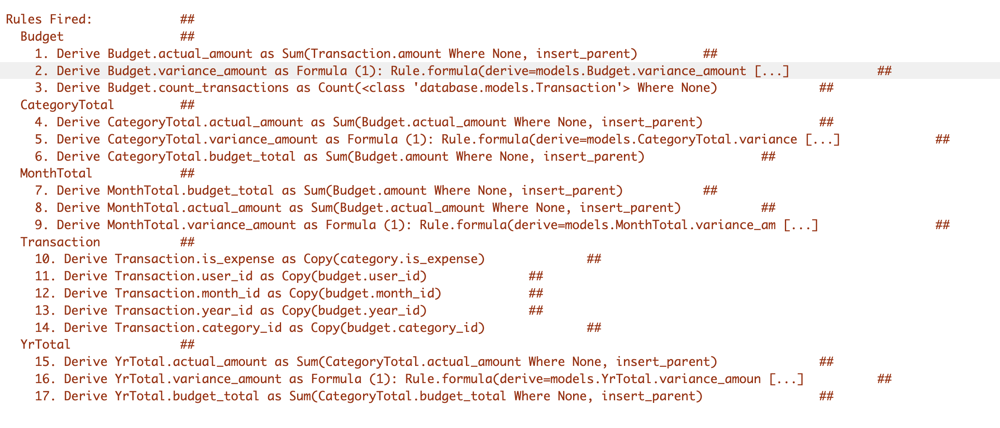

# Budget App

This is an example of how rules can be used to do a multi table rollup 
(budget .> month -> qtr -> yr) - it also introduces the flag on sum and count (insert_parent=True).
This allows the child to trigger the creation of the parent before doing the sum or count aggregation.

## Data Model
The Budget table holds the monthly values by category, tenant_user, and date.  This will rollup into Month then Qtr then Yr.  The Transactions table holds the actual values (one to many) so import from a CSV using the API will allow comparison with budget values. The database folder has the schema for both MySQL and SQLite.


## Multi Tenant and Security
The ability to filter users (tenant) to see only their own data is implemented in the declarative_security.py. The login user_id should match the tenant_user user_id.

```
DeclareGlobalTenant(tenant='user_id', filter="{entity_class}.user_id == Security.current_user().id")
```

## Budget API
The api folder (customize_api.py) has 2 user defined endpoints that can be used to insert budget amounts. 

```
curl -X 'POST' \
  'http://localhost:5656/api/ServicesEndPoint/budget_insert' \
  -H 'accept: application/vnd.api+json' \
  -H 'Content-Type: application/json' \
  -d '{
  "meta": {
    "method": "budget_insert",
    "args": {
      "year_id": 2023,
      "qtr_id": 1,
      "month_id": 1,
      "user_id": 1,
      "category_id": 1,
      "actual_amount": 0,
      "amount": 100,
      "is_expense": 1,
      "description": "Budget  insert"
    }
  }
```


## Actual Transactions API
The transactions are actual entries from different named accounts. The Budget table will sum and count these transactions.  The API can be used to post these entries.

```
curl -X 'POST' \
  'http://localhost:5656/api/ServicesEndPoint/transaction_insert' \
  -H 'accept: application/vnd.api+json' \
  -H 'Content-Type: application/json' \
  -d '{
  "meta": {
    "method": "transaction_insert",
    "args": {
      "budget_id": 2,
      "amount": 100,
      "category_id": 1,
      "is_expense": 0,
      "description": "test transaction insert"
    }
  }
}'
```

## Declarative Logic
The rules are un-ordered bu represent the rollup (sums) of budget and actual transactions. 
```
 # Roll up budget amounts
    Rule.sum(derive=models.YrTotal.budget_total, as_sum_of=models.QtrTotal.budget_total)
    Rule.sum(derive=models.QtrTotal.budget_total, as_sum_of=models.MonthTotal.budget_total)
    Rule.sum(derive=models.MonthTotal.budget_total, as_sum_of=models.Budget.amount)
    Rule.sum(derive=models.MonthTotal.actual_amount, as_sum_of=models.Budget.actual_amount)
    Rule.sum(derive=models.Budget.actual_amount, as_sum_of=models.Transaction.amount)
    Rule.copy(derive=models.Budget.is_expense,from_parent=models.Category.is_expense)
    
    # Roll up actual transaction amounts
    Rule.sum(derive=models.YrTotal.actual_amount, as_sum_of=models.QtrTotal.actual_amount)
    Rule.sum(derive=models.QtrTotal.actual_amount, as_sum_of=models.MonthTotal.actual_amount)
    Rule.sum(derive=models.MonthTotal.actual_amount, as_sum_of=models.Budget.actual_amount)
    Rule.copy(derive=models.Transaction.is_expense,from_parent=models.Category.is_expense)
    
    Rule.copy(derive=models.Transaction.category_id,from_parent=models.Budget.category_id)
    Rule.copy(derive=models.Transaction.user_id,from_parent=models.Budget.user_id)
    Rule.copy(derive=models.Transaction.year_id,from_parent=models.Budget.year_id)
    Rule.copy(derive=models.Transaction.qtr_id,from_parent=models.Budget.qtr_id)
    Rule.copy(derive=models.Transaction.month_id,from_parent=models.Budget.month_id)
```

### Logic Trace
As each budget entry is posted via API (/ServiceEndpoint/insert_budget) the logic trace shows how the rules are fired.

