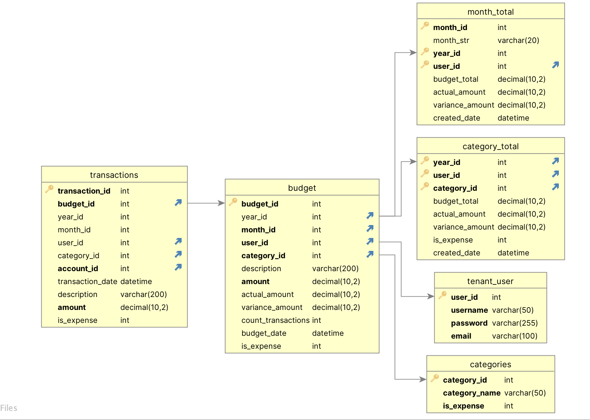

# Budget App

This is an example of how rules can be used to do a multi table rollup 
(budget -> category -> month -> yr) - it also introduces the rule flag on sum and count (insert_parent=True).
This allows the child to trigger the creation of the parent before doing the sum or count aggregation.

## Install
This will create the sample application to run - press f5 (no security)
```
$ApiLogicServer create --project_name=BudgetApp --db_url=BudgetApp

$cd BudgetApp
$code .
```
## Data Model
The Budget table holds the monthly values by category, tenant_user, and date.  This will rollup into Category, Month, and Yr.  The Transactions table holds the actual values (one to many) so import from a CSV using the API will allow comparison with budget values. The database folder has the schema for both MySQL and SQLite.  



## Multi Tenant and Security
The ability to filter users (tenant) to see only their own data is implemented in the declarative_security.py. The login user_id should match the tenant_user user_id.

```
GlobalFilter(global_filter_attribute_name='user_id', 
     roles_not_filtered = ['sa'],
     filter="{entity_class}.user_id == Security.current_user().id")
```

## Budget API
The api folder (api/customize_api.py) has user defined endpoints that can be used to insert budget and transaction amounts. This demonstrates how to customize and create new REST endpoints.

```
curl -X 'POST' \
  'http://localhost:5656/api/ServicesEndPoint/budget_insert' \
  -H 'accept: application/vnd.api+json' \
  -H 'Content-Type: application/json' \
  -d '{
  "meta": {
    "method": "budget_insert",
    "args": {
      "year_id": 2023,
      "qtr_id": 1,
      "month_id": 1,
      "user_id": 1,
      "category_id": 1,
      "amount": 100,
      "description": "Budget  insert"
    }
  }'
```


## Actual Transactions API
The transactions are actual entries from different named accounts. The Budget table will sum and count these transactions.  The API can be used to post these entries.

```
curl -X 'POST' \
  'http://localhost:5656/api/ServicesEndPoint/transaction_insert' \
  -H 'accept: application/vnd.api+json' \
  -H 'Content-Type: application/json' \
  -d '{
  "meta": {
    "method": "transaction_insert",
    "args": {
      "budget_id": 1,
      "amount": 100,
      "category_id": 1,
      "description": "test transaction insert"
    }
  }
}'
```

## Declarative Logic
The rules are un-ordered bu represent the rollup (sums) of budget and actual transactions. 
```
      use_parent_insert = True

    # Roll up budget amounts
    
    Rule.sum(derive=models.YrTotal.budget_total, as_sum_of=models.CategoryTotal.budget_total,insert_parent=use_parent_insert)
    Rule.sum(derive=models.CategoryTotal.budget_total, as_sum_of=models.Budget.amount,insert_parent=use_parent_insert)
    Rule.sum(derive=models.CategoryTotal.actual_amount, as_sum_of=models.Budget.actual_amount,insert_parent=use_parent_insert)
    Rule.sum(derive=models.MonthTotal.budget_total, as_sum_of=models.Budget.amount,insert_parent=use_parent_insert)
    Rule.sum(derive=models.Budget.actual_amount, as_sum_of=models.Transaction.amount,insert_parent=use_parent_insert)
    
    Rule.copy(derive=models.Budget.is_expense,from_parent=models.Category.is_expense)
    Rule.copy(derive=models.CategoryTotal.is_expense,from_parent=models.Category.is_expense)
    Rule.count(derive=models.Budget.count_transactions,as_count_of=models.Transaction)
    
    # Calculate variance from budget to actual
    Rule.formula(derive=models.Budget.variance_amount, as_expression=lambda row: row.actual_amount - row.amount)
    Rule.formula(derive=models.CategoryTotal.variance_amount, as_expression=lambda row: row.actual_amount - row.budget_total)
    Rule.formula(derive=models.MonthTotal.variance_amount, as_expression=lambda row: row.actual_amount - row.budget_total)
    Rule.formula(derive=models.YrTotal.variance_amount, as_expression=lambda row: row.actual_amount - row.budget_total)
    
    # Roll up actual transaction amounts into Budget
    
    Rule.sum(derive=models.YrTotal.actual_amount, as_sum_of=models.CategoryTotal.actual_amount,insert_parent=use_parent_insert)
    Rule.sum(derive=models.MonthTotal.actual_amount, as_sum_of=models.Budget.actual_amount,insert_parent=use_parent_insert)
    
    # Copy Budget (parent) values 
    
    Rule.copy(derive=models.Transaction.category_id,from_parent=models.Budget.category_id)
    Rule.copy(derive=models.Transaction.user_id,from_parent=models.Budget.user_id)
    Rule.copy(derive=models.Transaction.year_id,from_parent=models.Budget.year_id)
    Rule.copy(derive=models.Transaction.month_id,from_parent=models.Budget.month_id)
    Rule.copy(derive=models.Transaction.is_expense,from_parent=models.Category.is_expense)

```

### Logic Trace
As each budget entry is posted via API (/ServiceEndpoint/insert_budget) the logic trace shows how the rules are fired.

```

Rules Fired:		##
  Budget		##
    1. Derive Budget.is_expense as Copy(category.is_expense)		##
    2. Derive Budget.variance_amount as Formula (1): Rule.formula(derive=models.Budget.variance_amount [...]		##
  CategoryTotal		##
    3. Derive CategoryTotal.budget_total as Sum(Budget.amount Where None, insert_parent)		##
    4. Derive CategoryTotal.is_expense as Copy(category.is_expense)		##
    5. Derive CategoryTotal.actual_amount as Sum(Budget.actual_amount Where None, insert_parent)		##
    6. Derive CategoryTotal.variance_amount as Formula (1): Rule.formula(derive=models.CategoryTotal.variance [...]		##
  MonthTotal		##
    7. Derive MonthTotal.budget_total as Sum(Budget.amount Where None, insert_parent)		##
    8. Derive MonthTotal.actual_amount as Sum(Budget.actual_amount Where None, insert_parent)		##
    9. Derive MonthTotal.variance_amount as Formula (1): Rule.formula(derive=models.MonthTotal.variance_am [...]		##
  YrTotal		##
    10. Derive YrTotal.budget_total as Sum(CategoryTotal.budget_total Where None, insert_parent)		##
    11. Derive YrTotal.variance_amount as Formula (1): Rule.formula(derive=models.YrTotal.variance_amoun [...]		##
    12. Derive YrTotal.actual_amount as Sum(CategoryTotal.actual_amount Where None, insert_parent)		##
```

## Behave Testing
The behave test is run after starting the server (no security) - this will attempt to insert a budget and transaction and see if the YR_TOTAL values change.
Run Behave Test (no security) and then review the behave.log
See the directory test/api_logic_server_behave features/budget.features and steps/budget.py.