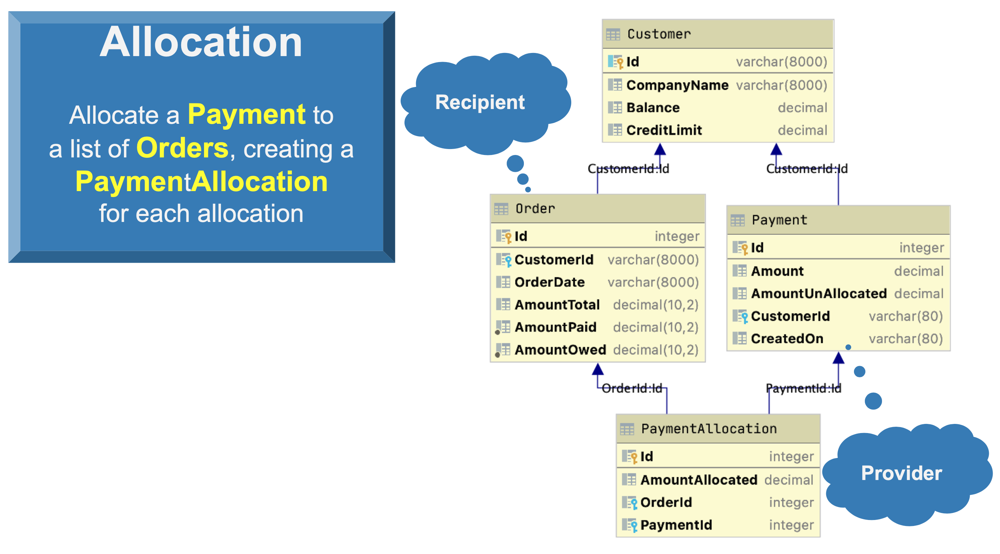

# Allocate Payment to Outstanding Orders

This project is to illustrate the use of Allcation.

Allocation is a pattern where:

> A ```Provider``` allocates to a list of ```Recipients```,
>creating ```Allocation``` rows.


For example, imagine a ```Customer``` has a set of outstanding
```Orders```, and pays all/several off with a single ```Payment```.


&nbsp;&nbsp;

## Data Model



## Requirements
When the ```Payment``` is inserted, our system must:
1. Allocate the ```Payment``` to ```Orders``` that have ```AmountOwed```, oldest first
1. Keep track of how the ```Payment``` is allocated, by creating 
a ```PaymentAllocation```
1. As the ```Payment``` is allocated,
   1. Update the ```Order.AmountOwed```, and
   1. Adjust the ```Customer.Balance```


&nbsp;&nbsp;


# Setup

Create the project:

```
ApiLogicServer create --project_name=allocation --db_url=allocation
```
After you establish the venv in the usual manner, you canopen the project in your IDE and run launch configuration `ApiLogicServer`.


# Test

Use `sh test/test.sh`

&nbsp;&nbsp;

# Walkthrough


The test illustrates allocation logic for our inserted payment,
which operates as follows:
1. The triggering event is the insertion of a ```Payment```, which triggers:
1. The ```allocate``` rule.  It performs the allocation:
   1. Obtains the list of recipient orders by calling the function```unpaid_orders```
   1. For each recipient (```Order```), the system...
      1. Creates a ```PaymentAllocation```, links it to the ```Order``` and ```Payment```,
      1. Invokes the default ```while_calling_allocator```, which
           1. Reduces ```Payment.AmountUnAllocated```
           1. Inserts the ```PaymentAllocation```, which runs the following rules:
              * r1 ```PaymentAllocation.AmountAllocated``` is derived ; 
                 this triggers the next rule...
              * r2 ```Order.AmountPaid``` is adjusted; that triggers... 
              * r3 ```Order.AmountOwed``` is derived; that triggers
              * r4 ```Customer.Balance``` is adjusted
           1. Returns whether the ```Payment.AmountUnAllocated``` has remaining value ( > 0 ).
        1. Tests the returned result
            1. If true (allocation remains), the loop continues for the next recipient
            1. Otherwise, the allocation loop is terminated
 

#### Log Output
Logic operation is visible in the log


```
Logic Phase:		BEFORE COMMIT          						 - 2020-12-23 05:56:45,682 - logic_logger - DEBUG
Logic Phase:		ROW LOGIC (sqlalchemy before_flush)			 - 2020-12-23 05:56:45,682 - logic_logger - DEBUG
..Customer[ALFKI] {Update - client} Id: ALFKI, CompanyName: Alfreds Futterkiste, Balance: 1016.00, CreditLimit: 2000.00  row@: 0x10abbea00 - 2020-12-23 05:56:45,682 - logic_logger - DEBUG
..Payment[None] {Insert - client} Id: None, Amount: 1000, AmountUnAllocated: None, CustomerId: None, CreatedOn: None  row@: 0x10970f610 - 2020-12-23 05:56:45,682 - logic_logger - DEBUG
..Payment[None] {BEGIN Allocate Rule, creating: PaymentAllocation} Id: None, Amount: 1000, AmountUnAllocated: None, CustomerId: None, CreatedOn: None  row@: 0x10970f610 - 2020-12-23 05:56:45,683 - logic_logger - DEBUG
....PaymentAllocation[None] {Insert - Allocate Payment} Id: None, AmountAllocated: None, OrderId: None, PaymentId: None  row@: 0x10abbe700 - 2020-12-23 05:56:45,684 - logic_logger - DEBUG
....PaymentAllocation[None] {Formula AmountAllocated} Id: None, AmountAllocated: 100.00, OrderId: None, PaymentId: None  row@: 0x10abbe700 - 2020-12-23 05:56:45,684 - logic_logger - DEBUG
......Order[10692] {Update - Adjusting Order} Id: 10692, CustomerId: ALFKI, OrderDate: 2013-10-03, AmountTotal: 878.00, AmountPaid:  [778.00-->] 878.00, AmountOwed: 100.00  row@: 0x10ac82370 - 2020-12-23 05:56:45,685 - logic_logger - DEBUG
......Order[10692] {Formula AmountOwed} Id: 10692, CustomerId: ALFKI, OrderDate: 2013-10-03, AmountTotal: 878.00, AmountPaid:  [778.00-->] 878.00, AmountOwed:  [100.00-->] 0.00  row@: 0x10ac82370 - 2020-12-23 05:56:45,685 - logic_logger - DEBUG
........Customer[ALFKI] {Update - Adjusting Customer} Id: ALFKI, CompanyName: Alfreds Futterkiste, Balance:  [1016.00-->] 916.00, CreditLimit: 2000.00  row@: 0x10abbea00 - 2020-12-23 05:56:45,685 - logic_logger - DEBUG
....PaymentAllocation[None] {Insert - Allocate Payment} Id: None, AmountAllocated: None, OrderId: None, PaymentId: None  row@: 0x10ac6a850 - 2020-12-23 05:56:45,686 - logic_logger - DEBUG
....PaymentAllocation[None] {Formula AmountAllocated} Id: None, AmountAllocated: 330.00, OrderId: None, PaymentId: None  row@: 0x10ac6a850 - 2020-12-23 05:56:45,686 - logic_logger - DEBUG
......Order[10702] {Update - Adjusting Order} Id: 10702, CustomerId: ALFKI, OrderDate: 2013-10-13, AmountTotal: 330.00, AmountPaid:  [0.00-->] 330.00, AmountOwed: 330.00  row@: 0x10ac824f0 - 2020-12-23 05:56:45,686 - logic_logger - DEBUG
......Order[10702] {Formula AmountOwed} Id: 10702, CustomerId: ALFKI, OrderDate: 2013-10-13, AmountTotal: 330.00, AmountPaid:  [0.00-->] 330.00, AmountOwed:  [330.00-->] 0.00  row@: 0x10ac824f0 - 2020-12-23 05:56:45,686 - logic_logger - DEBUG
........Customer[ALFKI] {Update - Adjusting Customer} Id: ALFKI, CompanyName: Alfreds Futterkiste, Balance:  [916.00-->] 586.00, CreditLimit: 2000.00  row@: 0x10abbea00 - 2020-12-23 05:56:45,686 - logic_logger - DEBUG
....PaymentAllocation[None] {Insert - Allocate Payment} Id: None, AmountAllocated: None, OrderId: None, PaymentId: None  row@: 0x10ac6a9d0 - 2020-12-23 05:56:45,687 - logic_logger - DEBUG
....PaymentAllocation[None] {Formula AmountAllocated} Id: None, AmountAllocated: 570.00, OrderId: None, PaymentId: None  row@: 0x10ac6a9d0 - 2020-12-23 05:56:45,687 - logic_logger - DEBUG
......Order[10835] {Update - Adjusting Order} Id: 10835, CustomerId: ALFKI, OrderDate: 2014-01-15, AmountTotal: 851.00, AmountPaid:  [0.00-->] 570.00, AmountOwed: 851.00  row@: 0x10ac82550 - 2020-12-23 05:56:45,688 - logic_logger - DEBUG
......Order[10835] {Formula AmountOwed} Id: 10835, CustomerId: ALFKI, OrderDate: 2014-01-15, AmountTotal: 851.00, AmountPaid:  [0.00-->] 570.00, AmountOwed:  [851.00-->] 281.00  row@: 0x10ac82550 - 2020-12-23 05:56:45,688 - logic_logger - DEBUG
........Customer[ALFKI] {Update - Adjusting Customer} Id: ALFKI, CompanyName: Alfreds Futterkiste, Balance:  [586.00-->] 16.00, CreditLimit: 2000.00  row@: 0x10abbea00 - 2020-12-23 05:56:45,688 - logic_logger - DEBUG
..Payment[None] {END Allocate Rule, creating: PaymentAllocation} Id: None, Amount: 1000, AmountUnAllocated: 0.00, CustomerId: None, CreatedOn: None  row@: 0x10970f610 - 2020-12-23 05:56:45,688 - logic_logger - DEBUG
Logic Phase:		COMMIT   									 - 2020-12-23 05:56:45,689 - logic_logger - DEBUG
Logic Phase:		FLUSH   (sqlalchemy flush processing       	 - 2020-12-23 05:56:45,689 - logic_logger - DEBUG

add_payment, update completed
```


## Key Points
Allocation illustrates some key points regarding logic.

### Extensibility
While Allocation is part of Logic Bank, you could have recognized
the pattern yourself, and provided the implementation.  This is
enabled since Event rules can invoke Python.  You can make your
Python code generic, using meta data (from SQLAlchemy),
parameters, etc.  

For more information, see [Extensibility](https://github.com/valhuber/LogicBank/wiki/Rule-Extensibility#3-extended-rules).

### Rule Chaining
Note how the created ```PaymentAllocation``` row triggered
the more standard rules such as sums and formulas.  This
required no special machinery: rules watch and react to changes in data -
if you change the data, rules will "notice" that, and fire.  Automatically.
