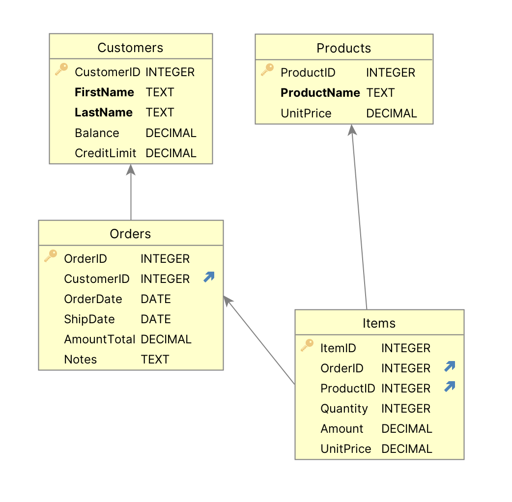

# Basic Demo

This illustrates:

1. Creating a database using AI
2. Automation - instant collaboration for business users, UI developers
3. Declarative Logic and Security
4. Extensibility with Python
5. Iteration

For more information, see [this page](https://apilogicserver.github.io/Docs/Tutorial-AI/).

&nbsp;

## What's already happened

This project was created with a command like:

```bash
$ ApiLogicServer create --project_name=basic_demo --db_url=basic_demo
```

> Note: the `db_url` value is [an abbreviation](https://apilogicserver.github.io/Docs/Data-Model-Examples/).  You would normally supply a SQLAlchemy URI.

&nbsp;

## Next Steps

So, you can start [from here](https://apilogicserver.github.io/Docs/Tech-AI/#add-security).

&nbsp;

## Data Model


