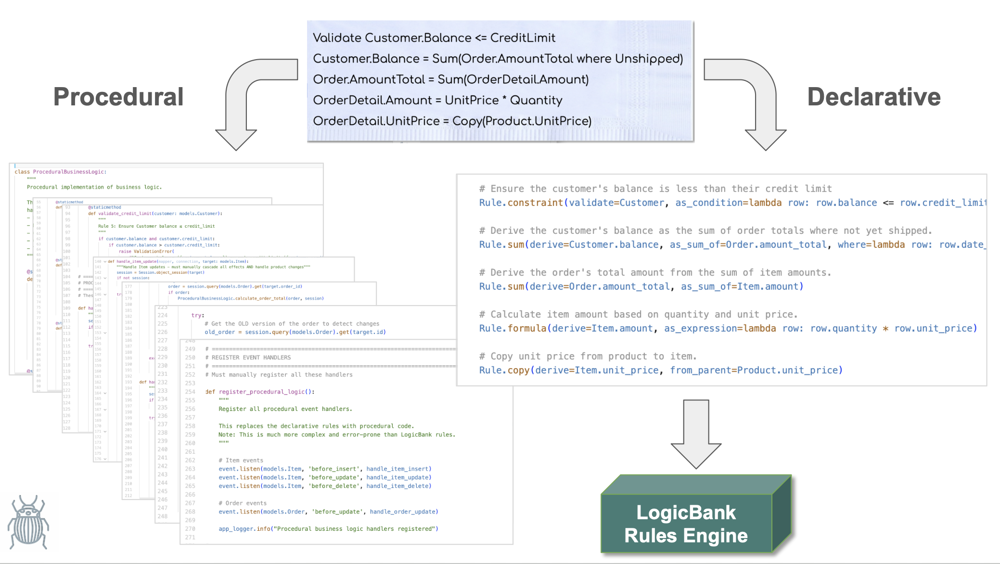

# Declarative vs. Procedural Business Logic: A Comparison

<br>

## Foreword

This document compares two approaches to implementing the **same business logic requirements**: a **procedural** implementation using conventional event-handler code, and a **declarative** implementation using the LogicBank rules engine. Both were written by AI, from the same requirements.

Business logic typically represents nearly half the effort in database projects, so how AI handles it matters. Asked to produce logic with no further guidance, AI defaults to procedural code — event handlers, session queries, manual cascades — because that's the pattern it's seen most in training. This example surfaces what that costs:

1. **Quality.** The procedural version contained real bugs — not typos, but missed cases in exactly the kind of multi-table cascade this system needs to get right.
2. **Size.** The procedural version ran to ~220 lines; the declarative version expressed the same requirements in 5 rules.

The declarative version had neither bug.

The lesson isn't "don't use AI for logic" — AI's speed here is real and worth keeping. It's that AI needs to be pointed at the right target: a small, declarative rule vocabulary that an engine (LogicBank) executes and orders automatically, instead of open-ended procedural code that AI has to get right by hand across every change path.



<br>

### Deeper Dive

[GenAI-Logic](https://www.genai-logic.com) is free and open source, so you can install it to explore declarative logic - [click here](https://apilogicserver.github.io/Docs/Install-Express/). This project is available on GitHub - [click here](https://github.com/ApiLogicServer/basic_demo/blob/main/logic/declarative-vs-procedural-comparison.md).

<br>

### How this Document Was Created

1. Built the `basic_demo` project [as described here](https://apilogicserver.github.io/Docs/Sample-Basic-Demo/).
2. Asked Copilot to **rebuild the logic using a procedural approach** — without the LogicBank rule engine.
    * Resulting procedural logic: `logic/procedural_logic.py`
    * Declarative logic: `logic/declare_logic.py` (*with LogicBank,* [below](#business-requirements))
3. Asked Copilot: **what would happen if an order's customer changed?**
    * Copilot found a real gap and fixed it: the old customer's balance was never adjusted, only the new one's.
4. Asked Copilot: **what if an item's product changed?**
    * Same shape of bug, second instance: the item kept the old product's price. Copilot fixed it and — unprompted — wrote up an analysis of why this class of bug keeps happening.

<br>

> **A note on that analysis.** Generated on the spot, right after finding its own second bug, Copilot's first draft read like it had just discovered fire — "44X reduction," "fundamentally superior," checkmarks and X's stacked across seven straight sections, no hedge anywhere. The underlying observations were sound; the delivery wasn't. What follows keeps the substance and drops the exclamation marks.

<br>

## Business Requirements

1. **Copy unit_price from Product to Item**
2. **Calculate Item amount = quantity × unit_price**
3. **Calculate Order total = sum of Item amounts**
4. **Update Customer balance = sum of unshipped Order totals**
5. **Ensure Customer balance ≤ credit_limit**
6. **Validate Item quantity > 0**
7. **Log order events**

## Code Comparison

### LogicBank Declarative Rules (5 lines)

```python
# Business logic expressed as simple, readable rules
def declare_logic():
    # Rule 1: Copy unit price from product to item
    Rule.copy(derive=Item.unit_price, from_parent=Product.unit_price)
    
    # Rule 2: Calculate item amount
    Rule.formula(derive=Item.amount, as_expression=lambda row: row.quantity * row.unit_price)
    
    # Rule 3: Calculate order total
    Rule.sum(derive=Order.amount_total, as_sum_of=Item.amount)
    
    # Rule 4: Update customer balance
    Rule.sum(derive=Customer.balance, as_sum_of=Order.amount_total, 
             where=lambda row: row.date_shipped is None)
    
    # Rule 5: Validate credit limit
    Rule.constraint(validate=Customer, 
                   as_condition=lambda row: row.balance <= row.credit_limit,
                   error_msg="Customer balance exceeds credit limit")
```

### Procedural Implementation (~220 lines total; one handler shown)

```python
# Manual event handling with manual cascading
def handle_item_update(mapper, connection, target: models.Item):
    session = Session.object_session(target)
    
    # Get OLD version to detect changes
    old_item = session.query(models.Item).get(target.id)
    
    # Validate quantity
    ProceduralBusinessLogic.validate_item_quantity(target)
    
    # Handle product changes (bug found on probing — see below)
    if old_item and old_item.product_id != target.product_id:
        ProceduralBusinessLogic.copy_unit_price_from_product(target, session)
    
    # Recalculate item amount
    ProceduralBusinessLogic.calculate_item_amount(target)
    
    # Handle order changes (a second instance of the same bug class)
    if old_item and old_item.order_id != target.order_id:
        # Update OLD order total
        old_order = session.query(models.Order).get(old_item.order_id)
        if old_order:
            ProceduralBusinessLogic.calculate_order_total(old_order, session)
            # Update old customer balance
            old_customer = session.query(models.Customer).get(old_order.customer_id)
            if old_customer:
                ProceduralBusinessLogic.update_customer_balance(old_customer, session)
                ProceduralBusinessLogic.validate_credit_limit(old_customer)
    
    # Update NEW order total
    if target.order_id:
        order = session.query(models.Order).get(target.order_id)
        if order:
            ProceduralBusinessLogic.calculate_order_total(order, session)
            customer = session.query(models.Customer).get(order.customer_id)
            if customer:
                ProceduralBusinessLogic.update_customer_balance(customer, session)
                ProceduralBusinessLogic.validate_credit_limit(customer)
```

This is one event handler. A complete implementation needs equivalents for insert, delete, and the corresponding handlers on `Order` and `Product` — each carrying the same old-parent/new-parent burden.

## The Two Bugs

Both bugs share one shape: **when a row's parent changes, both the old and the new parent need adjustment** — and the first-draft procedural code only ever handled the new one.

- **Order reparented to a new customer.** The new customer's balance updated correctly. The old customer's did not — left inflated, with credit checks against it now wrong.
- **Item reparented to a new product.** The item kept the old product's price instead of picking up the new one, so the amount, the order total, and the customer balance were all quietly wrong.

Neither bug was visible on the happy path. Insert an order, ship it, add a normal item — everything passes. The bugs only show up on the specific re-parenting cases, which is exactly why they survive a quick review and only surface once something in production actually reassigns a row to a different parent.

The declarative version doesn't dodge this by being cleverer — it doesn't have old-parent/new-parent handling to write or forget, because the engine derives the dependency graph and adjusts both sides automatically. There's no reparenting branch to miss because there's no reparenting branch at all.

## Detailed Comparison

| Dimension | LogicBank (declarative) | Procedural (as generated) |
|---|---|---|
| **Lines of code** | 5 | ~220 |
| **Reparenting bugs** | 0 — engine adjusts both old and new parent automatically | 2 — found only after specifically probing for them |
| **Adding a rule later** | New rule, dependency order resolved automatically; existing rules untouched | New handler branch, must be checked against every existing branch for ordering/interaction |
| **Reading the logic** | Each rule states an invariant about data — readable in isolation | Business intent is interleaved with session queries and old/new-value tracking |
| **Performance** | Rules fire only when a dependent attribute actually changes, and adjust by delta rather than recomputing (LogicBank's documented pruning/adjustment behavior) | Recomputes via fresh queries per handler; no such optimization unless hand-written |
| **Testing** | Each rule is independently inspectable via the rule engine's execution log | Must exercise the full handler chain, including both reparenting cases, to catch the same bugs found here |

The performance row describes LogicBank's engine behavior generally, not something separately benchmarked in this example — noted so it isn't confused with the two measured items above it (line count, bug count).

## Why This Matters as Systems Grow

Two bugs in one 220-line file is a data point, not a proof. But the *shape* of the bugs generalizes: every derived value, every aggregate that rolls up across a foreign key, adds change paths — the update/delete/reparent cases that must each be handled by hand to keep derived data correct. Change paths grow faster than the underlying dependencies do, because reparenting and conditional aggregation each multiply the cases a human (or an AI) has to enumerate correctly.

This is a fact about practice, not a theorem — procedural code *can* handle these paths correctly; LogicBank's own engine is procedural code that does. The difference is that the engine solves it once, for every project that uses it, while each hand-written implementation is a fresh chance to miss a case — as this one did, twice, in a system with only 5 requirements.

## Conclusion

Same requirements, same AI, two implementations: 5 declarative rules with no bugs found, versus ~220 lines of procedural code with two real ones — both instances of the same missed-reparenting pattern, both invisible until specifically probed for.

That's the concrete case for pointing AI at declarative rules for business logic specifically, not at procedural code generation generally. AI's strength elsewhere — UI, boilerplate, translating requirements into a first draft — isn't in question here. What this example shows is narrower and more useful: for logic with cross-table dependencies, giving AI a small declarative vocabulary and letting an engine handle ordering and completeness produced a correct result where letting AI write the ordering and completeness by hand did not.

---

*This comparison is based on an actual AI-generated implementation in the API Logic Server project. It's one example, not a benchmark — see the fuller writeup in [`basic_demo_logic_gov`](../../../basic_demo_logic_gov/logic/procedural/declarative-vs-procedural-comparison.md) for the same comparison, with a committed Behave test suite covering the non-reparenting paths (the reparenting scenarios themselves are not yet in that suite — see its "What the suite does not yet cover" note).*
