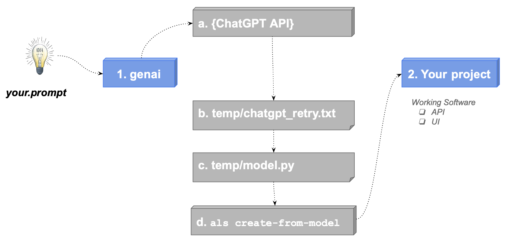

Welcome to API Logic Server.  It creates ***executable projects*** (APIs and Admin Apps) from a database or description, with 1 command.  The created projects are based on standard Python libraries (Flask, SQLAlchemy), so you can ***customize them with rules and Python in your IDE.***

You are in the [API Logic Server Manager](https://apilogicserver.github.io/Docs/Manager/).  This is a good place to manage projects, create notes and resources, etc.

<details markdown>

<summary>How to Run Projects from the Manager </summary>

<br>There are 2 ways of running projects from the Manager:

1. Use ***another instance of VSCode.***  You can *examine* them in this current instance, but *run* them in their own instance.

    * To do so, you probably want to acquire this extension: `Open Folder Context Menus for VS Code`. It will enable you to open the sample, tutorial or your own projects in another instance of VSCode.

    * This option provides more Run/Debug options (e.g., run without security, etc),

2. Or, use the Run/Debug Entry: `API Logic Server Run (run project from manager)`

</details>

&nbsp;

# Explore Pre-created Samples

See these [important pre-created sample apps](samples/readme-samples.md).

&nbsp;

#  Explore Creating Projects

Click on the disclosure buttons, below.
<br><br>

<details markdown>

<summary> Existing Database - pre-installed demo </summary>

<br>To create a project, **press F5**, or use the CLI (**Terminal > New Terminal**) and try the pre-installed [**nw**](https://apilogicserver.github.io/Docs/Tutorial/):

```
als create --project-name=nw_sample_nocust --db-url=sqlite:///nw.sqlite
```

Or, see it [with customizations](https://apilogicserver.github.io/Docs/IDE-Customize/):

```
als create --project-name=nw_sample --db-url=sqlite:///nw+.sqlite
```

Then, try your own databases [(db-url examples here)](https://apilogicserver.github.io/Docs/Database-Connectivity/), or experiment with [these Docker databases](https://apilogicserver.github.io/Docs/Database-Docker/).

</details>

&nbsp;

<details markdown>

<summary> New Database - using GenAI Microservice Automation (Signup optional)</summary>

<br>You can do this with or without signup:

1. If you have signed up, this will create and open a project called `genai_demo` from `genai_demo.prompt`:

```bash
als genai --using=genai_demo.prompt
```


2. ***Or,*** you can simulate the process using:


```bash
als genai --using=genai_demo.prompt --gen-using-file=system/genai/temp/chatgpt_retry.txt
```

&nbsp;

<details markdown>

<summary> What Just Happened? &nbsp;&nbsp;&nbsp;Next Steps...</summary>

<br>`genai` processing is shown below (internal steps denoted in grey):

1. You create your.prompt file, and invoke `als genai --using=your.prompt`.  genai then creates your project as follows:

    a. Submits your prompt to the `ChatGPT API`

    b. Writes the response to file, so you can correct and retry if anything goes wrong

    c. Extracts model.py from the response

    d. Invokes `als create-from-model`, which creates the database and your project

2. Your created project is opened in your IDE, ready to execute and customize.  

    a. Review `Sample-Genai.md`, Explore Customizations.



</details>

&nbsp;

<details markdown>

<summary> AI somtimes fails - here's how to recover</summary>

<br>AI results are not consistent, so the model file may need corrections.  You can find it at `system/genai/temp/model.py`.  You can correct the model file, and then run:

```bash
als create --project-name=genai_demo --from-model=system/genai/temp/model.py --db-url=sqlite
```

Or, correct the chatgpt response, and

```bash
als genai --using=genai_demo.prompt --gen-using-file=system/genai/temp/chatgpt_retry.txt
```

We have seen failures such as:

* duplicate definition of `DECIMAL`
* unclosed parentheses
* data type errors in test data creation
* wrong engine import: from logic_bank import Engine, constraint
* bad test data creation: with Engine() as engine...
* Bad load code (no session)

</details>

&nbsp;

**Postgresql Example**

You can test this as follows:

1. Use [our docker image](https://apilogicserver.github.io/Docs/Database-Docker/):
2. And try:

```bash
als genai --using=genai_demo_pg.prompt --db-url=postgresql://postgres:p@localhost/genai_demo
```

Provisos:

* You have to create the database first; we are considering automating that: https://stackoverflow.com/questions/76294523/why-cant-create-database-if-not-exists-using-sqlalchemy

</details>

&nbsp;

<details markdown>

<summary> New Database - using Copilot (Signup optional) </summary>

<br>You can use Copilot chat (if extension installed; if not, skip to step 3):

1. Create a model, eg:

<details markdown>

<summary> Show Me How to Use Copilot </summary>

<br>>Paste this into the Copilot prompt:

```
Use SQLAlchemy to create a sqlite database named sample_ai.sqlite, with customers, orders, items and product

Hints: use autonum keys, allow nulls, Decimal types, foreign keys, no check constraints.

Include a notes field for orders.

Create a few rows of only customer and product data.

Enforce the Check Credit requirement (do not generate check constraints):

1. Customer.Balance <= CreditLimit
2. Customer.Balance = Sum(Order.AmountTotal where date shipped is null)
3. Order.AmountTotal = Sum(Items.Amount)
4. Items.Amount = Quantity * UnitPrice
5. Store the Items.UnitPrice as a copy from Product.UnitPrice
```


</details>

<br>

2. Paste the copilot response into a new `sample_ai.py` file

3. Create your project:

```bash
als create --project-name=sample_ai --from-model=sample_ai.py --db-url=sqlite
```

4. This will create your database, create an API Logic Project from it, and launch your IDE.

</details>

&nbsp;

<details markdown>

<summary> New Database - using ChatGPT in the Browser </summary>

<br>ChatGPT in the Browser

Please see [this doc](https://apilogicserver.github.io/Docs/Sample-AI-ChatGPT/)

</details>
