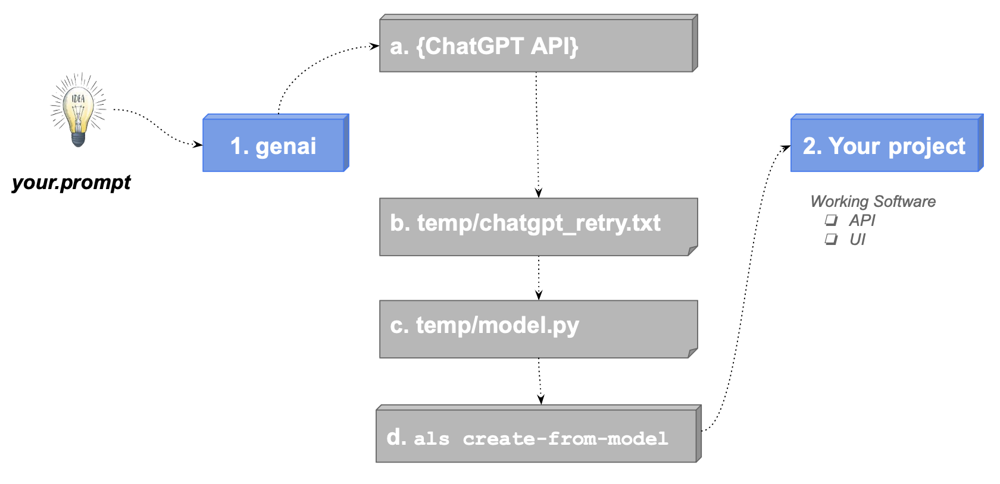
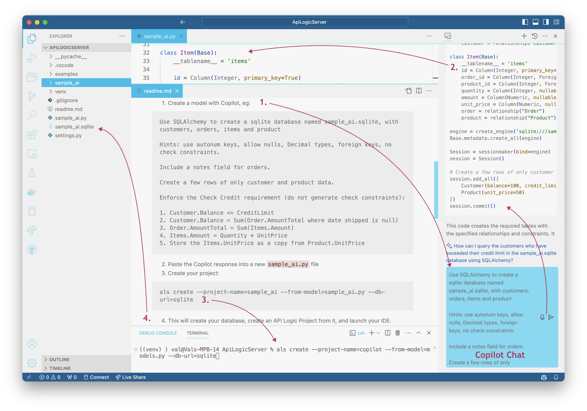

<style>
  .md-typeset h1,
  .md-content__button {
    display: none;
  }
</style>

# Welcome to GenAI-Logic

## 🚀 New Users: Start Here!

> 🤖 **For GitHub Copilot Users:** See `.github/.copilot-instructions.md` for AI assistant guidance on getting started with this project.

**Bootstrap Copilot by pasting the following into the chat:**
```
Please find and read `.github/.copilot-instructions.md`.
```

<br>

## What is GenAI-Logic

1. ***Instant mcp-enabled microservice creation*** (APIs and Admin Apps), from a database or **GenAI prompt** -- one command and you are ready for MCP, Vibe and Business User Collaboration.

2. ***Customize*** with **Declarative Rules** and Python in your IDE, standard container deployment

You are in the [API Logic Server Manager](Manager.md).  This is a good place to manage projects, create notes and resources, etc.


&nbsp;

# Product Tour (Start Here)

**Evaluation Guide:** click on the disclosure buttons, below.   

This illustrates basic [GenAI-Logic](https://www.genai-logic.com/product/key-features){:target="_blank" rel="noopener"} operation: 

1. Creating projects from new or existing databases, providing a MCP-enabled API and an Admin App
2. Adding declarative logic and security, and 
3. Customizing your project using your IDE and Python


The entire process takes 20 minutes; usage notes:

* Important: look for **readme files** in created projects
* You may find it more convenient to view this [in your Browser](Sample-Basic-Tour.md)
* A slide show summary is available [on our Web Site](https://www.genai-logic.com/product/tour){:target="_blank" rel="noopener"}


&nbsp;

## 1. Create and Run

API Logic Server can create projects from existing databases, or use GenAI to create projects with new databases.  Let's see how.

&nbsp;
### From Existing Database

Create the project - use the CLI (**Terminal > New Terminal**), :

```bash
$ genai-logic create --project_name=basic_demo --db_url=basic_demo
```

> Note: the `db_url` value is [an abbreviation](https://apilogicserver.github.io/Docs/Data-Model-Examples/){:target="_blank" rel="noopener"} for a test database provided as part of the installation.  You would normally supply a SQLAlchemy URI to your existing database, e.g. <br>`genai-logic create  --project_name=basic_demo --db_url=sqlite:///samples/dbs/basic_demo.sqlite`.


<details markdown>

<summary> The database is Customer, Orders, Items and Product</summary>


</details>
<br>
&nbsp;

### GenAI: New Database

You can create a project *and a new database* from a prompt using GenAI, either by:

* [WebGenAI - in the Browser, via pubic website](WebGenAI.md){:target="_blank" rel="noopener"}, or
* [GenAI -         in the Browser, via docker](WebGenAI-install.md){:target="_blank" rel="noopener"}, or 
* [GenAI CLI](WebGenAI-CLI.md){:target="_blank" rel="noopener"} 

Here we use the GenAI CLI:

1. If you have signed up (see *Get an OpenAI Key*, below), this will create and open a project called `genai_demo` from `genai_demo.prompt` (available in left Explorer pane):

```bash
genai-logic genai --using=system/genai/examples/genai_demo/genai_demo.prompt --project-name=genai_demo
```

2. ***Or,*** you can simulate the process (no signup) using:

```bash
genai-logic genai --repaired-response=system/genai/examples/genai_demo/genai_demo.response_example --project-name=genai_demo
```

For background on how it works, [click here](Sample-Genai.md#how-does-it-work){:target="_blank" rel="noopener"}.

&nbsp;


### Open in your IDE and Run

You can open with VSCode, and run it as follows:

1. **Start the Server:** F5 (also described in the Appendix).

    * Your virtual environment is automatically configured in most cases; see the Appendix (Procedures / Detail Procedures) if that's not working.

2. **Start the Admin App:** either use the links provided in the IDE console, or click [http://localhost:5656/](http://localhost:5656/).  The Admin App screen shown below should appear in your Browser.

The sections below explore the system that has been created (which would be similar for your own database).
<br><br>

### API with Swagger

The system creates an API with end points for each table, with filtering, sorting, pagination, optimistic locking and related data access -- **[self-serve](https://apilogicserver.github.io/Docs/API-Self-Serve/), ready for custom app dev.**

<details markdown>

<summary>See the Swagger </summary>


</details>
<br>

### Admin App

It also creates an Admin App: multi-page, multi-table -- ready for **[business user agile collaboration](https://apilogicserver.github.io/Docs/Tech-AI/),** and back office data maintenance.  This complements custom UIs created with the API.

You can click Customer Alice, and see their Orders, and Items.

<details markdown>

<summary>See the Admin App </summary>

</details>


## 2. Custom UI: GenAI, Vibe

The app above is suitable for collaborative iteration to nail down the requirements, and back office data maintenance.  It's also easy to make simple customizations, using the yaml file.

For more custom apps, you get complete control by generating app source code, which you can then customize in your IDE, e.g. using Vibe Natural Language:

```bash
# create react source (requires OpenAI key)
genai-logic genai-add-app --vibe
cd react-app
npm install
npm start
```

And you are ready to Vibe:

* Instead of creating data mockups, you have a **running API server with real data**
* Instead of starting from scratch, you have a **running multi-page app** 
* And, you'll have projects that are **architecturally correct:** shared logic, enforced in the server, available for both User Interfaces and services.
* Then, use you favorite Vibe tools with your running API

<br>

```txt title='Customize using Natural Language'
Update the Customer list to provide users an option to see results in a list, or in cards
```


<br>

## 3. MCP-Ready APIs

Your project is MCP-ready - this will run a simple query *List customers with credit_limit > 1000* (we'll explore more interesting examples below, including provisions for user input):

```bash
python integration/mcp/mcp_client_executor.py
```


<br>

## 4. Declare Logic And Security

While API/MCP/UI automation is a great start, it's **critical to enforce logic and security.**  You do this in your IDE.  Here's how.

The following `add_customizations` process simulates:

* Adding security to your project, and
* Using your IDE to declare logic and security in `logic/declare_logic.sh` and `security/declare_security.py`.

> Declared security and logic are shown in the screenshots below.<br>It's quite short - 5 rules, 7 security settings.

To add customizations, in a terminal window for your project:

**1. Stop the Server** (Red Stop button, or Shift-F5 -- see Appendix)

**2. Add Customizations**

```bash
genai-logic add-cust
genai-logic add-auth --db_url=auth
```
&nbsp;

### Security: Role Based Access

The `add_customizations` process above has simulated using your IDE to declare security in `logic/declare_logic.sh`.

To see security in action:

**1. Start the Server**  F5

**2. Start the Admin App:** [http://localhost:5656/](http://localhost:5656/)

**3. Login** as `s1`, password `p`

**4. Click Customers**

<br>
Observe:

**1. Login now required**

**2. Role-Based Filtering**

Observe you now see fewer customers, since user `s1` has role `sales`.  This role has a declared filter, as shown in the screenshot below.

**3. Transparent Logging**

<details markdown>

<summary>See Security Declarations </summary>

<br>The screenshot below illustrates security declaration and operation:

* The declarative Grants in the upper code panel, and

*  The logging in the lower panel, to assist in debugging by showing which Grants (`+ Grant:`) are applied:


</details>

&nbsp;

### Logic: Derivations, Constraints

Logic (multi-table derivations and constraints) is a significant portion of a system, typically nearly half.  API Logic Server provides **spreadsheet-like rules** that dramatically simplify and accelerate logic development.

Rules are declared in Python, simplified with IDE code completion.  The screen below shows the 5 rules for **Check Credit Logic.**

The `add_customizations` process above has simulated the process of using your IDE to declare logic in `logic/declare_logic.sh`.

To see logic in action:

**1. In the admin app, Logout (upper right), and login as admin, p**

**2. Use the Admin App to add an Order and Item for `Customer Alice`** (see Appendix)

Observe the rules firing in the console log - see Logic In Action, below.

<br>
> 💡 Logic: Multi-table Derivations and Constraint Declarative Rules.<br>&emsp;&emsp;Declarative Rules are 40X More Concise than procedural code.<br>&emsp;&emsp;For more information, [click here](Logic-Why.md){:target="_blank" rel="noopener"}.

<br>

<details markdown>

<summary>See Logic In Action </summary>

<br>[Declare logic](Logic.md#declaring-rules){:target="_blank" rel="noopener"} with WebGenAI, or in your IDE using code completion or Natural Language:


**a. Chaining**

The screenshot below shows our logic declarations, and the logging for inserting an `Item`.  Each line represents a rule firing, and shows the complete state of the row.

Note that it's a `Multi-Table Transaction`, as indicated by the indentation.  This is because - like a spreadsheet - **rules automatically chain, *including across tables.***


**b. 40X More Concise**

The 5 spreadsheet-like rules represent the same logic as 200 lines of code, [shown here](https://github.com/valhuber/LogicBank/wiki/by-code).  That's a remarkable 40X decrease in the backend half of the system.

> 💡 No FrankenCode<br>Note the rules look like syntactically correct requirements.  They are not turned into piles of unmanageable "frankencode" - see [models not frankencode](https://www.genai-logic.com/faqs#h.3fe4qv21qtbs){:target="_blank" rel="noopener"}.

<br><br>

**c. Automatic Re-use**

The logic above, perhaps conceived for Place order, applies automatically to all transactions: deleting an order, changing items, moving an order to a new customer, etc.  This reduces code, and promotes quality (no missed corner cases).
<br><br>

**d. Automatic Optimizations**

SQL overhead is minimized by pruning, and by elimination of expensive aggregate queries.  These can result in orders of magnitude impact.
<br><br>

**e. Transparent**

Rules are an executable design.  Note they map exactly to our natural language design (shown in comments) - readable by business users.  

Optionally, you can use the Behave TDD approach to define tests, and the Rules Report will show the rules that execute for each test.  For more information, [click here](https://apilogicserver.github.io/Docs/Behave-Logic-Report/).

</details>

&nbsp;

### MCP: Logic, User Interface

Logic is automatically executed in your MCP-enabled API.  For example, consider the following MCP orchestration:


When sending email, we require ***business rules*** to ensure it respects the opt-out policy:


The server is automatically mcp-enabled, but we might also want an mcp user-interface client:

**1. Stop the Server**

**2. Create an MCP Client Executor like this:**

```
genai-logic genai-add-mcp-client
```

**3. Restart the Server**

<br>

With the server running, test it like this:

1. **Test MCP**

You can do this in the command line, or via the admin app.

```bash title='MCP from the command line'
python integration/mcp/mcp_client_executor.py mcp
```

Or, use the **Admin App:** (shown above), and follow step 4 on the Home page to see a Business-User-friendly example.

<br>

For more on MCP, [click here](Integration-MCP.md){:target="_blank" rel="noopener"}.

<br>

## 5. Iterate with Rules and Python

Not only are spreadsheet-like rules 40X more concise, they meaningfully simplify maintenance.  Let's take an example:

>> Give a 10% discount for carbon-neutral products for 10 items or more.
<br>

The following `add-cust` process simulates an iteration:

* acquires a new database with `Product.CarbonNeutral`

* issues the `genai-logic rebuild-from-database` command that rebuilds your project (the database models, the api), while preserving the customizations we made above.

* acquires a revised `ui/admin/admin.yaml` that shows this new column in the admin app

* acquires this revised logic - in `logic/declare_logic.py`, we replaced the 2 lines for the `models.Item.Amount` formula with this (next screenshot shows revised logic executing with breakpoint):

```python
    def derive_amount(row: models.Item, old_row: models.Item, logic_row: LogicRow):
        amount = row.Quantity * row.UnitPrice
        if row.Product.CarbonNeutral and row.Quantity >= 10:
           amount = amount * Decimal(0.9)  # breakpoint here
        return amount

    Rule.formula(derive=models.Item.Amount, calling=derive_amount)
```

&nbsp;

To add this iteration, repeat the process above - in a terminal window for your project:

**1. Stop the Server** (Red Stop button, or Shift-F5 -- see Appendix)

**2. Add Iteration**

```bash
genai-logic add-cust
genai-logic rebuild-from-database --db_url=sqlite:///database/db.sqlite
```

* You can ignore the warning regarding *'mcp-SysMcp' - not present*

**3. Set the breakpoint as shown in the screenshot below**

**4. Test: Start the Server, login as Admin**

**5. Use the Admin App to update your Order by adding 12 `Green` Items**

At the breakpoint, observe you can use standard debugger services to debug your logic (examine `Item` attributes, step, etc).


&nbsp;

This simple example illustrates some significant aspects of iteration, described in the sub-sections below.

<br>
> 💡 Iteration: Automatic Invocation/Ordering, Extensible, Rebuild Preserves Customizations

<br>

**a. Dependency Automation**

Along with perhaps documentation, one of the tasks programmers most loathe is maintenance.  That's because it's not about writing code, but it's mainly archaeology - deciphering code someone else wrote, just so you can add 4 or 5 lines that will hopefully be called and function correctly.

Rules change that, since they **self-order their execution** (and pruning) based on system-discovered dependencies.  So, to alter logic, you just "drop a new rule in the bucket", and the system will ensure it's called in the proper order, and re-used over all the Use Cases to which it applies.  Maintenance is **faster, and higher quality.**
<br><br>

**b. Extensibile with Python**

In this case, we needed to do some if/else testing, and it was convenient to add a pinch of Python. Using "Python as a 4GL" is remarkably simple, even if you are new to Python.

Of course, you have the full object-oriented power of Python and its many libraries, so there are *no automation penalty* restrictions.  
<br>

**c. Debugging: IDE, Logging**

The screenshot above illustrates that debugging logic is what you'd expect: use your IDE's debugger.  This "standard-based" approach applies to other development activities, such as source code management, and container-based deployment.
<br><br>

**d. Customizations Retained**

Note we rebuilt the project from our altered database, illustrating we can **iterate, while *preserving customizations.***

&nbsp;

### API Customization: Standard

Of course, we all know that all businesses the world over depend on the `hello world` app.  This is provided in `api/customize_api`.  Observe that it's:

* standard Python

* using Flask

* and, for database access, SQLAlchemy.  Note all updates from custom APIs also enforce your logic.

Explore the custom API in `api/api_discovery/order_b2b.py`, and test it using swagger:


&nbsp;

### Messaging With Kafka

Along with APIs, messaging is another technology commonly employed for application integration.  See the screenshot below; for more information, see [Sample Integration](Sample-Integration.md#produce-ordershipping-message){:target="_blank" rel="noopener"}.


&nbsp;

## 6. Deploy Containers: No Fees

API Logic Server also creates scripts for deployment.  While these are ***not required at this demo,*** this means you can enable collaboration with Business Users:

1. Create a container from your project -- see `devops/docker-image/build_image.sh`
2. Upload to Docker Hub, and
3. Deploy for agile collaboration.

&nbsp;

#  Explore GenAI CLI

<br>

<details markdown>

<summary>1. New Database - using GenAI Microservice Automation (Experiment with AI - Signup optional)</summary>

<br>You can do this with or without signup:

1. If you have signed up (see *Get an OpenAI Key*, below), this will create a new database and project called `genai_demo`, and open the project.  It's created using `genai_demo.prompt`, visible in left Explorer pane:

```bash
als genai --using=system/genai/examples/genai_demo/genai_demo.prompt --project-name=genai_demo
```


2. ***Or,*** you can simulate the process (no signup) using:


```bash
als genai --repaired-response=system/genai/examples/genai_demo/genai_demo.response_example --project-name=genai_demo
```

Verify it's operating properly:

1. Run Configurations are provided to start the server
2. Verify the logic by navigating to a Customer with an unshipped order, and altering one of the items to have a very large quantity
3. Observe the constraint operating on the rollup of order amount_totals.
    * View the logic in `logic/declare_logic.py`
    * Put a breakpoint on the `as_condition`.  Observe the console log to see rule execution for this multi-table transaction.

</br>

<details markdown>

<summary> What Just Happened? &nbsp;&nbsp;&nbsp;Next Steps...</summary>

<br>`genai` processing is shown below (internal steps denoted in grey):

1. You create your.prompt file, and invoke `als genai --using=your.prompt`.  genai then creates your project as follows:

    a. Submits your prompt to the `ChatGPT API`

    b. Writes the response to file, so you can correct and retry if anything goes wrong

    c. Extracts model.py from the response

    d. Invokes `als create-from-model`, which creates the database and your project

2. Your created project is opened in your IDE, ready to execute and customize.  

    a. Review `Tutorial.md`, Explore Customizations.



</details>
</br>

<details markdown>

<summary> You can iterate the logic and data model</summary>

<br>The approach for an iteration is to create a new project from an existing one:

1. add another prompt to an existing projects `docs` directory, specifying your changes
2. use `als genai`, specifying 
    * `--using` existing projects `docs` directory, and 
    * `--project-name` as the output project
 
 **Logic iterations** are particuarly useful.  For example, here we take the basic check-credit logic, and add:

> Provide a 10% discount when buying more than 10 carbon neutral products.<br><br>The Item carbon neutral is copied from the Product carbon neutral

Explore [genai_demo_iteration_discount](system/genai/examples/genai_demo/genai_demo_iteration_discount).  It's an iteration of basic_demo (see system/genai/examples/genai_demo/genai_demo_iteration_discount/002_create_db_models.prompt).  This will add carbon_neutral to the data model, and update the logic to provide the discount:

```bash title='Iterate Business Logic'
# Iterate with data model and logic
als genai --project-name='genai_demo_with_discount' --using=system/genai/examples/genai_demo/genai_demo_iteration_discount
# open Docs/db.dbml
```

<br>

You can perform **model iterations:** add new columns/tables, while keeping the prior model intact.  First, we create a project with no logic, perhaps just to see the screens (this step is optional, provided just to illustrate that iterations create new projects from existing ones):

```bash title='Iterate Without Logic'
# Step 1 - create without logic
als genai --project-name='genai_demo_no_logic' --using=system/genai/examples/genai_demo/genai_demo_no_logic.prompt
# open Docs/db.dbml
```

Then, we would create another prompt in the docs directory with our model changes. We've already created these for you in `system/genai/examples/genai_demo/genai_demo_iteration` - we use that to alter the data model (see `system/genai/examples/genai_demo/genai_demo_iteration/004_iteration_renames_logic.prompt`):

```bash title='Iterate With Logic'
# Iterate with data model and logic
als genai --project-name='genai_demo_with_logic' --using=system/genai/examples/genai_demo/genai_demo_iteration
# open Docs/db.dbml
```

Explore [genai_demo_iteration](system/genai/examples/genai_demo/genai_demo_iteration) - observe the `--using` is a *directory* of prompts.  These include the prompts from the first example, plus an *iteration prompt* (`004_iteration_renames_logic.prompt`) to rename tables and add logic.


</details>
</br>

<details markdown>

<summary> You can declare informal logic</summary>

<br>You can declare rules using dot notation, or more informally:

```bash title="Informal Logic (no dot notation)"
als genai --using=system/genai/examples/genai_demo/genai_demo_informal.prompt --project-name=genai_demo_informal
```
</details>
</br>


<details markdown>

<summary> Multi-Rule Logic</summary>

<br>You can add new columns/tables, while keeping the prior model intact:

```bash title="Multi-Rule Logic"
als genai --using=system/genai/examples/emp_depts/emp_dept.prompt
```
</details>
</br>

<details markdown>

<summary> You can ask AI to suggest logic (great way to learn!)</summary>

<br>You can create a project, and ask GenAI for logic suggestions:

```bash title='1. Create Project, without Rules'
# 1. Create Project, without Rules
als genai --project-name='genai_demo_no_logic' --using=system/genai/examples/genai_demo/genai_demo_no_logic.prompt
```

```bash title="2. Request Rule Suggestions"
# 2. Request Rule Suggestions
cd genai_demo_no_logic
als genai-logic --suggest
```

You can review the [resultant logic suggestions](genai_demo_no_logic/docs/logic_suggestions) in the `genai_demo_no_logic` project:

 * See and edit: `docs/logic_suggestions/002_logic_suggestions.prompt` (used in step 3, below)
    * This corresponds to the Logic Editor - Logic View in the WebGenAI web app

```bash title="3. See the rules for the logic"
# 3. See the rule code for the logic
als genai-logic --suggest --logic='*'
```

Important notes about suggestions and generated code:
* `--suggest --logic='*'` is intended to enable you to identify logic that does not translate into proper code
* The example above was pretty good, but sometimes the results are downright silly:
    * Just run suggest again, or
    * Repair `docs/logic_suggestions/002_logic_suggestions.prompt`

Also...
* It is not advised to paste the code into `logic/declare_logic.py`
    * The suggested logic may result in new data model attributes
    * These are created automatically by running `als genai` (next step)

The [logic suggestions directory](genai_demo_no_logic/docs/logic_suggestions) now contains the prompts to create a new project with the suggested logic.  
When you are ready to proceed:
1. Execute the following to create a *new project* (iteration), with suggested logic:

```bash title="4. Create a new project with the Rule Suggestions"
# 4. Create a new project with the Rule Suggestions
cd ..  # important - back to manager root dir
als genai --project-name='genai_demo_with_logic' --using=genai_demo_no_logic/docs/logic_suggestions
```

Observe:
1. The created project has the rule suggestions in `logic/declare_logic.py`
2. A revised Data Model in `database/models.py` that includes attributes introduced by the logic suggestions
3. Revised test database, initialized to reflect the derivations in the suggested logic

Internal Note: this sequence available in the run configs (s1/s4).

</details>

</br>

<details markdown>

<summary>Fixup - update data model with new attributes from rules</summary>

<br>Fixes project issues by updating the Data Model and Test Data:
when adding rules, such as using suggestions, you may introduce new attributes.
If these are missing, you will see exceptions when you start your project.

The `genai-utils --fixup` fixes such project issues by updating the Data Model and Test Data:

1. Collects the latest model, rules, and test data from the project. 
2. Calls ChatGPT (or similar) to resolve missing columns or data in the project.
3. Saves the fixup request/response under a 'fixup' folder.
4. You then use this to create a new project

***Setup***

After starting the [Manager](https://apilogicserver.github.io/Docs/Manager): 

```bash title="0. Create Project Requiring Fixup"
# 0. Create a project requiring fixup
als genai --repaired-response=system/genai/examples/genai_demo/genai_demo_fixup_required.json --project-name=genai_demo_fixup_required
```

If you run this project, you will observe that it fails with:
```bash
Logic Bank Activation Error -- see https://apilogicserver.github.io/Docs/WebGenAI-CLI/#recovery-options
Invalid Rules:  [AttributeError("type object 'Customer' has no attribute 'balance'")]
Missing Attrs (try als genai-utils --fixup): ['Customer.balance: constraint']
```
&nbsp;

***Fixup***

To Fix it:
```bash title="1. Run FixUp to add missing attributes to the fixup response data model"
# 1. Run FixUp to add missing attributes to the data model
cd genai_demo_fixup_required
als genai-utils --fixup
```

Finally, use the created [fixup files](genai_demo_fixup_required/docs/fixup/) to rebuild the project:
```bash title="2. Rebuild the project from the fixup response data model"
# 2. Rebuild the project from the fixup response data model
cd ../
als genai --repaired-response=genai_demo_fixup_required/docs/fixup/response_fixup.json --project-name=fixed_project
```
    
&nbsp;
The created project may still report some attributes as missing.  
(ChatGPT seems to often miss attributes mentioned in sum/count where clauses.)  To fix:

1. Note the missing attributes(s) from the log
2. Add them to `docs/003_suggest.prompt`
3. Rebuild the project: `als genai --project-name='genai_demo_with_logic' --using=genai_demo_no_logic/docs`


Internal Note: this sequence available in the run configs (f1/f2).

</details>


</br>

<details markdown>

<summary>Create from WebGenAI, and import (merge) subsequent changes</summary>

<br>You can use [WebGenAI](https://apilogicserver.github.io/Docs/WebGenAI/) to create a project, and export it.  

You (or colleagues) can make changes to both the WebGenAI project (on the web), and your downloaded project.  You can import the WebGenAI project, and the system will merge changes to the data model and rules automatically.  

This is possible since the logic is declarative, so ordering is automatic.  This eliminates the troublesome merge issues so prevalent in procedural code.  For more on import, [click here](https://apilogicserver.github.io/Docs/IDE-Import-WebGenAI/).

The Manager pre-installs a sample project you can use to explore import:

```bash
cd system/genai/examples/genai_demo/wg_dev_merge/dev_demo_no_logic_fixed
als genai-utils --import-genai --using=../wg_demo_no_logic_fixed
```
Observe:
1. The [data model](system/genai/examples/genai_demo/wg_dev_merge/dev_demo_no_logic_fixed/database) contains `Customer.balance` and `Product.carbon_neutral`
2. The test data has been updated to include these attributes, with proper values

</details>

</br>

<details markdown>

<summary>Rebuild the test data</summary>

<br>Fixes project issues by rebuilding the database to conform to the derivation rules:

1. Create genai_demo: 
```
als genai --using=system/genai/examples/genai_demo/genai_demo.prompt --project-name=genai_demo
```
2. Rebuild:
```
cd genai_demo
als genai-utils --rebuild-test-data
```

</details>
</br>

<details markdown>

<summary> You can also execute directly, and iterate</summary>

<br>You can add new columns/tables, while keeping the prior model intact:

```bash title="Iterate"
# create project without creating a file...
als genai-create --project-name='customer_orders' --using='customer orders'

als genai-iterate --using='add Order Details and Products'
# open Docs/db.dbml
```

</details>
</br>

<details markdown>

<summary> AI somtimes fails - here's how to recover</summary>

<br>AI results are not consistent, so the model file may need corrections.  You can find it at `system/genai/temp/model.py`.  You can correct the model file, and then run:

```bash
als create --project-name=genai_demo --from-model=system/genai/temp/create_db_models.py --db-url=sqlite
```

Or, correct the chatgpt response, and

```bash
als genai --repaired-response=system/genai/examples/genai_demo/genai_demo.response_example --project-name=genai_demo
```

We have seen failures such as:

* duplicate definition of `DECIMAL`
* unclosed parentheses
* data type errors in test data creation
* wrong engine import: from logic_bank import Engine, constraint
* bad test data creation: with Engine() as engine...
* Bad load code (no session)

</details>
</br>

<details markdown>

<summary> Postgresql Example </summary>

You can test this as follows:

1. Use [our docker image](https://apilogicserver.github.io/Docs/Database-Docker/):
2. And try:

```bash
als genai --using=system/genai/examples/postgres/genai_demo_pg.prompt --db-url=postgresql://postgres:p@localhost/genai_demo
```

Provisos:

* You have to create the database first; we are considering automating that: https://stackoverflow.com/questions/76294523/why-cant-create-database-if-not-exists-using-sqlalchemy

</details>
</details>
</br>

<details markdown>

<summary> 2. New Database - using Copilot (Signup optional) </summary>

<br>You can use Copilot chat (if extension installed; if not, skip to step 3):

1. Create a model, eg:

<details markdown>

<summary> Show Me How to Use Copilot </summary>

<br>>Paste this into the Copilot prompt:

```
Use SQLAlchemy to create a sqlite database named sample_ai.sqlite, with customers, orders, items and product

Hints: use autonum keys, allow nulls, Decimal types, foreign keys, no check constraints.

Include a notes field for orders.

Create a few rows of only customer and product data.

Enforce the Check Credit requirement (do not generate check constraints):

1. Customer.Balance <= CreditLimit
2. Customer.Balance = Sum(Order.AmountTotal where date shipped is null)
3. Order.AmountTotal = Sum(Items.Amount)
4. Items.Amount = Quantity * UnitPrice
5. Store the Items.UnitPrice as a copy from Product.UnitPrice
```


</details>

<br>

2. Paste the copilot response into a new `sample_ai.py` file

3. Create your project:

```bash
als create --project-name=sample_ai --from-model=sample_ai.py --db-url=sqlite
```

4. This will create your database, create an API Logic Project from it, and launch your IDE.

5. Create business logic

    * You can create logic with either your IDE (and code completion), or Natural Language
    * To use Natural Language:

        1. Use the CoPilot chat,
        2. Paste the logic above
        3. Copy it to `logic/declare_logic.py` after `discover_logic()`
        
            * Alert:  Table and Column Names may require correction to conform to the model
            * Alert: you may to apply [defaulting](https://apilogicserver.github.io/Docs/Logic-Use/#insert-defaulting), and initialize derived attributes in your database

</details>
</br>

<details markdown>

<summary> 3. New Database - using ChatGPT in the Browser (Signup not required)</summary>

<br>A final option for GenAI is to use your Browser with ChatGPT.

Please see [this doc](https://apilogicserver.github.io/Docs/Sample-AI-ChatGPT/)

</details>

<br>

<br>

# Appendices

### Procedures

<details markdown>

<summary>Quick Basic Demo - Cheat Sheet</summary>

<br>This demo creates and customizes a project, starting from a database:

```bash title="Quick Basic Demo"

# Microservice Automation
# Admin App, API, Project
als create --project-name=basic_demo --db-url=basic_demo

# Logic and Securityf
# see logic (logic/declare_logic.py, logic/cocktail-napkin.jpg);  add an Order and Item
# see security (security/declare_security.py); compare customers, s1 vs. admin
als add-cust
als add-auth --db_url=auth

# Python Extensibility, Kafka Integration, Rebuild Iteration
# see logic/declare_logic.py (breakpoint for Kafka)
# Swagger: ServicesEndPoint.OrderB2B
als add-cust
als rebuild-from-database --db_url=sqlite:///database/db.sqlite
```

</details>
<br>

<details markdown>

<summary>Quick GenAI Demo - Cheat Sheet</summary>

<br>This demo creates and customizes a project, starting from a prompt:

```bash title="Quick GenAI Demo"

# Microservice Automation from GenAI Prompt
# Admin App, API, Project
als genai --using=system/genai/examples/genai_demo/genai_demo.prompt

# Or, Microservice Automation from Saved Response
# Admin App, API, Project
als genai --repaired-response=system/genai/temp/chatgpt_retry.response

# Logic and Security
#   - see logic (logic/declare_logic.py, logic/cocktail-napkin.jpg);  add an Order and Item
#   - see security (security/declare_security.py); compare customers, s1 vs. admin
# Python Extensibility, Kafka Integration, Rebuild Iteration
#   - see logic/declare_logic.py (breakpoint for Kafka)
#   - Swagger: ServicesEndPoint.OrderB2B
als add-cust
```

</details>
<br>

<details markdown>

<summary> Detail Procedures</summary>

<br>Specific procedures for running the demo are here, so they do not interrupt the conceptual discussion above.

You can use either VSCode or Pycharm.


**1. Establish your Virtual Environment**

Python employs a virtual environment for project-specific dependencies.  Create one as shown below, depending on your IDE.

For VSCode:

Establish your `venv`, and run it via the first pre-built Run Configuration.  To establish your venv:

```bash
python -m venv venv; venv\Scripts\activate     # win
python3 -m venv venv; . venv/bin/activate      # mac/linux

pip install -r requirements.txt
```

For PyCharm, you will get a dialog requesting to create the `venv`; say yes.

See [here](https://apilogicserver.github.io/Docs/Install-Express/) for more information.

&nbsp;

**2. Start and Stop the Server**

Both IDEs provide Run Configurations to start programs.  These are pre-built by `ApiLogicServer create`.

For VSCode, start the Server with F5, Stop with Shift-F5 or the red stop button.

For PyCharm, start the server with CTL-D, Stop with red stop button.

&nbsp;

**3. Entering a new Order**

To enter a new Order:

1. Click `Customer 1``

2. Click `+ ADD NEW ORDER`

3. Set `Notes` to "hurry", and press `SAVE AND SHOW`

4. Click `+ ADD NEW ITEM`

5. Enter Quantity 1, lookup "Product 1", and click `SAVE AND ADD ANOTHER`

6. Enter Quantity 2000, lookup "Product 2", and click `SAVE`

7. Observe the constraint error, triggered by rollups from the `Item` to the `Order` and `Customer`

8. Correct the quantity to 2, and click `Save`


**4. Update the Order**

To explore our new logic for green products:

1. Access the previous order, and `ADD NEW ITEM`

2. Enter quantity 11, lookup product `Green`, and click `Save`.

</details>

&nbsp;

### Setup Codespaces

Codespaces enables you to run in the cloud: VSCode via your Browser, courtesy GitHub.  

<details markdown>

<summary> Using codespaces on your GenAI project</summary>

__1. Open your project on GitHub__


__2. Open it in Codespaces (takes a minute or 2):__


> You will now see your project - running in VSCode, _in the Browser._  But that's just what you _see..._

> Behind the scenes, Codespaces has requisitioned a cloud machine, and loaded your project - with a _complete development environment_ - Python, your dependencies, git, etc.  

> You are attached to this machine in your Browser, running VSCode.

> :trophy: Pretty remarkable.

__3. Start the Server and open the App in the Browser__

* Use the pre-defined Launch Configuration


We think you'll find Codespaces pretty amazing - check it out!

</details>

&nbsp;

### Get an OpenAI ApiKey

<br>GenAI-Logic uses OpenAI, which requires an OpenAI Key:

1. Obtain one from [here](https://platform.openai.com/account/api-keys) or [here](https://platform.openai.com/api-keys)

2. Authorize payments [here](https://platform.openai.com/settings/organization/billing/overview)

</details>

&nbsp;

### Pre-created Samples

<details markdown>

<summary> Explore Pre-created Samples</summary>

<br>The `samples` folder has pre-created important projects you will want to review at some point (Important: look for **readme files**):

* [nw_sample_nocust](https://apilogicserver.github.io/Docs/Tutorial/) - northwind (customers, orders...) database

    * This reflects the results you can expect with your own databases

* [nw_sample](https://apilogicserver.github.io/Docs/Sample-Database/) - same database, but with ***with [customizations](https://apilogicserver.github.io/Docs/IDE-Customize/) added***.  It's a great resource for exploring how to customize your projects.

    * Hint: use your IDE to search for `#als`

* [tutorial](https://apilogicserver.github.io/Docs/Tutorial/) - short (~30 min) walk-through of using API Logic Server using the northwind (customers, orders...) database

</br>

<details markdown>

<summary>You can always re-create the samples</summary>

<br>Re-create them as follows:

1. Open a terminal window (**Terminal > New Terminal**), and paste the following CLI command:

```bash
ApiLogicServer create --project-name=samples/tutorial --db-url=
ApiLogicServer create --project-name=samples/nw_sample --db-url=nw+
ApiLogicServer create --project-name=samples/nw_sample_nocust --db-url=nw
```
</details>


</details>

