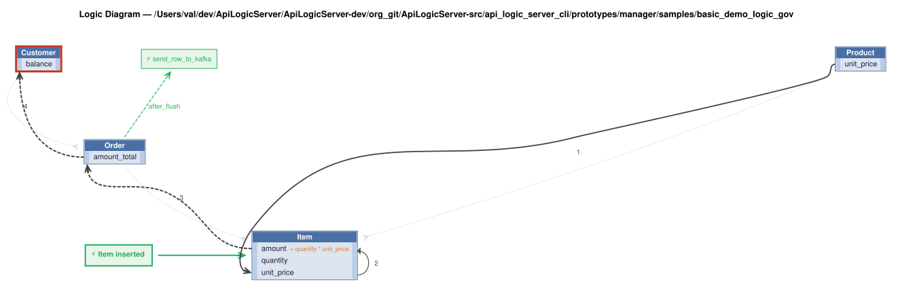

<!--
title: Welcome - see end for instructions to hide this
Description: Instant mcp-enabled microservices, standard projects, declarative business logic
Source: docs/Manager-readme
version info: 17.03.08 (07/22/2026)
do_process_code_block_titles: True
Used: Manager Readme (via copy_md())
demo_customs: Customs-readme
demo_customs_surtax: Customs-readme-surtax
demo_kafka: Sample-Integration
demo_allo: Sample_Allo_Dept_GL_readme
demo_ai_rules: Sample-ai-rules
demo_mcp_send: Sample-Basic-Demo-MCP-Send-Email
demo_emp_types: Sample-Types
demo_eai: Sample-Basic-EAI
demo_vibe: Sample-Basic-Demo-Vibe
demo_copilot_mcp_discovery: Sample-ai-mcp
basic_demo: Sample-Basic-Demo
codespaces_patch: |
  create_codespaces_mgr.py injects a Codespaces-only browser note immediately after
  the "## 🚀 First Time Here?" heading (sentinel: do not rename that heading without
  updating the matching logic in create_codespaces_mgr.py). The note warns Safari users to
  switch to Chrome/Edge. This avoids forking the README for Codespaces.
-->
<style>
  -typeset h1,
  -content__button {
    display: none;
  }
</style>

# Welcome to GenAI-Logic

### Governed Executable Requirements

<!-- LOCAL-MGR-ONLY-START -->
Describe it, and get a real system:
<!-- LOCAL-MGR-ONLY-END -->
<!-- CODESPACES-ONLY-START
Describe it, and get a real system (see [codespaces setup here](system/ApiLogicServer-Internal-Dev/setup.gif)):
CODESPACES-ONLY-END -->

<details markdown>
<summary>For <strong>today:</strong> a working API, Admin App, and governed logic, <strong>built from a prompt</strong></summary>

<br>Leverage AI for what it's great at — database design, data mapping, and more. Start from a prompt alone and AI designs the database too, or point it at your existing database and skip straight to the logic. Either way, your AI assistant reads whatever you already have — plain English, Gherkin, pseudocode — and hands business logic off as rules, not code.

</details>

&nbsp;

<details markdown>
<summary>And it <strong>fits</strong>: uses your existing org, technology, and practices</summary>

<br>What comes out the other end is exactly what you already run:

1. **A business user can drive it, in the requirements format they already write** — plain English, Gherkin, pseudocode, even actual regulation text; no database design, screen painting, or scripting to learn.
2. **Standard IDE, standard language** — a project in the IDE and language you already use, ready to extend.
3. **Standard deploy** — a standard container; cloud or on-prem, no additional charges.
4. **Standard enterprise infrastructure** — pluggable security (SQL or Keycloak), full REST API, event/messaging integration (Kafka, webhooks) — built in, not bolted on, same as any other enterprise system.

</details>

&nbsp;

<details markdown>
<summary>And for <strong>tomorrow</strong>: systems <strong><em>governed</em></strong> by rules you can <strong>Read, Trust, and Maintain</strong></summary>

<br>**The key idea:** that split — AI for executable intent, declarative rules for governance — is the whole point. Here's what "governed" means in practice:

- **Read** — [5 rules](samples/basic_demo_logic_gov/logic/logic_discovery/place_order/check_credit.py), not [~200 lines of code](samples/basic_demo_logic_gov/logic/procedural/credit_service.py). A rule you can point to and know what it does, at a glance.
- **Trust** — those rules run at **one commit point**, no matter which path the transaction came in on — API, MCP, agent, Kafka. **No bypass.**
- **Maintain** — add a rule anywhere, and the engine resolves dependency order automatically. No untangling existing code to find where it belongs.

And you're not alone throughout: ask your AI assistant anything — architecture, rules, debugging, deployment, or how the system works.

</details>

<br>

This is the start page for the [GenAI-Logic Manager](https://apilogicserver.github.io/Docs/Manager) — where you manage projects, create notes and resources, etc.

&nbsp;

## 🤖 AI Assistance

<!-- LOCAL-MGR-ONLY-START -->
We get good results with **Claude Sonnet 5** — any AI assistant works (Claude Code, GitHub Copilot, etc.), but pick Sonnet 5 if you can. Then say:
<!-- LOCAL-MGR-ONLY-END -->
<!-- CODESPACES-ONLY-START
We get good results with **Claude Sonnet 5**. In this environment, GitHub Copilot is what's available — pick Sonnet 5 if you can. Then say:
CODESPACES-ONLY-END -->

```
Please load `.github/.copilot-instructions.md`.
```

<details markdown>
<summary>Detailed steps, what to expect, model/cost info, and why we recommend a frontier model</summary>

&nbsp;

> **See "Quota reached" in the status bar?** Safe to ignore — it doesn't mean anything is broken or unavailable.

> **This takes 20-30 seconds.** You'll see "Working" the whole time with no other feedback — that's normal, not stuck.

&nbsp;

<!-- LOCAL-MGR-ONLY-START -->
Any AI assistant works here — Claude Code, the Claude Code plugin, GitHub Copilot, etc. The steps below are for **GitHub Copilot in VS Code**; if you're using something else, the same idea applies, just paste the command above into whatever chat/agent interface you have open.
<!-- LOCAL-MGR-ONLY-END -->

**Step by step:**
1. Open the **Chat** tab in the right-hand panel.
2. Click the model pill at the bottom of the chat box (shows **Auto** by default).
3. **If Claude Sonnet 5 appears in the list:** select it.
   **If it's not there:** click **Other Models** near the bottom of that same list — this expands the list to show more models, including Claude Sonnet 5. Still not there (Free/Student plans — see below): leave it on **Auto**.
4. Type the command above and press Enter.


&nbsp;

<details markdown>
<summary>&emsp;&emsp;Which model, and what does this cost?</summary>

<br>

**Model selection is plan-dependent** (GitHub changed this June 2026):
- **Copilot Free / Student:** Chat and Agent mode only run in **Auto** — GitHub picks the model for you from a pool that includes Claude Sonnet 4.6 among others. You cannot force Claude specifically.
- **Copilot Pro ($10/mo) and above:** Manual model selection is available — but Claude Sonnet 5 may not appear until you click **Other Models** to expand the list (see step 3 above).

**Cost, in practice:** All plans (including Free) include a monthly allotment of GitHub AI Credits for chat/agent usage — the Free plan's is small but real; Pro includes about $15/month worth. Two things keep a GenAI-Logic project cheap relative to that allotment:
- The scaffold — the API, Admin App, and database models — is generated by template, **not** by AI. The AI is only doing the design/logic work (schema decisions, rule translation, Q&A) — a small fraction of what you actually get.
- If you exceed your monthly credits, GitHub does not silently charge you — on individual plans you're prompted to either wait for the next cycle or opt in to paid overage; it does not happen by accident.

For current figures, see [GitHub Copilot plans & pricing](https://github.com/features/copilot/plans).

</details>

&nbsp;

<details markdown>
<summary>&emsp;&emsp;Why we recommend a frontier model</summary>

<br>

The mechanical parts of this system — folder structure, rule syntax, provenance files — come through reliably even on lighter/auto-selected models. What separates frontier models (Claude Sonnet 4.6/5, GPT-5, etc.) is judgment on subtler cases: patterns documented in the training material that require reasoning about *why* a naive implementation is wrong, not just matching a syntax example. In testing, a smaller auto-selected model built a project correctly, then wrote a real correctness bug into a follow-up rule that our own docs specifically call out as an easy mistake — and reported it as verified when it wasn't.

For exploring the product, any available model is fine. For real logic you intend to keep, pick a frontier model explicitly when your plan allows it — and review the AI's output either way, the same as you would any other engineer's.

</details>

For more information, see [AI-Enabled Projects](https://apilogicserver.github.io/Docs/Project-AI-Enabled/) or [click here](https://apilogicserver.github.io/Docs/Manager-readme/).

</details>

&nbsp;

## 🚀 First Time Here?
<!-- CODESPACES-INSERT-POINT: create_codespaces_mgr.py injects browser note here — do not rename this heading -->

<details markdown>
<summary>The Ideal — executable business prompts, held to an enterprise standard</summary>

<br>

<!-- LOCAL-MGR-ONLY-START -->
> **Heads up:** you're about to switch to the AI chat panel, and back. VS Code's preview forgets which sections below are open/closed when you return — so **drag this preview tab's icon out into its own window** first (once), and it won't happen again.
<!-- LOCAL-MGR-ONLY-END -->
<!-- CODESPACES-ONLY-START
> **Heads up:** you're about to switch to the AI chat panel, and back. The browser tab showing this README forgets which sections below are open/closed when you return — so **open the README on GitHub** ([ApiLogicServer/codespaces_mgr](https://github.com/ApiLogicServer/codespaces_mgr)) **in a split-view tab** first (once), and it won't happen again.

<details markdown>
<summary>&emsp;&emsp;Show me how</summary>

<br>Right-click the GitHub README tab and choose **New Split View with Current Tab**:


You'll end up with the Codespace on one side and the README on the other — switch between AI chat and README without losing your place:


</details>
CODESPACES-ONLY-END -->

<br>Say this to your AI assistant (allow several minutes):

```
Create basic_demo from samples/dbs/basic_demo.sqlite.

On Placing Orders, Check Credit:    
    1. The Customer's balance is less than the credit limit
    2. The Customer's balance is the sum of the Order amount_total where date_shipped is null
    3. The Order's amount_total is the sum of the Item amount
    4. The Item amount is the quantity * unit_price
    5. The Item unit_price is copied from the Product unit_price

Use case: App Integration
    1. Publish the Order to Kafka topic 'order_shipping' when the date_shipped is not None.
```

<details markdown>
<summary>Starting from a new database instead?</summary>

&nbsp;

The prompt above starts from an existing database — the common real-world case, and much faster (no schema design step). You *could* have AI design a new database from scratch instead:

<br>Say this to your AI assistant (allow several minutes):

```
Create basic_demo from samples/prompts/genai_demo.prompt
```

</details>

&nbsp;

<!-- CODESPACES-ONLY-START
> **During project creation, a browser tab may auto-open (or offer to)** showing it running — safe to decline or dismiss.
CODESPACES-ONLY-END -->

The goal here isn't a demo — it's an **enterprise-class** system you can trust and maintain. That's exactly what gets tested next.

</details>

&nbsp;

<details markdown>
<summary>AI is great — but logic-as-code is hard to Read, Trust, and Maintain — here's why</summary>

<br>AI is genuinely good at UI, data mapping, boilerplate, etc — no argument there. **Business logic is the exception.**

On a real system, business logic routinely consumes **half the development and debugging effort** — and it's the half that determines whether the system is actually correct.

Left unguided, any AI assistant — including the one that just built basic_demo for you — would default to procedural code for logic like this. Ask it directly, and you get three problems:

<details markdown>
<summary>&emsp;&emsp;<strong>Not readable</strong> — unreadable at scale is ungovernable at scale</summary>

<br>[procedural/credit_service.py](samples/basic_demo_logic_gov/logic/procedural/credit_service.py) — ~200 lines for those same 5 requirements. Open it and judge for yourself. Now picture a real system: 10-20X the requirements of this example, and proportionally more procedural code to match. Nobody can audit that at a glance — not the next developer, not compliance, not you in six months. At that scale, an auditor can't read it all — they can only sample, and hope.

</details>

&nbsp;

<details markdown>
<summary>&emsp;&emsp;<strong>Not trustworthy</strong> — the procedural version shipped 2 real bugs</summary>

<br>Found only by specifically testing what happens when a row is reparented to a new owner: [the A/B test](samples/basic_demo_logic_gov/logic/procedural/declarative-vs-procedural-comparison.md). Root cause: **path confusion** — procedural code must enumerate every change path (insert, update, delete, reparent) by hand, and it's easy to miss one.

There's a structural problem underneath the bugs, too: **AI pattern-matches dependencies, it doesn't compute them** — so the odds of a miss go up as the system grows. [More detail →](samples/basic_demo_logic_gov/logic/procedural/declarative-vs-procedural-comparison.md#the-underlying-problem-dependency-graphs)

</details>

&nbsp;

<details markdown>
<summary>&emsp;&emsp;<strong>Not maintainable</strong> — the cost doesn't scale with the fix</summary>

<br>Hand-editing 200 generated lines isn't a real option — nobody reliably patches the output of a code generator, any more than you'd hand-patch a compiler's output. That leaves one path: **change the prompt and regenerate.**

But that doesn't dodge the risk, it repeats it — the AI re-derives everything from scratch, with no guarantee it reproduces the paths that already worked. Adding one small constraint — a one-line change — means regenerating and re-reviewing the whole system, every time, at every table. On a real system that's not a quick edit. It's hours, real AI cost, and a fresh chance at a new bug — to make a change that should have taken a minute.

</details>

&nbsp;

That's not (only) a capability gap — it's a representation problem: procedural code doesn't carry an explicit dependency graph, so nothing short of building one — inside the AI's process or outside it — closes this gap. A rules engine builds that graph explicitly, once, and checks it. That's the difference this document shows.

**We're deeply impressed with AI — this is about closing the one gap it has: logic.** That's next.

</details>

&nbsp;

<details markdown>
<summary>AI-driven rules are easy to Read, Trust, and Maintain — here's how</summary>

&nbsp;

<details markdown>
<summary>&emsp;&emsp;1. Run it — see the API and logic operate</summary>

<br>You've probably used AI to generate code before — so what's different here?

**Difference 1: it produces models, not code.** Run the basic_demo prompt above, and instead of a pile of procedural code, you get artifacts that declare structure or policy rather than procedure — same 5 requirements, same AI:

1. **Data model** — `database/models.py`
2. **Full JSON:API** — Swagger, pagination, optimistic locking (`api/expose_api_models.py` — 52 lines, zero per-table code)
3. **Admin App** — multi-table, with navigations and lookups (`ui/admin/admin.yaml` — simple YAML, not HTML/JS)
4. **Business logic** — [logic_discovery/place_order/check_credit.py](samples/basic_demo_logic_gov/logic/logic_discovery/place_order/check_credit.py) — 5 rules (~40X less), same requirements, same AI, 0 bugs

**Difference 2: the logic itself is declarative.** 5 lines, intent still clear — not ~200 lines of procedural frankencode. That's what declarative buys — more on that below.

Each small, readable, yours. Plain Python — standard tooling applies. Security is opt-in, not default — bootstrap RBAC anytime with `genai-logic add-auth`.

**See it running:** Press F5 using "API Logic Server Run (run project from manager)", and open the Admin App. Explore the API via Swagger, browse the data, and follow the relationships — all auto-generated from the data model.

Now trigger it: open an **unshipped** Order for Alice, edit the Widget item:

```
Change the quantity to a very large number. Save.
```

<details markdown>
<summary>&emsp;&emsp;Detail Instructions -- Screen Shots</summary>

<br>Alter the quantity for an *unshipped* item:

1. Show the Customer List
2. Show the first Customer
3. Show first Order
4. Edit the Item
5. Set the quantity


</details>

<br>

The save fails — note the dialog. Why? Let's look.

</details>

&nbsp;

<details markdown>
<summary>&emsp;&emsp;2. Debug it — standard logging, standard debugger</summary>

<br>No new tools required. The rule chain that just fired is in the log — plain text, readable in your terminal or editor: [sample trace](samples/basic_demo_logic_gov/logs/als-sample.log). A live run writes the same thing to the standard log, `logs/als.log`.

Every rule is a plain Python function or lambda. Set a breakpoint on any `calling=` function or `as_condition=` lambda in your IDE, exactly like you would anywhere else in the codebase — no proprietary debugger, no special UI.


</details>

&nbsp;

<details markdown>
<summary>&emsp;&emsp;3. Iterate — 1 AI prompt adds table, relationship, 2 rules</summary>

<br>Ask your AI assistant for a new rule, in plain English:

```
Customers should not be able to create new orders if they have unresolved past due letters.
```

There was no `Letter` table in the model — the AI adds it, relates it to `Customer`, and declares a `count` + a `constraint`. One sentence creates a schema change and two new rules — automatically integrated with the 5 already there. No need to open `check_credit.py` to find where this belongs, or trace the other rules to check for conflicts.

**A lot just happened here — worth a closer look.**

</details>

&nbsp;

<details markdown>
<summary>&emsp;&emsp;4. Why Rules Are Declarative — automatic calling, automatic ordering</summary>

<br>This iteration — like maintenance generally — was remarkably simple, because **rules are declarative:**

- **No need to call the new logic.** Rules are invoked automatically - regardless of the originating path.  You can **trust** that they'll always run.
- **Order doesn't matter.** Open `check_credit.py` and shuffle the five rules into any order you like. Rerun — still correct. Try that with 200 lines of procedural code.  You can **trust** that they'll run in the right order.
- **You got more than you asked for.** The original requirement said *"On Placing Orders, Check Credit"* — insert time. But the save that failed was an *edit* to an existing order. Nobody wrote an update-time check.

Functions don't behave like that. So why is that?

> **Traditional logic is procedural** — you own *how*: when it's called, and in what order. **Declarative logic — rules** — is about *what*, not how: you state the fact, and the system takes responsibility for invocation and ordering. That's why the new rule didn't need to be called, and why order didn't matter.

The next section explores this in detail. Ask your AI assistant — *"What are rules?"* — or keep reading.

</details>

&nbsp;

<details markdown>
<summary>&emsp;&emsp;5. How Declarative Rules Make Logic Easy to Read, Trust, and Maintain</summary>

<br>**Rules** enforce business policy — multi-table derivations, constraints, and actions like messaging. **LogicBank**, the rule engine, hooks SQLAlchemy's commit event to run them on every transaction — authored as plain Python functions in `logic/logic_discovery/`, readable, version-controlled, owned like any other source file.

**How it works:**
1. **At startup** — rules load, and the engine computes their dependency graph once.
2. **At commit** — for each transaction, the engine finds the rules relevant to what changed, and fires them in the right order.

Unlike procedural code, they're **declarative** — solving exactly the three problems raised above (AI great, but hard to Read, Trust, and Maintain):

| Property | What it means | Why it matters |
|---|---|---|
| **Readable** | 5 lines, one per requirement — declared once, e.g. `Customer.balance = sum of unpaid orders` | No archaeology needed to see what it does |
| **Trustworthy** | Rules fire at every commit, from every caller, on every insert *and* edit — you never call them | Can't be forgotten, can't be bypassed |
| **Maintainable** | Dependency order is computed once, automatically — not written into your source file | Add a rule anywhere, it finds its place |

> Think of a **spreadsheet:** `B10 = SUM(B1:B9)` isn't called, it *reacts* — change any input cell, it recalculates. Rules react the same way to changes in what they depend on.

Procedural code is hard to read — so you can't tell whether it's called from every caller, in the right order. That's not a testing gap; it's a representation problem.

> Declarative rules are easy to read — the intent, now rigorous — and with no bypass and automatic ordering.
>
> ***You can read the rules, and trust they are being enforced. Always.***

Full writeup: [declarative/procedural comparison](samples/basic_demo_logic_gov/logic/procedural/declarative-vs-procedural-comparison.md).

&nbsp;

<details markdown>
<summary>&emsp;&emsp;How this works: Context Engineering (CE) + a commit-time rules engine</summary>

<br>Two things have to be true for this to work:

**Step 1 — Context Engineering trains the AI to write rules, not code.** That same AI, left unguided, would have produced the ~200 buggy lines from earlier. Writing rules instead wasn't its own idea — it was told to, in detail, by **Context Engineering** — the same files driving this conversation right now. When you ask for business logic, CE steers the AI toward the *right* rule type (sum vs. count vs. Allocate vs. Request Pattern) for what you actually asked for, instead of letting it default to the procedural code it's seen a million times in training — making rules the default, easy path, not a discipline a team has to maintain by hand.

**Step 2 — the rules engine runs the rules.** Rules aren't called from your code — they're wired into a single SQLAlchemy `before_flush` listener, loaded once at server start as described above. Every write, from any path — API, custom endpoint, Kafka consumer, agent — passes through that one listener before it commits. No bypass — there's no second door.

</details>

&nbsp;

<details markdown>
<summary>&emsp;&emsp;<strong>Governance reports</strong> — logic flow, AI alerts, health check</summary>

<br>Rules you can read is only half of it — the AI is also proactive about what it wants *you* to double-check. Three reports, generated from the running system, not hand-written:

- **[Logic flow diagram](samples/basic_demo_logic_gov/docs/requirements/logic_flow_basic_demo_logic_gov.md)** — NL requirement, dependency diagram, and rule summary, for every rule chain
- **[AI alerts](samples/basic_demo_logic_gov/docs/requirements/ad-libs.md)** — every assumption the AI made beyond the spec, flagged for you to verify, not buried
- **[Health check](samples/basic_demo_logic_gov/docs/requirements/health_check.md)** — rule adoption, dependency-tracking integrity, missing docstrings, across the whole project

A compliance reviewer can check the implementation in minutes, not by reading code. Here's that report for the basic_demo rules you just ran — the same report generates for any project, including the enterprise-scale ones below:



</details>

</details>

</details>

&nbsp;

<details markdown>
<summary>Scaling to the Enterprise — here's how</summary>

&nbsp;

<details markdown>
<summary>&emsp;&emsp;<strong>1. Integrate other enterprise technologies</strong> — EAI, MCP, AI Rules, Custom UIs</summary>

<br>We have extended the governed API and rules engine you just saw with the integration points a real enterprise system needs:

- **Enterprise Integration (EAI)** — the demo above showed ***Publish** the Order to Kafka topic*. For the **subscribe** side, see [samples/basic_demo_eai/readme.md](samples/basic_demo_eai/readme.md): B2B orders from partner systems, via a Custom API or Kafka subscriber, including *lookups* so partners send `"Account": "Alice"` (not internal IDs).

<br>

- **MCP** (Model Context Protocol) — your API is **MCP-discoverable** out of the box (`/.well-known/mcp.json`). Copilot, Claude, or ChatGPT can find the schema and answer natural-language queries against it. There's no discovery layer for you to write — see [samples/basic_demo_ai_rules-supplier/readme_ai_mcp.md](samples/basic_demo_ai_rules-supplier/readme_ai_mcp.md)

<br>

- **AI Rules** — rules that call AI for genuinely judgment-call decisions (e.g. picking a supplier under disrupted shipping lanes). Such AI "proposals" are **governed by the deterministic rules** to ensure results conform to business policy — see [samples/basic_demo_ai_rules-supplier/readme.md](samples/basic_demo_ai_rules-supplier/readme.md)

<br>

- **Custom UIs, safely** — Vibe tools (Cursor, v0, etc.) generate the UI; it's built against the same governed API, so the logic runs the same regardless of what's calling it. Quick-start a React app from your (possibly customized) admin app: `Create a new react app named my-app-name from ui/admin/admin.yaml`.

</details>

&nbsp;

<details markdown>
<summary>&emsp;&emsp;<strong>2. The Logic Architecture</strong> — any requirement format, one commit point (no bypass)</summary>

<br>The **Commit No Bypass** gate ensures these additional transaction sources — MCP, AI Rules, Custom UIs, and EAI's own Kafka producers and consumers — all converge on the same enforcement point.


That's the architecture: two funnels, converging on one engine, at the **same commit point. No bypass.**

* **Design Funnel:** all requirement formats — NL, Gherkin, pseudocode, formulas

* **Runtime Funnel:** all transaction sources — APIs, messages, MCP, agents, workflows

    * **This architecture is future-proofed:** a new integration tomorrow (another broker, custom API, an MCP tool call) inherits every rule already declared, automatically — because rules operate at the ORM layer, the same `before_flush` listener from above. Nothing to re-wire, nothing to remember to call.

</details>

&nbsp;

<details open markdown>
<summary>&emsp;&emsp;<strong>3. This is what makes Executable Requirements possible</strong> — at enterprise class</summary>

<br>We now have a comprehensive tool set (AI, rules for governance, enterprise integration services). These enable **Governed Enterprise Systems — from prompts**, in formats you already know, not a new syntax to learn:

- **Budget allocation system:**

    - [The prompt](samples/prompts/allocation.prompt.md) ([↗](https://github.com/ApiLogicServer/allocate_dept_account_demo/blob/main/docs/requirements/prompt.md)) that built it.
    - **Trust:** read [the resultant rules](samples/allocate_dept_account_demo/logic/logic_discovery/charge_distribution.py) ([↗](https://github.com/ApiLogicServer/allocate_dept_account_demo/blob/main/logic/logic_discovery/charge_distribution.py)) (or see the [logic diagram](samples/allocate_dept_account_demo/docs/requirements/logic_diagrams/logic_diagram.svg) ([↗](https://github.com/ApiLogicServer/allocate_dept_account_demo/blob/main/docs/requirements/logic_diagrams/logic_diagram.svg))) — they'll monitor every transaction.
    - **Verify:** AI read those same rules and wrote a [Behave test suite](samples/allocate_dept_account_demo/test/api_logic_server_behave/features/charge_distribution.feature) ([↗](https://github.com/ApiLogicServer/allocate_dept_account_demo/blob/main/test/api_logic_server_behave/features/charge_distribution.feature)) from them — no test written by hand. Running it produces an automated [Logic Report](samples/allocate_dept_account_demo/test/api_logic_server_behave/reports/Behave%20Logic%20Report.md) ([↗](https://github.com/ApiLogicServer/allocate_dept_account_demo/blob/main/test/api_logic_server_behave/reports/Behave%20Logic%20Report.md)) — 7 scenarios, 37 steps, all passing, with the rule chain's execution trace on every scenario. Not a hand-written report — regenerate it any time the rules change, and it's still true.

- **Canadian CBSA duty-calculation system:**

    - Use **actual regulations** — [this prompt](samples/demo_customs_surtax/readme.md) ([↗](https://github.com/ApiLogicServer/demo_customs_surtax/blob/main/docs/requirements/prompt.md)) reads them straight off the web, producing [these rules](samples/demo_customs_surtax/logic/logic_discovery/cbsa_steel_surtax.py) ([↗](https://github.com/ApiLogicServer/demo_customs_surtax/blob/main/logic/logic_discovery/cbsa_steel_surtax.py)).
    - **Proactive Human-in-the-loop:** the [ad-libs report](samples/demo_customs_surtax/docs/requirements/ad-libs.md) ([↗](https://github.com/ApiLogicServer/demo_customs_surtax/blob/main/docs/requirements/ad-libs.md)) lists every low-confidence decision — so you know exactly where it guessed.

- **Low Value Import Shipments (CLVS)** — screens dangerous goods, using internationally agreed rules:

    - [Business description](samples/demo_customs_clvs/readme.md) ([↗](https://github.com/ApiLogicServer/demo_customs_clvs/blob/main/readme.md)) and [actual requirements](samples/demo_customs_clvs/docs/requirements/customs_demo/requirements.md) ([↗](https://github.com/ApiLogicServer/demo_customs_clvs/blob/main/docs/requirements/customs_demo/requirements.md)), expressed in **Gherkin format**.
    - Complex incoming messages need only sample [XML examples](samples/requirements/customs_demo_clvs/docs/requirements/customs_demo/message_formats/demo-01-no-match.xml) ([↗](https://github.com/ApiLogicServer/demo_customs_clvs/blob/main/docs/requirements/customs_demo/message_formats/demo-01-no-match.xml)).
    - Rules make it **auditable** — logistics firm participation is *subject to audit*. Failure would mean hiring 100+ additional staff, an *8-figure exposure*. Auditors can [read the rules](samples/demo_customs_clvs/logic/logic_discovery/clvs_eligibility.py) [↗](https://github.com/ApiLogicServer/demo_customs_clvs/blob/main/logic/logic_discovery/clvs_eligibility.py), and trust they will be enforced - not sample and hope.  ([Full writeup →](https://apilogicserver.github.io/Docs/Tech-Ent-AI))

**Unburdened from logic, AI is free to do what it's great at** — reading any of these requirement formats and translating intent — while rules turn that intent into real, governed systems.

</details>

</details>

&nbsp;

<details markdown>
<summary>Go deeper — guided tour, plus your AI as on-call support and consulting</summary>

&nbsp;

<details markdown>
<summary>&emsp;&emsp;Guided tour — create basic_demo</summary>

<br>**Create basic_demo** (auto-opens with guided tour option):
```bash
genai-logic create --project_name=basic_demo --db_url=sqlite:///samples/dbs/basic_demo.sqlite
```

**Inside the project:** Say to your AI assistant: *"Guide me through basic_demo"* (30-45 min hands-on tour).

> Teaches API creation, declarative rules, security, and Python customization. Fail-safe — scripts ensure no coding errors.

</details>

&nbsp;

<details markdown>
<summary>&emsp;&emsp;Your AI as on-call consultant — ask it anything, verify it doesn't just recite</summary>

<br>Same materials, same AI you've been using — it doesn't just write rules, it automates everything above and helps when things break: EAI's 2-message Kafka pattern, the AI/Request Pattern wiring, Executable Requirements' pre-coding schema assessment — all documented training material (`docs/training/*`) the AI reads *before* writing your code, not generic knowledge it's guessing from. Ask "what are rules?" or "how do rules work?" — or, without an AI handy, just read [samples/basic_demo_logic_gov/logic/readme_logic.md](samples/basic_demo_logic_gov/logic/readme_logic.md) — same material.

Ask it your own questions directly:
- Is this really infrastructure, like a database?
- Is this a black box? How do I debug a rule chain?
- Can I verify this with tests, not just take it on faith?
- What did the AI decide on its own that I should double-check? (the ad-libs report)
- Can I see a governance/health report for this project's logic?
- What does it take to migrate off this if we ever wanted to?
- How does this perform at scale?
- What does this integrate with — APIs, workflows, agents, MCP?
- Does this work with my existing database?

More background: [Eval Guide](https://apilogicserver.github.io/Docs/Eval/).

Put together: once the AI knows how the system works, it doesn't just generate rules instead of code — it helps you debug them, and helps you understand them. A design assistant, not just a coding assistant.

<details markdown>
<summary>&emsp;&emsp;&emsp;&emsp;The AI was trained on this material — can you trust its answers?</summary>

<br>Don't take them on faith. Ask the same question a different way, or ask something not covered here — like where this architecture breaks down. If it just recites the same lines back, you've caught it. If it reasons, that's the test passing.

</details>

</details>

</details>

&nbsp;

&nbsp;

## 📚 Build It Yourself — Demo Catalog

The section above showed you pre-built samples to browse. These are the same use cases, but as commands you run yourself — paste one into your AI assistant and it builds that project for you, live.

> Tip: every project is AI-enabled — once it's built, ask your AI assistant how it works

&nbsp;

## 1. Enterprise-Class Systems From Requirements

Each of these builds a complete system from a single prompt or command — 💬 = say it to your AI assistant, › = run in a terminal:


| Use Case | 💬 Say to your AI, or › run | What You'll Learn |
|----------|---------|-------------------|
| **[Allocation with AI Rules](samples/allocate_dept_account_demo/docs/requirements/logic_flow_allocate_dept_account_demo.md)** <br> demo_allo_dept_gl | 💬 create demo_allo_dept_gl from samples/prompts/allocation.prompt.md <br> *or* <br> › genai-logic create --project_name=demo_allo_dept_gl --db_url=sqlite:///samples/dbs/starter.sqlite | - [Cascade Allocation (Costs to Depts/GL)](https://apilogicserver.github.io/Docs/Sample_Allo_Dept_GL_full) <br> - AI Rules for fuzzy match to project |
| **[Customs CLVS](samples/requirements/customs_demo_clvs/docs/requirements/customs_demo/requirements.md)** <br> demo_customs_clvs | › genai-logic create  --project_name=demo_customs_clvs --db_url=sqlite:///samples/requirements/customs_demo_clvs/database/customs.sqlite | - Governed Business Systems<br> - EAI (using XML), textual requirements |
| **[Customs Surtax](samples/prompts/customs_cbsa.prompt.md)** <br> demo_customs_surtax | 💬 create project demo_customs_surtax from samples/prompts/customs_cbsa.prompt.md | - New Business System from Regulations |

&nbsp;

> **Running a cloned project?** F5 won't work until the venv is set up — see [Project-Env](https://apilogicserver.github.io/Docs/Project-Env/) for options (`genai-logic run`, symlink, or local venv).

&nbsp;

## 2. Enterprise Technology Demos

Each of these builds a complete system from a single prompt or command — 💬 = say it to your AI assistant, › = run in a terminal:


| Use Case | 💬 Say to your AI, or › run | What You'll Learn |
|----------|---------|-------------------|
| **[Use Case 1: AI Rules](samples/basic_demo_ai_rules-supplier/readme.md)**<br> demo_ai_rules_supplier | › genai-logic create --project_name=demo_ai_rules_supplier --db_url=sqlite:///samples/dbs/basic_demo.sqlite | - Use AI Rules (req pattern) to choose Optimal Supplier, per world conditions |
| **[Use Case 2: Governed MCP Server](https://apilogicserver.github.io/Docs/Sample-Basic-Demo-MCP-Send-Email)** <br>demo_mcp_send_email | › genai-logic create --project_name=demo_mcp_send_email --db_url=sqlite:///samples/dbs/basic_demo.sqlite | - Bus Users compose new service to send email to overdue customers, subject to email opt-out rules<br>- Create custom API with NL<br>- Create an email service (req pattern) |
| **[EAI: Enterprise App Integration](samples/basic_demo_eai/readme.md)** <br>demo_eai | › genai-logic create --project_name=demo_eai --db_url=sqlite:///samples/dbs/basic_demo.sqlite | - Executable Requirements<br>- Create custom API with NL<br>- Create Kafka Listener with NL |
| **[Use Case 4: Vibe Dev Backend](https://apilogicserver.github.io/Docs/Sample-Basic-Demo-Vibe)** <br> demo_vibe | › genai-logic create --project_name=demo_vibe --db_url=sqlite:///samples/dbs/basic_demo.sqlite | - UI elements, eg, Cards, Maps, Trees... |
| **[Use Case 5: Business Users](https://www.genai-logic.com/#h.69d2voz8q5r1)** <br> webgenai | See `webgenai/` in this Manager | - Create systems from browser, with logic, sample data and derived attributes |

&nbsp;


## 3. Additional Demos

Advanced examples and specialized patterns:

| Demo | 💬 Say to your AI, or › run | What You'll Learn |
|------|---------|-------------------|
| **Executable Requirements** | See [samples/requirements/readme_reqmts.md](samples/requirements/readme_reqmts.md) | Create from Gherkin requirements <br>implement reqs <path> |
| **New system from prompt** | › genai-logic genai --using=samples/prompts/genai_demo.prompt | Create systems from prompt<br>Like WebGenAI, but from IDE |
| **Coding Samples** | › code samples/nw_sample | Useful code examples<br>Search: `#als` |
| **MCP Discovery** <br> demo_copilot_mcp_discovery | › genai-logic create --project_name=demo_copilot_mcp_discovery --db_url=sqlite:///samples/dbs/basic_demo.sqlite | test rules via Copilot access to MCP Server | 


**Copy Snippets for venv:**
```bash title="Copy Snippets for venv"
source venv/bin/activate       # windows: venv\Scripts\activate
source ../venv/bin/activate    # windows: ../venv\Scripts\activate
python -m venv venv            # may require python3 -m venv venv
```

&nbsp;


## Procedures

<br>

<details markdown>

<summary> Detail Procedures</summary>

<br>Specific procedures for running the demo are here, so they do not interrupt the conceptual discussion above.

You can use either VSCode or Pycharm.


**1. Establish your Virtual Environment**

Python employs a virtual environment for project-specific dependencies.

**If the project was created in this Manager** (or opened from it), the venv is already configured — just press F5.

**If the project was cloned from git**, choose one of:

* **Quickest (no VS Code setup):** from the Manager terminal (or, use Code Assistant):
    ```bash
    genai-logic run --project-name=<project-name>
    ```

* **Mac/Linux with F5:** create a symlink to the Manager venv:
    ```bash
    cd <project>
    sh venv_setup/venv.sh symlink
    # reload VS Code window, then F5
    ```

* **Any platform:** create a local venv:
    ```bash
    sh venv_setup/venv.sh go        # mac/linux
    .\venv_setup\venv.ps1 go        # windows
    ```

For PyCharm, you will get a dialog requesting to create the `venv`; say yes.

See [Project-Env](https://apilogicserver.github.io/Docs/Project-Env/) for more information.

&nbsp;

**2. Start and Stop the Server**

Both IDEs provide Run Configurations to start programs.  These are pre-built by `ApiLogicServer create`.

For VSCode, start the Server with F5, Stop with Shift-F5 or the red stop button.

For PyCharm, start the server with CTL-D, Stop with red stop button.

&nbsp;

**3. Entering a new Order**

To enter a new Order:

1. Click `Customer 1`

2. Click `+ ADD NEW ORDER`

3. Set `Notes` to "hurry", and press `SAVE AND SHOW`

4. Click `+ ADD NEW ITEM`

5. Enter Quantity 1, lookup "Product 1", and click `SAVE AND ADD ANOTHER`

6. Enter Quantity 2000, lookup "Product 2", and click `SAVE`

7. Observe the constraint error, triggered by rollups from the `Item` to the `Order` and `Customer`

8. Correct the quantity to 2, and click `Save`


**4. Update the Order**

To explore our new logic for green products:

1. Access the previous order, and `ADD NEW ITEM`

2. Enter quantity 11, lookup product `Green`, and click `Save`.

</details>

&nbsp;

### Pre-created Samples

<details markdown>

<summary> Explore Pre-created Samples</summary>

<br>The `samples` folder has pre-created important projects you will want to review at some point (Important: look for **readme files**):

* [nw_sample_nocust](https://apilogicserver.github.io/Docs/Tutorial/) - northwind (customers, orders...) database

    * This reflects the results you can expect with your own databases

* [nw_sample](https://apilogicserver.github.io/Docs/Sample-Database/) - same database, but with ***with [customizations](https://apilogicserver.github.io/Docs/IDE-Customize/) added***.  It's a great resource for exploring how to customize your projects.

    * Hint: use your IDE to search for `#als`

* [tutorial](https://apilogicserver.github.io/Docs/Tutorial/) - short (~30 min) walk-through of using API Logic Server using the northwind (customers, orders...) database

</br>

<details markdown>

<summary>You can always re-create the samples</summary>

<br>Re-create them as follows:

1. Open a terminal window (**Terminal > New Terminal**), and paste the following CLI command:

```bash
ApiLogicServer create --project-name=samples/tutorial --db-url=
ApiLogicServer create --project-name=samples/nw_sample --db-url=nw+
ApiLogicServer create --project-name=samples/nw_sample_nocust --db-url=nw
```
</details>


</details>

&nbsp;

### Hiding Front Matter

<details markdown>

<summary>Hiding Front Matter </summary>

To hide the YAML or JSON front matter (the metadata block at the top of your markdown files) in the built-in VS Code markdown preview, you can adjust your editor settings:

1. Open the Settings panel using Ctrl + , (Windows/Linux) or Cmd + , (macOS).
2. Search for the following term: `markdown.previewFrontMatter`.
3. Change the dropdown value from show to `hide`.

The preview will now automatically strip the front matter from the rendered view.


</details>

&nbsp;

### Appendix

<details markdown>

<summary>Appendix</summary>

#### Recurrent Errors on Complex Business Logic Dependencies

The A/B test's two bugs came from AI writing *procedural logic* and missing the reparenting case — old parent left stale when a foreign key is reassigned. Separately, AI was also asked to generate the *Behave test suite* for `basic_demo_logic_gov` directly from the declared rules — a credible, well-structured result, reactive and API-driven, comparable in shape to test infrastructure that took weeks to write by hand for other sample projects in this repo. But it has the same gap: no scenario reassigns an existing order's customer or an existing item's product. Same AI, same underlying reasoning pattern, two different generative tasks (write the logic, write the tests for the logic) — one recurring miss.

That's not a knock on either result — both are genuinely useful starting points. It's evidence for the underlying claim: AI reasons locally, case by case, not by systematically enumerating a dependency graph — and that blind spot doesn't go away because you ask it to "be careful about dependencies" in a different task. It shows up again. **This is exactly what LogicBank takes off the table** — not just the reparenting case, but the entire category: every change path (insert, update, delete, and their combinations with every foreign key and conditional aggregate), across every use case, from every source (API, message, MCP, agent). Not because the rules are written more carefully, but because the engine derives the paths structurally — there's no enumeration step left for anyone, human or AI, to get wrong.

#### A Proven Technology

The 40X figure isn't a one-off — it's consistent with two decades of production measurement on a predecessor system (Versata, 1995-2010: 94-99% of logic automated by rules, typically ~97%, across several dozen systems). The remaining 3-6% is exactly the hand-written event code the guard below governs — most of a real system falls inside the declarative vocabulary, not outside it. This is the architect's own measurement, not an independently audited figure — treat it as a strong internal data point, not third-party verification. [Full history →](https://apilogicserver.github.io/Docs/Tech-Proven/)

#### Not a RETE Engine

Purpose-built for transaction processing, not inference/decision logic. [Why this matters →](https://apilogicserver.github.io/Docs/FAQ-RETE/)

#### Events and No Bypass

Hand-written event code can reopen the bug class — if a `row_event`/`commit_row_event` mutates a row directly, that value skips derivation, cascades, and constraints entirely. But this isn't a silent hole: the engine **refuses to start** if it detects a mutating event without an explicit `allow_row_mutation=True` override. The safe alternative (`early_row_event`, or `logic_row.insert()`) gets full rule processing automatically. Net effect: the escape hatch is closed by default, and every place it's deliberately opened is a single `grep` away. [Details →](https://apilogicserver.github.io/Docs/Logic-Type-Events/#events-must-not-mutate-row)

</details>