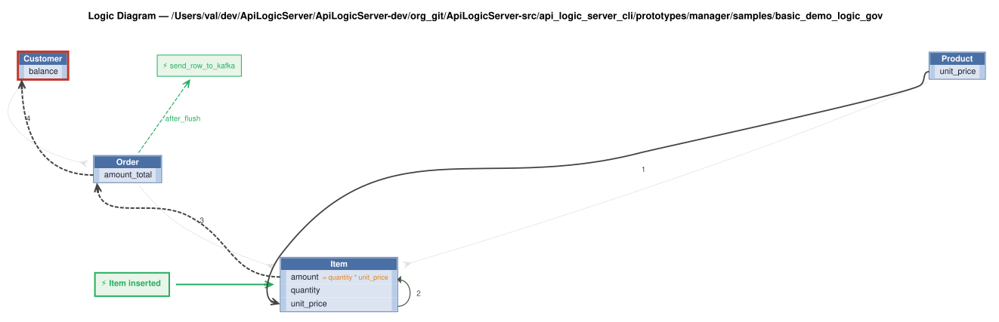
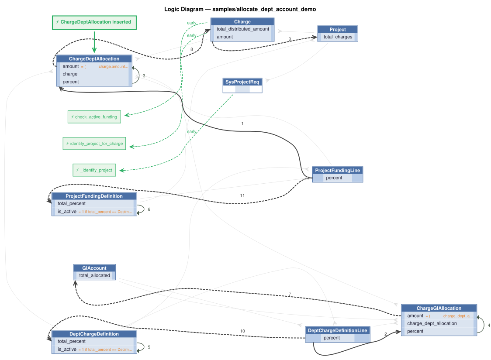
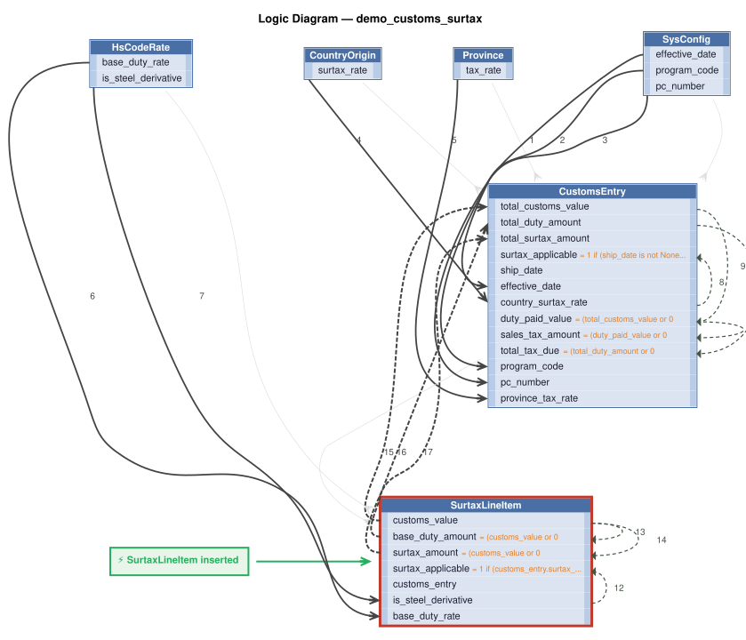

<!--
title: Welcome - see end for instructions to hide this
Description: Instant mcp-enabled microservices, standard projects, declarative business logic
Source: docs/Manager-readme
version info: 17.03.08 (07/22/2026)
do_process_code_block_titles: True
Used: Manager Readme (via copy_md())
demo_customs_clvs: Customs-clvs-readme
demo_customs_surtax: Customs-readme-surtax
demo_kafka: Sample-Integration
demo_allo: Sample_Allo_Dept_GL_readme
demo_ai_rules: Sample-ai-rules
demo_mcp_send: Sample-Basic-Demo-MCP-Send-Email
demo_emp_types: Sample-Types
demo_eai: Sample-Basic-EAI
demo_vibe: Sample-Basic-Demo-Vibe
demo_copilot_mcp_discovery: Sample-ai-mcp
basic_demo: Sample-Basic-Demo
codespaces_patch: |
  create_codespaces_mgr.py injects a Codespaces-only browser note immediately after
  the "## 🚀 First Time Here?" heading (sentinel: do not rename that heading without
  updating the matching logic in create_codespaces_mgr.py). The note warns Safari users to
  switch to Chrome/Edge. This avoids forking the README for Codespaces.
-->
<style>
  -typeset h1,
  -content__button {
    display: none;
  }
</style>

# Welcome to GenAI-Logic

GenAI-Logic turns your requirements into enterprise-class database transaction systems, **governed** by **no-bypass rules** that you can read, trust and maintain.

It reads whatever form your requirements are already in — **plain English, Gherkin, actual regulation text** — or, you can request an **interview** to discover the requirements.

And it **fits what you already use**: your methodology, standard tools, and shared artifacts, **fostering collaboration** between Business Users and Developers.

This is the start page for the [GenAI-Logic Manager](https://apilogicserver.github.io/Docs/Manager) — where you manage projects, create notes and resources, etc.  It's also your learnng hub.
<!-- CODESPACES-ONLY-START
(see [codespaces setup here](system/ApiLogicServer-Internal-Dev/setup.gif))
CODESPACES-ONLY-END -->

<details markdown>
<summary><strong>Say "hi" to your coding assistant</strong> — click to see important notes on models</summary>

<br>Using a lighter or auto-selected model? Fine for exploring — for real logic you intend to keep, pick a frontier model (Claude Sonnet 5, Gemini 3 Pro, GPT-5, etc.) if your plan allows it, and review the AI's output either way, the same as you would any other engineer's.

*Why this matters: [AI-Enabled Projects](https://apilogicserver.github.io/Docs/Project-AI-Enabled/).*

</details>

&nbsp;

## 🚀 First Time Here?
<!-- CODESPACES-INSERT-POINT: create_codespaces_mgr.py injects browser note here — do not rename this heading -->

<details markdown>
<summary>The Ideal — executable business prompts, held to an enterprise standard</summary>

<br>

**Widespread agreement on governance.** It's a [standing CIO concern](https://www.nascio.org/resource/state-cio-top-ten-policy-and-technology-priorities-for-2026/) — AI took the #1 spot in NASCIO's 2026 survey of state CIOs, and governance is the first concern NASCIO lists under it.

**How do we get the speed and simplicity of AI — with the governance enterprises require?**

Everyone who's had AI build a system hits the same wall afterward: *what have I actually got?* The developer can't be sure what it does when something changes. QA doesn't know what to test. The business can't say what policy it's really enforcing — and the auditor can't certify what nobody can read. Requirements are, and should be, incomplete. Code is complete but unreadable at scale.

**The missing artifact is spreadsheet-like rules.** *Balance = sum of unshipped orders. Balance must not exceed credit limit.* One line per requirement, readable by anyone who's ever read a spreadsheet. And like a spreadsheet, they *react*: change anything, every dependent value recalculates — automatically, on every path, nothing to forget. That's why they're trustworthy, not just readable.

That's governance by architecture, not process: logic everyone can read, and trust that the engine enforces.

Many assume AI will eventually get good enough that the prompt becomes the system of record, and code is just compiler output nobody reads. We hope so — but even then, governance still needs something you can read and check. Spreadsheet-like rules are that thing, regardless of which model wrote them.

Watch it live below: the save that fails in a moment is governance in action.

Paste these **requirements** into your AI assistant (allow several minutes):

```
Create basic_demo from samples/dbs/basic_demo.sqlite.

On Placing Orders, Check Credit:    
    1. The Customer's balance is less than the credit limit
    2. The Customer's balance is the sum of the unshipped Order amount_total
    3. The Order's amount_total is the sum of the Item amount
    4. The Item amount is the quantity * unit_price
    5. The Item unit_price is copied from the Product unit_price

Use case: App Integration
    1. Publish the Order to Kafka topic 'order_shipping' when the date_shipped is not None.
```

<!-- CODESPACES-ONLY-START
> **In a hurry, or want zero AI/model dependency?** Skip the wait — copy the finished result instead:
> ```bash
> cp -r samples/basic_demo_existing_db basic_demo
> ```
> Same prompt, same logic, same rules — [check_credit.py](samples/basic_demo_existing_db/logic/logic_discovery/place_order/check_credit.py) is real, already there. Press F5 and you're looking at a working, governed project in seconds, no AI call required.
CODESPACES-ONLY-END -->

<details markdown>
<summary>The AI turns those <strong>requirements</strong> into five <strong>rules</strong>, one for each — click to see them in your IDE</summary>

<br>

The requirements are the docstring; the rules are the five lines of `declare_logic()`, one per requirement. The file is [check_credit.py](samples/basic_demo_logic_gov/logic/logic_discovery/place_order/check_credit.py).

*Note:* the screenshot words requirement 2 as "…where date_shipped is null"; the prompt above says "…the unshipped Order amount_total". Both produce the same rule: your wording doesn't have to match ours.

</details>

&nbsp;

<details markdown>
<summary>Starting from a new database instead?</summary>

The prompt above starts from an existing database — the common real-world case, and much faster (no schema design step). You *could* have AI design a new database from scratch instead:

<br>Say this to your AI assistant (allow several minutes):

```
Create basic_demo from samples/prompts/genai_demo.prompt
```

</details>

&nbsp;

<!-- CODESPACES-ONLY-START
> **During project creation, a browser tab may auto-open (or offer to)** showing it running — safe to decline or dismiss.
CODESPACES-ONLY-END -->

**See it running:** Press F5 using "API Logic Server Run (run project from manager)", and open the **Admin App**. Explore the **API via Swagger**, browse the data, and follow the relationships — all auto-generated from the data model.

What you're running is a service: an API, an Admin App, and the rules engine, over your database. Callers use the API (or messages, or MCP); the rules fire inside the service, at commit, from Python files in your project.

Now trigger it: open an **unshipped** Order for Alice, edit the Widget item:

```
Change the quantity to a very large number. Save.
```

<details markdown>
<summary>&emsp;&emsp;Detail Instructions -- Screen Shots</summary>

<br>Alter the quantity for an *unshipped* item:

1. Show the Customer List
2. Show the first Customer
3. Show first Order
4. Edit the Item
5. Set the quantity


</details>

<br>

Key take-aways:

* The save fails — note the dialog.  The **dialog is governance in action.**
* **First thing to check: read the rules.** The API and Admin App are mechanical; open `logic/logic_discovery/place_order/check_credit.py` in your project — that's where "is it right?" is decided.
* That's 5 rules — not ~200 lines of code — governing this transaction across four tables. **Not what you'd get if you'd asked AI alone.** Let's explore.

</details>

&nbsp;

<details markdown>
<summary>AI Alone Writes Code That's Hard to Read or Trust — Here's What We Found</summary>

<br>AI is genuinely good at UI, data mapping, boilerplate, etc — we see impressive results. **Business logic is the exception.**

Left unguided, any AI assistant — including the one that just built basic_demo for you — generates a running system from this requirement. On inspection, we found three problems:

<details markdown>
<summary>&emsp;&emsp;<strong>Not readable</strong> — you can't govern what you can't read (5 vs ~200 lines)</summary>

<br>**~200 lines** of procedural code — ***hard to read, intent unclear*:**


Same 5 requirements from the Check Credit prompt in "The Ideal" above — handed to AI with no guidance, it generated this: [procedural/credit_service.py](samples/basic_demo_logic_gov/logic/procedural/credit_service.py) — **~200 lines**. Open it and judge for yourself.

**5 declarative rules — *readable* at a glance:**


[logic_discovery/place_order/check_credit.py](samples/basic_demo_logic_gov/logic/logic_discovery/place_order/check_credit.py) — same 5 requirements, same AI.

~200 lines is a **demo-scale** number — a real system runs 1-2 orders of magnitude more requirements, and proportionally more procedural code to match. That's why **business logic ends up as roughly half the total effort on a real system**. Nobody can audit that at a glance — not the next developer, not compliance, not you in six months. At that scale, an auditor can't read it all — they can only sample, and hope.

</details>

&nbsp;

<details markdown>
<summary>&emsp;&emsp;<strong>Not trustworthy (a)</strong> — subtle reparenting bugs even from a good spec</summary>

<br>The AI's code handled updates, but missed two re-parenting cases:

- **Change an item's product, and the order wasn't re-priced** — the item kept its old price, and the error propagated to the order total and the customer balance.
- **Move an order to another customer, and the old customer's balance stayed stale.**

Found only by specifically testing what happens when a row is reparented to a new owner: [the A/B test](samples/basic_demo_logic_gov/logic/procedural/declarative-vs-procedural-comparison.md). Root cause: **path confusion** — procedural code must enumerate every change path (insert, update, delete, reparent) by hand, and it's easy to miss one.

There's a structural problem underneath the bugs, too: **AI pattern-matches dependencies, it doesn't compute them** — so the odds of a miss go up as the system grows. [More detail →](samples/basic_demo_logic_gov/logic/procedural/declarative-vs-procedural-comparison.md#the-underlying-problem-dependency-graphs)

</details>

&nbsp;

<details markdown>
<summary>&emsp;&emsp;<strong>Not trustworthy (b)</strong> — whole paths silently missing from a typical spec</summary>

<br>The example above presumed an excellent, declarative spec — but specs aren't always so good. We tried it with a *typical* one: check credit on placing an order, phrased the way a developer naturally writes it. We gave that requirement to two frontier models, with no GenAI-Logic, and told them explicitly not to use rules:

```text
Note: this is a test of native AI coding ability — please do not use ApiLogicServer, GenAI-Logic, LogicBank, or any other code-generation or business-rules/rules-engine framework. Just plain hand-written code (standard web framework + ORM of your choice).

Using basic_demo.sqlite, build a system (api + web app) that lets us enter orders.

Here's what needs to happen when someone places an order:

- For each line item on the order, look up the product's price and multiply by the quantity to get the item's amount.
- Add up the item amounts to get the order's total.
- Add the order total to the customer's balance.
- Before we let the order go through, check that the customer's balance doesn't go over their credit limit — if it would, reject the order.
```

Both produced the same shape of code: one function, wired to order creation. **No update path. No delete path** — confirmed in [the actual code](samples/bd_claude_native_ai/app/orders.py).

Probed directly: change an item's quantity, delete an item, reassign an order to a different customer, reassign an item to a different product. Every case, both models, left stale data behind. No error. Nothing to catch it.

**Key takeaways:**
- **The logic wasn't buggy so much as absent** — it existed for exactly one path and nowhere else. [Full experiment →](https://apilogicserver.github.io/Docs/Tech-Standard-Reqs)
- **A similar finding, looking beyond logic:** the hand-written API has no PATCH or DELETE on any resource either — not a bug, just more of what the prompt never asked for. [Full assessment →](samples/bd_claude_native_ai/project-assessment.md)

</details>

&nbsp;

<details markdown>
<summary>&emsp;&emsp;<strong>Not maintainable</strong> — every regeneration re-exposes you to (a) and (b)</summary>

<br>Hand-editing 200 generated lines isn't a real option — nobody reliably patches the output of a code generator, any more than you'd hand-patch a compiler's output. That leaves one path: **change the prompt and regenerate.**

**Regen risks the same bug, every time.** The AI re-derives everything from scratch, with no guarantee it reproduces the paths that already worked. Adding one small constraint — a one-line change — means regenerating and re-reviewing the whole system, every time, at every table. On a real system that's not a quick edit. It's hours, real AI cost, and a fresh chance at a new bug — to make a change that should have taken a minute.

</details>

<br>

That's not (only) a capability gap — it's what happens when dependencies are expressed as procedural code: real opportunities for subtle, hard-to-spot bugs. With rules, those same dependencies are handled deterministically by the rules engine — computed once, checked every time. That's the difference this document shows.

**We're deeply impressed with AI — this is about closing the gap it has here: logic.** That's next.

</details>

&nbsp;

<details markdown>
<summary><strong>Rules</strong> You Can Read, Trust, and Maintain — <strong>Governance by Architecture</strong></summary>

&nbsp;

<details markdown>
<summary>&emsp;&emsp;<strong>What you just built</strong> — run it, debug it, change it in your existing IDE</summary>

<br>**Run it.** You've probably used AI to generate code before — so what's different here?

**Difference 1: it produces executable models, not code.** You just ran that project. Instead of a pile of procedural code, you got artifacts that declare structure or policy rather than procedure — same 5 requirements, same AI:

1. **Data model** — `database/models.py`
2. **Full JSON:API** — Swagger, pagination, optimistic locking (`api/expose_api_models.py` — 52 lines, zero per-table code)
3. **Admin App** — multi-table, with navigations and lookups (`ui/admin/admin.yaml` — simple YAML, not HTML/JS)
4. **Business logic** — [logic_discovery/place_order/check_credit.py](samples/basic_demo_logic_gov/logic/logic_discovery/place_order/check_credit.py) — 5 rules (~40X less), same requirements, same AI, 0 bugs

**Difference 2: the logic itself is declarative.** 5 lines, intent still clear — not ~200 lines of procedural frankencode. That's what declarative buys — more on that below.

It's plain Python — standard tooling applies. Security is opt-in, not default — bootstrap RBAC anytime with `genai-logic add-auth`.

The save you just saw fail was enforced by exactly one of those 5 rules.

**Debug it.** No new tools required. The rule chain that just fired is in the log — plain text, readable in your terminal or editor: [sample trace](samples/basic_demo_logic_gov/logs/als-sample.log). A live run writes the same thing to the standard log, `logs/als.log`.

Every rule is a plain Python function or lambda. Set a breakpoint on any `calling=` function or `as_condition=` lambda in your IDE, exactly like you would anywhere else in the codebase — no proprietary debugger, no special UI.


**Change it.** Ask your AI assistant for a new rule, in plain English:

```
Customers should not be able to create new orders if they have unresolved past due letters.
```

There was no `Letter` table in the model — the AI adds it, relates it to `Customer`, and declares a `count` + a `constraint`. One sentence creates a schema change and two new rules — automatically integrated with the 5 already there. No need to open `check_credit.py` to find where this belongs, or trace the other rules to check for conflicts.

To change a requirement later, edit its `requirements.md` and say "implement reqs". The AI diffs the new text against the existing rules and changes only what differs. The requirement, the rules, and the AI's assumptions are all files in your repo, so changes go through your normal review.

**A lot just happened here — worth a closer look.**

</details>

&nbsp;

<details markdown>
<summary>&emsp;&emsp;<strong>Trustworthy and Auditable</strong> — AI Driven Rules (AI, Context Engineering, Rules engine)</summary>


<br>Two funnels, converging on one engine, at the same commit point:

**AI** translates intent, from virtually any format (NL, Gherkin, pseudocode, formulas), as shown in this diagram. This means you can use your **existing approaches/methodologies**, which drives a **repeatable process**.

**Driven** by Context Engineering — translates AI intent into declarative **spreadsheet-like rules**, not the procedural code (with all the code-sprawl issues above). The result stays as concise as the requirement itself: **~40x less** than the equivalent code in this example (consistent with production data from the predecessor system — see the Appendix), since **rules are deterministic, path-independent expressions** of *what*, not *how*.

**Rules** — enforced at runtime by the rules engine. All transaction sources — APIs, messages, MCP, agents, workflows, and whatever comes next — converge here. Rules aren't called from your code; they're wired into a single SQLAlchemy `before_flush` listener, loaded once at server start. **All transaction sources** pass through that one listener at commit, where **rules govern for every path**. No bypass — there's no second door.

**Not a RETE engine.** Classic rules engines are *called* with a bag of objects, pattern-match across them, and re-derive everything — built for decision logic. This one is purpose-built for transactions: it hooks the ORM, receives the actual change events (*Item inserted; Order.amount_total moved from X to Y*), and fires only the rules those changes affect, maintaining aggregates incrementally instead of recomputing them. [Why this matters →](https://apilogicserver.github.io/Docs/FAQ-RETE/)

<br>

<details markdown>
<summary>&emsp;&emsp;↳ <strong>Declarative rules are trustworthy</strong>, since they're automatically invoked and ordered</summary>

<br>The "Change it" example above — like maintenance generally — was remarkably simple, because **rules are declarative:**

- **No need to call the new logic.** Rules are invoked automatically - regardless of the originating path.  You can **trust** that they'll always run.
- **Order doesn't matter.** Open `check_credit.py` and shuffle the five rules into any order you like. Rerun — still correct. Try that with 200 lines of procedural code.  You can **trust** that they'll run in the right order.
- **You got more than you asked for.** The original requirement said *"On Placing Orders, Check Credit"* — insert time. But the save that failed was an *edit* to an existing order. Nobody wrote an update-time check.

Functions don't behave like that. So why is that? **Traditional logic is procedural** — you own *how*: when it's called, and in what order. **Declarative logic — rules** — is about *what*, not how: you state the fact, and the system takes responsibility for invocation and ordering.

| Property | Why it matters |
|---|---|
| **Auto-reused** | Declared once, enforced over every change path — no per-path handlers to write or miss |
| **Auto-invoked** | Fires at every commit, from every caller — can't be forgotten, can't be bypassed |
| **Auto-ordered** | The engine computes dependency order — add a rule anywhere, it finds its place |
| **Auto-chained** | A change in one table fires dependent rules in another — so changes to Item's amount adjust the Order's total |

`Rule.sum(derive=Customer.balance, as_sum_of=Order.amount_total, where=lambda row: row.date_shipped is None)` looks like a function call — it isn't one. Grep this codebase for `check_credit(` — you won't find a call site. Nothing calls it. It runs because it's *declared*, not because something invokes it.

**This is bigger than the ~40x less code.** With procedural code, seeing a function isn't enough — you still have to trace every call site to know whether it actually runs for the path you care about. With a rule, seeing it *is* the proof: Auto-invoked guarantees it fires everywhere, so reading the rule tells you it runs — **without the path analysis** you'd otherwise have to do yourself.

If it helps: think of a **spreadsheet** — `B10 = SUM(B1:B9)` isn't called, it *reacts*. Rules react the same way to changes in what they depend on.

Full writeup: [declarative/procedural comparison](samples/basic_demo_logic_gov/logic/procedural/declarative-vs-procedural-comparison.md).

</details>

&nbsp;

<details markdown>
<summary>&emsp;&emsp;↳ <strong>Rules <em>are</em> the governance you can read and trust</strong> — because intent is only an incomplete sketch</summary>

<br>**Natural language requirements are — and should be — a sketch, not complete.** (Otherwise, it would be code!) That's exactly what you want to hand to a capable collaborator: not every detail spelled out, just enough for them to run with it and do what you *meant*, not merely what you *said*. AI provides real value there — no artificial syntax to learn, just the gaps filled the way a good team member would fill them.

But that same incompleteness is why **natural language requirements can't be the system of record.** An auditor needs something rigorous and complete to check against.

**Rules *are* a suitable system of record — rigorous, complete — for auditing:**
- **Readable** — ~40x less than the procedural equivalent in this example, critical at enterprise scale
- **Trustworthy** — the engine guarantees it: an auditor isn't tracing execution paths, complex dependency chains, or worrying code did not get called at all. This is the exact chain AI's procedural code missed earlier — reparenting an Item silently left one side of the balance stale.

</details>

&nbsp;

*This is what people mean by "governance by architecture, not discipline" — see the full idea, tying this together with everything else here, further down this page.*

</details>

&nbsp;

<details markdown>
<summary>&emsp;&emsp;<strong>The missing governance layer</strong> — delivering AI's speed and simplicity, with the governance enterprises require</summary>

<br>

> **AI Driven Rules are a new piece of enterprise infrastructure:** AI's speed and simplicity, with the governance enterprises require, brought into your existing architecture.

They sit alongside the infrastructure you already rely on — your database, Kafka, security — and make what AI creates enforceable on every transaction, from every source.

**Think of a DBMS** — the rules are the DDL, the rules engine is the database server. The rules are plain Python files in your project, under source control, the way DDL is a script you keep. The rules engine runs inside your service and enforces them at commit, the way a database server enforces its schema.


&nbsp;

</details>

&nbsp;

<details markdown>
<summary>&emsp;&emsp;<strong>Project Governance</strong> — read the rules first, then manage the logic (alerts, diagrams, health check, tests)</summary>

<br>

<details markdown>
<summary>&emsp;&emsp;↳ <strong>Read the rules first</strong> — complete, rigorous, readable, trustworthy</summary>

<br>When a system is generated, the first question is whether it's right, or close. **Business logic is the focus**; the API and Admin App are mechanical.

**Rules** are complete and rigorous. They are **readable** (~40x more concise in this example), and you can **trust** what you read, without concern about where they are called, whether they are ordered correctly, or how dependencies are handled. The alternatives don't give you that:

- **Requirements are readable, but incomplete.** They leave decisions unmade, so they can't tell you what the system does.
- **Code is hard to read and hard to trust.** There's far more of it, and you have to trace where it's called, whether it's ordered correctly, and whether dependencies are handled.


[logic_discovery/place_order/check_credit.py](samples/basic_demo_logic_gov/logic/logic_discovery/place_order/check_credit.py): five requirements, five rules. What they can't show you is what the requirement left unsaid and the AI had to assume. That's next.

</details>

&nbsp;

<details markdown>
<summary>&emsp;&emsp;↳ <strong>AI Alerts</strong> — proactive human-in-the-loop, every AI assumption</summary>

<br>

Every requirement leaves things unsaid — the AI can and should resolve that ambiguity. But that carries the responsibility to provide a **proactive** heads-up so you can confirm the decision; that's shown in the report above.

**For anything with no safe default, it stops outright** — trained by Context Engineering to do exactly that, rather than guess and move on. No code written for that piece, a `FIXME` left in its place, and the real options listed here for you to decide. That's the comforting part: not just "the AI made a call, here it is," but "the AI knew this one wasn't its call to make."

You review the judgment calls, not the code. [Full report](samples/students_courses/docs/requirements/course_dropoff/ad-libs.md).

</details>

&nbsp;

<details markdown>
<summary>&emsp;&emsp;↳ <strong>Logic Flow Diagram</strong> — visualize logic flow</summary>

<br>

A compliance reviewer can check the implementation in minutes, not by reading code. [Full report](samples/basic_demo_logic_gov/docs/requirements/logic_flow_basic_demo_logic_gov.md) — the same report generates for any project, including the enterprise-scale ones below.

</details>

&nbsp;

<details markdown>
<summary>&emsp;&emsp;↳ <strong>Health Check</strong> — logic analysis / usage / utilization</summary>

<br>

Ongoing hygiene, not just at creation: run any time to confirm the codebase still holds up as the project evolves — rule adoption, dependency-tracking integrity, missing docstrings, across the whole project. [Full report](samples/basic_demo_logic_gov/docs/requirements/health_check.md).

</details>

&nbsp;

<details markdown>
<summary>&emsp;&emsp;↳ <strong>Test Creation</strong> — requirements traceability (from rules analysis)</summary>

<br>

The three reports above analyze the rules as declared — this one proves they ran. Behave tests trace straight back to the requirement that drove them — and the report shows which declarative rules fired for each scenario, with before/after values, not just pass/fail. Requirement → test → rule → execution log, in one place. [Full report](samples/basic_demo_logic_gov/test/api_logic_server_behave/reports/Behave%20Logic%20Report.md).

</details>

</details>

&nbsp;

<details markdown>
<summary>&emsp;&emsp;<strong>Governance at Scale</strong> — the architecture reliably produces rules, project after project</summary>

<br>**Governance depends on rules** — they're what you can read, trust, and audit. But the **manual rules-vs-code discipline is hard to sustain** across projects: someone has to walk the floor, bird-dogging and catching the reversions, and when the bird-dog goes away, the procedural code sneaks back in.

**Here, the architecture produces the rules.** Whatever the requirement format, Context Engineering directs the AI to generate rules, not procedural code. No team has to remember to choose rules, or be policed into it. Rules are what comes out.

**The evidence:** [a head-to-head test](https://apilogicserver.github.io/Docs/Tech-Standard-Reqs) gave the same naturally procedural spec — the kind most likely to produce procedural code — to native AI and to this pipeline. Native AI built the insert path and silently dropped update and delete. The pipeline produced 5 governed rules covering every path. Same input, same AI — the difference was the architecture.

**And it repeats:** we've run these three samples hundreds of times, and the output has always been rules. The Context Engineering is tuned not just on rule syntax but on the best patterns of rule use, and because the output is rules, anyone can read and check them.


The GenAI-Logic side of that test, in full: [samples/basic_demo_genai_logic](samples/basic_demo_genai_logic) — the procedurally-phrased prompt, the 5 rules it produced, and confirmation all 9 change paths are governed, not just the one the prompt described.


The native-AI side, in full: [samples/bd_claude_native_ai](samples/bd_claude_native_ai) — the actual code, the prompt, and the [unedited transcript](samples/bd_claude_native_ai/transcript.md).

Full case: [Governance at Scale](https://apilogicserver.github.io/Docs/Tech-XGR/).

</details>

</details>

&nbsp;

<details markdown>
<summary>Enterprise-Class Results — enabled by a pre-built enterprise architecture (click to see real projects)</summary>

&nbsp;

<details markdown>
<summary>&emsp;&emsp;<strong>Enterprise Architecture</strong> — EAI, MCP, Logic Using AI, RBAC, Custom UIs</summary>

<br>You've seen the API work, and you now know how the logic behind it holds up — declarative,
auto-enforced, governable. Fair question: **how does it integrate with your other enterprise
infrastructure** — Kafka messages, B2B partners, AI agents, role-based access, custom UIs? The
same **Context Engineering** that knows how to generate rules (not code) also knows key enterprise
patterns. [More on system vs. domain knowledge →](https://apilogicserver.github.io/Docs/Tech-AI-First/#two-kinds-of-knowledge-conflated)

<details markdown>
<summary>&emsp;&emsp;↳ <strong>Enterprise Integration (EAI)</strong> — B2B partner orders via Custom API or Kafka</summary>

<br>The demo above showed ***Publish** the Order to Kafka topic*. For the **subscribe** side, see [samples/basic_demo_eai/readme.md](samples/basic_demo_eai/readme.md): B2B orders from partner systems, via a Custom API or Kafka subscriber, including *lookups* so partners send `"Account": "Alice"` (not internal IDs). One project handles both directions — no separate system to stand up:


Below is the portion of the requirement for subscribing:

```text
Feature: Kafka Subscribe Order Integration - Inbound orders from sales channel

  Scenario: Accept inbound orders from sales channel
    Given an inbound order message in JSON format (message_formats/order_b2b.json)
    When the message is received from Kafka topic order_b2b
    Then map Account to Customer by name
    And map Items.Name to Product by name
    And map Items.QuantityOrdered to Item.quantity
```

Notice that you can define **complex message/API formats by example** — drop a
sample JSON file next to the requirement and reference it, instead of writing out
a schema. For more, see
[samples/requirements/Order-EAI/message_formats](samples/requirements/Order-EAI/message_formats).

Also notice what that requirement does *not* say. **Enterprise-grade reliability** —
a 2-message save that never loses data mid-parse, a queryable `error_text` reason
on every failure instead of a buried log line, and the same Check Credit rule
enforced no matter which path wrote the row — comes with every Kafka subscriber
this platform generates. You don't ask for it.

</details>

<br>

<details markdown>
<summary>&emsp;&emsp;↳ <strong>MCP</strong> (Model Context Protocol) — your API is agent-discoverable out of the box</summary>

<br>Your API is **MCP-discoverable** out of the box (`/.well-known/mcp.json`). Copilot, Claude, or ChatGPT can find the schema and answer natural-language queries against it. There's no discovery layer for you to write — see [samples/basic_demo_ai_rules-supplier/readme_ai_mcp.md](samples/basic_demo_ai_rules-supplier/readme_ai_mcp.md)


Here, an end user makes a NL request to find some data, and send email — **the same governing rules enforce it**, whether the request came from MCP, the API, or a form. No new door, no new bypass.

You can also use MCP in your IDE to issue queries in natural language.

</details>

<br>

<details markdown>
<summary>&emsp;&emsp;↳ <strong>Vibe Custom UIs</strong> — keep your vibe tool, point it at a governed backend</summary>

<br>The API and business logic are already built and governed — that's the part that's hard to get right, and now you don't hand-write it. What's left is the UI, and that's exactly what vibe tools (Cursor, v0, etc.) are great at.

Point yours at the generated API, and it renders against real, governed data — the same logic runs no matter what's calling it. One database, one API, any number of custom front ends: dashboards, tree views, maps, card layouts — all shown below, same backend, all generated in about 15 minutes with no hand-written JavaScript.


The card layout above, worked first try:

```text
Add an option on the Employee List page to show results as cards, and
show the employee image in the card.
```

More prompts (tree view, map, landing page) and what each produced: [Admin-Vibe-Sample](https://apilogicserver.github.io/Docs/Admin-Vibe-Sample).

Quick-start a React app from your (possibly customized) admin app:
```
Create a new react app named my-app-name from ui/admin/admin.yaml
```

</details>

<br>

<details markdown>
<summary>&emsp;&emsp;↳ <strong>RBAC</strong> (Role Based Access Control) — row-level security, declared not coded</summary>

<br>Declare row level security using technologies like Keycloak — and declare it the same
way you declare logic: describe it, AI writes `declare_security.py`. Same project as
above:

```text
sales role reads Customer and Order, but can't insert, update, or delete
```
```text
sales sees only customers with credit_limit >= 3000, or a positive balance
```

turns into:

```python
DefaultRolePermission(to_role=Roles.sales, can_read=True, can_insert=False, can_update=False, can_delete=False)

Grant(on_entity=models.Customer, to_role=Roles.sales,
      filter=lambda: models.Customer.credit_limit >= 3000, filter_debug="credit_limit >= 3000")
Grant(on_entity=models.Customer, to_role=Roles.sales,
      filter=lambda: models.Customer.balance > 0, filter_debug="balance > 0")
# two Grants for the same role are OR'd — either condition qualifies
```

No SQL, no per-endpoint checks to remember — the filter applies automatically everywhere
that role touches Customer: the API, the Admin App, MCP queries. See
[samples/basic_demo_eai/security/readme_security.md](samples/basic_demo_eai/security/readme_security.md)
for more NL → declaration examples.

</details>

<br>

<details markdown>
<summary>&emsp;&emsp;↳ <strong>Logic Using AI</strong> — governed reasoning inside deterministic rules</summary>

<br>Rules that call AI for genuinely judgment-call decisions (e.g. picking a supplier under disrupted shipping lanes). Such AI "proposals" are **governed by the deterministic rules** to ensure results conform to business policy, with a full audit trail of every AI request and response — see [samples/basic_demo_ai_rules-supplier/readme.md](samples/basic_demo_ai_rules-supplier/readme.md)


The rule below is one line (`__Use AI__ to Set...`) inside an otherwise ordinary logic declaration — deterministic and AI rules aren't two systems, they're the same DSL:

```text
On Placing Orders, Check Credit:

1. The Customer's balance is less than the credit limit
2. The Customer's balance is the sum of the Order amount_total where date_shipped is null
3. The Order's amount_total is the sum of the Item amount
4. The Item amount is the quantity * unit_price
5. The Product count suppliers is the sum of the Product Suppliers
6. __Use AI__ to Set Item field unit_price by finding the optimal Product Supplier based on cost, lead time, and world conditions
```

</details>

</details>

&nbsp;

<details markdown>
<summary>&emsp;&emsp;<strong>Three real systems</strong> — built from prompts, governed by rules</summary>

<br>Put that enterprise awareness to work, and here's what it builds.

Prompt-to-app tools build the screens. Here are three complete systems — the API, the Admin App, and the harder part, **business logic governed by rules** — created using each team's existing requirement methodology.

**Fast, and better:** the results below replaced work reported in person-years, and delivered where the hand-built versions fell short: a working allocation, and audit failures caught.

Click to see the prompt and the rules it produced:

<details markdown>
<summary>&emsp;&emsp;↳ <strong>Budget allocation</strong> — complex cascading cost allocation, two levels deep</summary>

<br>Cascading cost allocation illustrates **complex business logic**. Built by hand, it was reportedly four developers over two years, and it didn't deliver. Now it's created from [this prompt](samples/prompts/allocation.prompt.md) ([↗](https://github.com/ApiLogicServer/allocate_dept_account_demo/blob/main/docs/requirements/prompt.md)) — the API, the Admin App, and the logic:

```text
Departments own a series of General Ledger Accounts.

Departments also own Department Charge Definitions — each defines what percent
of an allocated cost flows to each of the Department's GL Accounts.
An active Department Charge Definition must cover exactly 100% (derived:
total_percent = sum of lines; is_active = 1 when total_percent == 100).

Project Funding Definitions define which Departments fund a designated percent
of a Project's costs, and which Department Charge Definition each Department
applies. An active Project Funding Definition must cover exactly 100% (derived:
total_percent = sum of lines; is_active = 1 when total_percent == 100).

Projects are assigned to a Project Funding Definition.

When a Charge is received against a Project, cascade-allocate it in two levels:
  Level 1 — allocate the Charge amount to each Department per their
             Project Funding Line percent → creates ChargeDeptAllocation rows
  Level 2 — allocate each ChargeDeptAllocation amount to that Department's
             GL Accounts per their Charge Definition line percents
             → creates ChargeGlAllocation rows

Constraint: a Charge may only be posted if the Project's
Project Funding Definition is active.
```

And the rules it produced:



&nbsp;

**Trust:** read [the resultant rules](samples/allocate_dept_account_demo/logic/logic_discovery/charge_distribution.py) ([↗](https://github.com/ApiLogicServer/allocate_dept_account_demo/blob/main/logic/logic_discovery/charge_distribution.py)) — they'll monitor every transaction.

**Verify:** AI read those same rules and wrote a [Behave test suite](samples/allocate_dept_account_demo/test/api_logic_server_behave/features/charge_distribution.feature) ([↗](https://github.com/ApiLogicServer/allocate_dept_account_demo/blob/main/test/api_logic_server_behave/features/charge_distribution.feature)) from them — no test written by hand. Running it produces an automated [Logic Report](samples/allocate_dept_account_demo/test/api_logic_server_behave/reports/Behave%20Logic%20Report.md) ([↗](https://github.com/ApiLogicServer/allocate_dept_account_demo/blob/main/test/api_logic_server_behave/reports/Behave%20Logic%20Report.md)) — 7 scenarios, 37 steps, all passing, with the rule chain's execution trace on every scenario. Not a hand-written report — regenerate it any time the rules change, and it's still true.

</details>

<details markdown>
<summary>&emsp;&emsp;↳ <strong>Canadian CBSA duty calculation</strong> — rules distilled straight from the regulation text</summary>

<br>[This prompt](samples/demo_customs_surtax/readme.md) ([↗](https://github.com/ApiLogicServer/demo_customs_surtax/blob/main/docs/requirements/prompt.md)) illustrates **reading regulations directly from the web** — business language, not rules. One practitioner who tried it estimated it replaced a project of about a person-year:

```text
Create a fully functional application and database
for CBSA Steel Derivative Goods Surtax Order PC Number: 2025-0917
on 2025-12-11 and annexed Steel Derivative Goods Surtax Order
under subsection 53(2) and paragraph 79(a) of the
Customs Tariff program code 25267A to calculate duties and taxes
including provincial sales tax or HST where applicable when
hs codes, country of origin, customs value, and province code and ship date >= '2025-12-26'
and create runnable ui with examples from Germany (CETA — exempt), US (CUSMA — exempt), Japan (CPTPP — exempt), and China (subject, 25%)
Transactions are received as a CustomsEntry with multiple
SurtaxLineItems, one per imported product HS code.
```

Producing these rules:



[Read the rules](samples/demo_customs_surtax/logic/logic_discovery/cbsa_steel_surtax.py) ([↗](https://github.com/ApiLogicServer/demo_customs_surtax/blob/main/logic/logic_discovery/cbsa_steel_surtax.py)) yourself.

**Proactive Human-in-the-loop:** the [ad-libs report](samples/demo_customs_surtax/docs/requirements/ad-libs.md) ([↗](https://github.com/ApiLogicServer/demo_customs_surtax/blob/main/docs/requirements/ad-libs.md)) lists every low-confidence decision — so you know exactly where it guessed.

</details>

<details markdown>
<summary>&emsp;&emsp;↳ <strong>Low Value Import Shipments (CLVS)</strong> — screens dangerous goods, using internationally agreed rules</summary>

<br>The [business description](samples/demo_customs_clvs/readme.md) ([↗](https://github.com/ApiLogicServer/demo_customs_clvs/blob/main/readme.md)) and [actual requirements](samples/demo_customs_clvs/docs/requirements/customs_demo/requirements.md) ([↗](https://github.com/ApiLogicServer/demo_customs_clvs/blob/main/docs/requirements/customs_demo/requirements.md)) illustrate **Gherkin requirements, with audit-grade rules**:


This system subscribes to a broker feed of messages in complex XML formats; the transformation into business objects is **by example**, from [sample XML](samples/requirements/customs_demo_clvs/docs/requirements/customs_demo/message_formats/demo-01-no-match.xml) ([↗](https://github.com/ApiLogicServer/demo_customs_clvs/blob/main/docs/requirements/customs_demo/message_formats/demo-01-no-match.xml)).

Rules make it **auditable** — logistics firm participation is *subject to audit*. Failure would mean hiring 100+ additional staff, an *8-figure exposure*. Auditors can [read the rules](samples/demo_customs_clvs/logic/logic_discovery/clvs_eligibility.py) [↗](https://github.com/ApiLogicServer/demo_customs_clvs/blob/main/logic/logic_discovery/clvs_eligibility.py), and trust they will be enforced - not sample and hope. ([Full writeup →](https://apilogicserver.github.io/Docs/Tech-Ent-AI))

</details>

</details>

</details>

&nbsp;

<details markdown>
<summary>Business Users and Developers, Collaborating — one governed artifact, a Friendly IDE, just enough guidance</summary>

&nbsp;

<details markdown>
<summary>&emsp;&emsp;<strong>A Business-User-Friendly IDE</strong> — same AI, same governed output, no developer tooling to learn</summary>

<br>


*More: [Business-User-Friendly IDE →](https://apilogicserver.github.io/Docs/Introduction/#a-business-user-friendly-ide)*

</details>

&nbsp;

<details markdown>
<summary>&emsp;&emsp;<strong>No Proprietary Interface, No Rigid Structure</strong> — just ask the AI when you need guidance</summary>

<br>Traditional studios lock you into proprietary, rigid interfaces. Here, AI isn't boxed into a fixed structure — and when you need guidance, just ask.

You keep your own methodology, and you never face a blank page: ask for just enough guidance, when you need it.


</details>

&nbsp;

<details markdown>
<summary>&emsp;&emsp;<strong>One Artifact, One Toolset</strong> — promotes Business User and Developer collaboration</summary>

<br>No proprietary interface means no proprietary artifact, either. The rule a business user reads and the rule a developer debugs are the same lines, in the same file, in the same IDE — **standard Python, standard tooling**, your infrastructure, not a proprietary one.

**Standard means no rewrite when the limit is reached** — a proprietary IDE and language hit a wall the BU version can't get past; a developer has to rebuild it in real code to meet corporate standards. Here the developer opens the same file. No paying twice for the same logic.

The result: **BU/IT collaboration** instead of finger-pointing over whose fault the gap was — one artifact, one team owns it, from day one.


</details>

&nbsp;

<details markdown>
<summary>&emsp;&emsp;<strong>And When You Need Even More Guidance</strong> — just ask the system to define Requirements From Interview</summary>

<br>And when you need even more guidance, just ask the system to define the **requirements from an interview** — AI will interview you on what's still ambiguous, then confirm before building. No spec-writing skill required going in.


[Real transcript, unedited →](samples/requirements/RFI/RFI-transcript.md)

</details>

</details>

&nbsp;

<details markdown>
<summary>Governance by Architecture — rules for design, runtime, review and maintenance</summary>

<br>**Discipline** means someone has to remember: write the rule correctly, for every path, and keep doing it as the system grows and deadlines press. The burden lives in people — and it slips.

**Architecture** means the rules are created automatically from your requirements, and automatically govern every transaction — nothing to remember.

Not governance by process: **the system itself produces rules you can read and check.** At every point it matters:

<details markdown>
<summary>&emsp;&emsp;<strong>At design time</strong> — anything in, rules out</summary>

<br>Prompt, Gherkin, regulation text, spreadsheet formula: whatever form intent arrives in, Context Engineering steers it toward *rules*, not code. That's what the pipeline does **by construction**, not a best practice to follow.

</details>

<details markdown>
<summary>&emsp;&emsp;<strong>At runtime</strong> — enforced, not called</summary>

<br>Every transaction, every caller (API, message, MCP, agent, workflow) fires through **the one commit point** nothing can route around. Nothing to forget, because there's nothing to remember.

</details>

<details markdown>
<summary>&emsp;&emsp;<strong>At review time</strong> — executable business documentation</summary>

<br>**The same rules** are code to a developer, business documentation to a business user confirming policy, and audit evidence to the auditor certifying it. And you can trust it runs: reading a rule needs no call-site tracing.

</details>

<details markdown>
<summary>&emsp;&emsp;<strong>At maintenance</strong> — change one rule, not every path</summary>

<br>Add a rule anywhere and the engine finds its place; change one and every path that touches it follows. No call sites to hunt down, no execution order to keep straight — nothing to remember when the system changes, which is where much of its cost lives.

</details>

&nbsp;

That works across the organization and the life cycle because rules are the one artifact that is complete, readable and executable:


Same claim, every time someone needs it — design, runtime, review, or maintenance: what happens doesn't depend on anyone's diligence. It depends on the architecture.

Full case: [Governance by Architecture, Not Discipline](https://apilogicserver.github.io/Docs/Tech-Gov-By-Arch/).

</details>

&nbsp;

<details markdown>
<summary>Go deeper — beyond credit-check: security, customization, integration, logic debugging</summary>

&nbsp;

<details markdown>
<summary>&emsp;&emsp;<strong>Guided tour</strong> — the full 30-45 min build, past what "The Ideal" showed</summary>

<br>**Create basic_demo** (auto-opens with guided tour option):
```bash
genai-logic create --project_name=basic_demo --db_url=sqlite:///samples/dbs/basic_demo.sqlite
```

**Inside the project:** Say to your AI assistant: *"Guide me through basic_demo"* (30-45 min hands-on tour).

> Teaches API creation, declarative rules, security, and Python customization. Fail-safe — scripts ensure no coding errors.

</details>

&nbsp;

<details markdown>
<summary>&emsp;&emsp;<strong>Your AI as on-call consultant</strong> — ask it anything, verify it doesn't just recite</summary>

<br>Same materials, same AI you've been using — it doesn't just write rules, it automates everything above and helps when things break: EAI's 2-message Kafka pattern, the AI/Request Pattern wiring, Executable Requirements' pre-coding schema assessment — all documented training material (`docs/training/*`) the AI reads *before* writing your code, not generic knowledge it's guessing from. Ask "what are rules?" or "how do rules work?" — or, without an AI handy, just read [samples/basic_demo_logic_gov/logic/readme_logic.md](samples/basic_demo_logic_gov/logic/readme_logic.md) — same material.

Ask it your own questions directly:
- Is this really infrastructure, like a database?
- Is this a black box? How do I debug a rule chain?
- Can I verify this with tests, not just take it on faith?
- What did the AI decide on its own that I should double-check? (the ad-libs report)
- Can I see a governance/health report for this project's logic?
- What does it take to migrate off this if we ever wanted to?
- How does this perform at scale?
- What does this integrate with — APIs, workflows, agents, MCP?
- Does this work with my existing database?

More background: [Eval Guide](https://apilogicserver.github.io/Docs/Eval/).

Put together: once the AI knows how the system works, it doesn't just generate rules instead of code — it helps you debug them, and helps you understand them. A design assistant, not just a coding assistant.

<details markdown>
<summary>&emsp;&emsp;&emsp;&emsp;<strong>The AI was trained on this material</strong> — can you trust its answers?</summary>

<br>Don't take them on faith. Ask the same question a different way, or ask something not covered here — like where this architecture breaks down. If it just recites the same lines back, you've caught it. If it reasons, that's the test passing.

</details>

Ready to see it for yourself? The demo catalog below runs the same systems live.

</details>

</details>

&nbsp;

&nbsp;

## 📚 Build It Yourself — Demo Catalog

The section above showed you pre-built samples to browse. These are the same use cases, but as commands you run yourself — paste one into your AI assistant and it builds that project for you, live.

> Tip: every project is AI-enabled — once it's built, ask your AI assistant how it works

&nbsp;

## 1. Enterprise-Class Systems From Requirements

Each of these builds a complete system from a single prompt or command — 💬 = say it to your AI assistant, › = run in a terminal:


| Use Case | 💬 Say to your AI, or › run | What You'll Learn |
|----------|---------|-------------------|
| **[Allocation with AI Rules](samples/allocate_dept_account_demo/docs/requirements/logic_flow_allocate_dept_account_demo.md)** <br> demo_allo_dept_gl | 💬 create demo_allo_dept_gl from samples/prompts/allocation.prompt.md <br> *or* <br> › genai-logic create --project_name=demo_allo_dept_gl --db_url=sqlite:///samples/dbs/starter.sqlite | - [Cascade Allocation (Costs to Depts/GL)](https://apilogicserver.github.io/Docs/Sample_Allo_Dept_GL_readme) <br> - AI Rules for fuzzy match to project |
| **[Customs CLVS](samples/requirements/customs_demo_clvs/docs/requirements/customs_demo/requirements.md)** <br> demo_customs_clvs | › genai-logic create  --project_name=demo_customs_clvs --db_url=sqlite:///samples/dbs/customs.sqlite | - Governed Business Systems<br> - EAI (using XML), textual requirements |
| **[Customs Surtax](samples/prompts/customs_cbsa.prompt.md)** <br> demo_customs_surtax | 💬 create project demo_customs_surtax from samples/prompts/customs_cbsa.prompt.md | - New Business System from Regulations |

&nbsp;

> **Running a cloned project?** F5 won't work until the venv is set up — see [Project-Env](https://apilogicserver.github.io/Docs/Project-Env/) for options (`genai-logic run`, symlink, or local venv).

&nbsp;

## 2. Enterprise Technology Demos

Each of these builds a complete system from a single prompt or command — 💬 = say it to your AI assistant, › = run in a terminal:


| Use Case | 💬 Say to your AI, or › run | What You'll Learn |
|----------|---------|-------------------|
| **[Use Case 1: AI Rules](samples/basic_demo_ai_rules-supplier/readme.md)**<br> demo_ai_rules_supplier | › genai-logic create --project_name=demo_ai_rules_supplier --db_url=sqlite:///samples/dbs/basic_demo.sqlite | - Use AI Rules (req pattern) to choose Optimal Supplier, per world conditions |
| **[Use Case 2: Governed MCP Server](https://apilogicserver.github.io/Docs/Sample-Basic-Demo-MCP-Send-Email)** <br>demo_mcp_send_email | 💬 `implement reqs samples/prompts/demo_mcp_send_email`<br><br>Or › `genai-logic create --project_name=demo_mcp_send_email --db_url=sqlite:///samples/dbs/basic_demo.sqlite` | Executable Requirements (fast path) or manual steps<br>- Bus Users compose new service to send email to overdue customers, subject to email opt-out rules<br>- Create custom API with NL<br>- Create an email service (req pattern) |
| **[EAI: Enterprise App Integration](samples/basic_demo_eai/readme.md)** <br>demo_eai | › genai-logic create --project_name=demo_eai --db_url=sqlite:///samples/dbs/basic_demo.sqlite | - Executable Requirements<br>- Create custom API with NL<br>- Create Kafka Listener with NL |
| **[Use Case 4: Vibe Dev Backend](https://apilogicserver.github.io/Docs/Sample-Basic-Demo-Vibe)** <br> demo_vibe | › genai-logic create --project_name=demo_vibe --db_url=sqlite:///samples/dbs/basic_demo.sqlite | - UI elements, eg, Cards, Maps, Trees... |
| **[Requirements From Interview](https://apilogicserver.github.io/Docs/Exec-Reqmts/)** <br> basic_demo_rfi | 💬 paste [samples/prompts/basic_demo_rfi.prompt](samples/prompts/basic_demo_rfi.prompt) | - Most of this prompt is fully specified (AI builds those parts directly, no questions asked)<br>- And requests interview ("Also, interview me to work out this general intent: ...")... AI interviews you on that part only, confirms before building<br>- [Real transcript included](samples/requirements/RFI/RFI-transcript.md) |
| **[Use Case 5: Business Users](https://www.genai-logic.com/#h.69d2voz8q5r1)** <br> webgenai | See `webgenai/` in this Manager | - Create systems from browser, with logic, sample data and derived attributes |

&nbsp;


## 3. Additional Demos

Advanced examples and specialized patterns:

| Demo | 💬 Say to your AI, or › run | What You'll Learn |
|------|---------|-------------------|
| **Executable Requirements** | See [samples/requirements/readme_reqmts.md](samples/requirements/readme_reqmts.md) | Create from Gherkin requirements <br>implement reqs <path> |
| **New system from prompt** | › genai-logic genai --using=samples/prompts/genai_demo.prompt | Create systems from prompt<br>Like WebGenAI, but from IDE |
| **Coding Samples** | › code samples/nw_sample | Useful code examples<br>Search: `#als` |
| **MCP Discovery** <br> demo_copilot_mcp_discovery | › genai-logic create --project_name=demo_copilot_mcp_discovery --db_url=sqlite:///samples/dbs/basic_demo.sqlite | test rules via Copilot access to MCP Server | 


**Copy Snippets for venv:**
```bash title="Copy Snippets for venv"
source venv/bin/activate       # windows: venv\Scripts\activate
source ../venv/bin/activate    # windows: ../venv\Scripts\activate
python -m venv venv            # may require python3 -m venv venv
```

&nbsp;


## Procedures

<br>

<details markdown>

<summary> Detail Procedures</summary>

<br>Specific procedures for running the demo are here, so they do not interrupt the conceptual discussion above.

You can use either VSCode or Pycharm.


**1. Establish your Virtual Environment**

Python employs a virtual environment for project-specific dependencies.

**If the project was created in this Manager** (or opened from it), the venv is already configured — just press F5.

**If the project was cloned from git**, choose one of:

* **Quickest (no VS Code setup):** from the Manager terminal (or, use Code Assistant):
    ```bash
    genai-logic run --project-name=<project-name>
    ```

* **Mac/Linux with F5:** create a symlink to the Manager venv:
    ```bash
    cd <project>
    sh venv_setup/venv.sh symlink
    # reload VS Code window, then F5
    ```

* **Any platform:** create a local venv:
    ```bash
    sh venv_setup/venv.sh go        # mac/linux
    .\venv_setup\venv.ps1 go        # windows
    ```

For PyCharm, you will get a dialog requesting to create the `venv`; say yes.

See [Project-Env](https://apilogicserver.github.io/Docs/Project-Env/) for more information.

&nbsp;

**2. Start and Stop the Server**

Both IDEs provide Run Configurations to start programs.  These are pre-built by `genai-logic create`.

For VSCode, start the Server with F5, Stop with Shift-F5 or the red stop button.

For PyCharm, start the server with CTL-D, Stop with red stop button.

&nbsp;

**3. Entering a new Order**

To enter a new Order:

1. Click `Customer 1`

2. Click `+ ADD NEW ORDER`

3. Set `Notes` to "hurry", and press `SAVE AND SHOW`

4. Click `+ ADD NEW ITEM`

5. Enter Quantity 1, lookup "Product 1", and click `SAVE AND ADD ANOTHER`

6. Enter Quantity 2000, lookup "Product 2", and click `SAVE`

7. Observe the constraint error, triggered by rollups from the `Item` to the `Order` and `Customer`

8. Correct the quantity to 2, and click `Save`


**4. Update the Order**

To explore our new logic for green products:

1. Access the previous order, and `ADD NEW ITEM`

2. Enter quantity 11, lookup product `Green`, and click `Save`.

</details>

&nbsp;

### Pre-created Samples

<details markdown>

<summary> Explore Pre-created Samples</summary>

<br>The `samples` folder has pre-created important projects you will want to review at some point (Important: look for **readme files**):

* [nw_sample_nocust](https://apilogicserver.github.io/Docs/Tutorial/) - northwind (customers, orders...) database

    * This reflects the results you can expect with your own databases

* [nw_sample](https://apilogicserver.github.io/Docs/Sample-Database/) - same database, but with ***with [customizations](https://apilogicserver.github.io/Docs/IDE-Customize/) added***.  It's a great resource for exploring how to customize your projects.

    * Hint: use your IDE to search for `#als`

* [tutorial](https://apilogicserver.github.io/Docs/Tutorial/) - short (~30 min) walk-through of using API Logic Server using the northwind (customers, orders...) database

</br>

<details markdown>

<summary>You can always re-create the samples</summary>

<br>Re-create them as follows:

1. Open a terminal window (**Terminal > New Terminal**), and paste the following CLI command:

```bash
ApiLogicServer create --project-name=samples/tutorial --db-url=
ApiLogicServer create --project-name=samples/nw_sample --db-url=nw+
ApiLogicServer create --project-name=samples/nw_sample_nocust --db-url=nw
```
</details>


</details>

&nbsp;

### Hiding Front Matter

<details markdown>

<summary>Hiding Front Matter </summary>

To hide the YAML or JSON front matter (the metadata block at the top of your markdown files) in the built-in VS Code markdown preview, you can adjust your editor settings:

1. Open the Settings panel using Ctrl + , (Windows/Linux) or Cmd + , (macOS).
2. Search for the following term: `markdown.previewFrontMatter`.
3. Change the dropdown value from show to `hide`.

The preview will now automatically strip the front matter from the rendered view.


</details>

&nbsp;

### Appendix

<details markdown>

<summary>Appendix</summary>

#### Recurrent Errors on Complex Business Logic Dependencies

The A/B test's two bugs came from AI writing *procedural logic* and missing the reparenting case — old parent left stale when a foreign key is reassigned. Separately, AI was also asked to generate the *Behave test suite* for `basic_demo_logic_gov` directly from the declared rules — a credible, well-structured result, reactive and API-driven, comparable in shape to test infrastructure that took weeks to write by hand for other sample projects in this repo. But it has the same gap: no scenario reassigns an existing order's customer or an existing item's product. Same AI, same underlying reasoning pattern, two different generative tasks (write the logic, write the tests for the logic) — one recurring miss.

That's not a knock on either result — both are genuinely useful starting points. It's evidence for the underlying claim: AI reasons locally, case by case, not by systematically enumerating a dependency graph — and that blind spot doesn't go away because you ask it to "be careful about dependencies" in a different task. It shows up again. **This is exactly what LogicBank takes off the table** — not just the reparenting case, but the entire category: every change path (insert, update, delete, and their combinations with every foreign key and conditional aggregate), across every use case, from every source (API, message, MCP, agent). Not because the rules are written more carefully, but because the engine derives the paths structurally — there's no enumeration step left for anyone, human or AI, to get wrong.

#### A Proven Technology

The 40X figure isn't a one-off — it's consistent with two decades of production measurement on a predecessor system (Versata, 1995-2010: 94-99% of logic automated by rules, typically ~97%, across several dozen systems). The remaining 3-6% is exactly the hand-written event code the guard below governs — most of a real system falls inside the declarative vocabulary, not outside it. This is the architect's own measurement, not an independently audited figure — treat it as a strong internal data point, not third-party verification. [Full history →](https://apilogicserver.github.io/Docs/Tech-Proven/)

#### Not a RETE Engine

Purpose-built for transaction processing, not inference/decision logic. [Why this matters →](https://apilogicserver.github.io/Docs/FAQ-RETE/)

#### Events and No Bypass

Hand-written event code can reopen the bug class — if a `row_event`/`commit_row_event` mutates a row directly, that value skips derivation, cascades, and constraints entirely. But this isn't a silent hole: the engine **refuses to start** if it detects a mutating event without an explicit `allow_row_mutation=True` override. The safe alternative (`early_row_event`, or `logic_row.insert()`) gets full rule processing automatically. Net effect: the escape hatch is closed by default, and every place it's deliberately opened is a single `grep` away. [Details →](https://apilogicserver.github.io/Docs/Logic-Type-Events/#events-must-not-mutate-row)

</details>