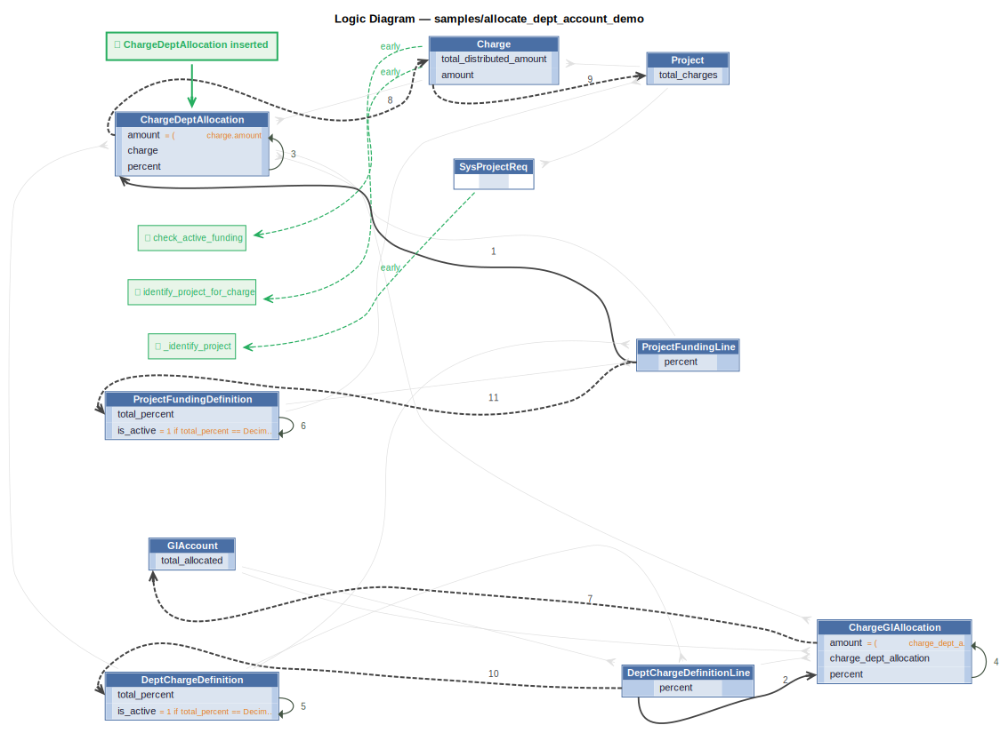

# Logic Flow — allocate_dept_account_demo

## Requirements

```
AI Project Identification — Probabilistic Logic Handler

When a contractor posts a Charge with only a project_description (no project_id),
this handler uses AI (or a keyword/history fallback) to fuzzy-match the description
to an active Project, then sets Charge.project_id.

Request Pattern:
  - Request fields:  contractor_id, project_description
  - Response fields: matched_project_id, confidence, reason, request

The early_row_event on Charge (registered in charge_distribution.py BEFORE Allocate)
calls identify_project_for_charge(), which inserts a SysProjectReq to trigger this
handler and then reads back matched_project_id.

version: 1.0
date: March 12, 2026
```

```
Charge Distribution — Cascade Two-Level Allocation

When a Charge is inserted against a Project:
  Level 1: Allocate charge.amount to each ProjectFundingLine (per percent)
           → creates ChargeDeptAllocation rows
  Level 2: Allocate each ChargeDeptAllocation.amount to the Dept's GL Accounts
           (per DeptChargeDefinitionLine percent) → creates ChargeGlAllocation rows

Constraint: Charge may only be posted if the Project's ProjectFundingDefinition is active.

AI tie-in: identify_project_for_charge is imported here and declared FIRST as an
early_row_event on Charge so it runs before the Allocate extension.  This ensures
project_id is set before the recipients function queries funding lines.

See: docs/training/allocate.md — Variant C (Cascade) for full pattern reference.

version: 1.0
date: March 12, 2026
```

```
Dept Charge Definition Rules
Derived: total_percent = sum of DeptChargeDefinitionLine.percent
Derived: is_active = 1 when total_percent == 100

Project Funding Definition Rules
Derived: total_percent = sum of ProjectFundingLine.percent
Derived: is_active = 1 when total_percent == 100

version: 1.0
date: March 12, 2026
```



## Rules

1. `percent = copy(percent)`
2. `percent = copy(percent)`
3. `amount = (
            charge.amount * percent / Decimal...`
4. `amount = (
            charge_dept_allocation.amount * p...`
5. `is_active = 1 if total_percent == Decimal("100"`
6. `is_active = 1 if total_percent == Decimal("100"`
7. `total_allocated = sum(amount)`
8. `total_distributed_amount = sum(amount)`
9. `total_charges = sum(amount)`
10. `total_percent = sum(percent)`
11. `total_percent = sum(percent)`
E. `SysProjectReq` → `_identify_project` (early) — Fires when a SysProjectReq is inserted.
E. `Charge` → `identify_project_for_charge` (early) — Early event on Charge: if project_id is missing but project_description is set,
E. `Charge` → `check_active_funding` (early)

---
_Generated 2026-06-10 15:21_
