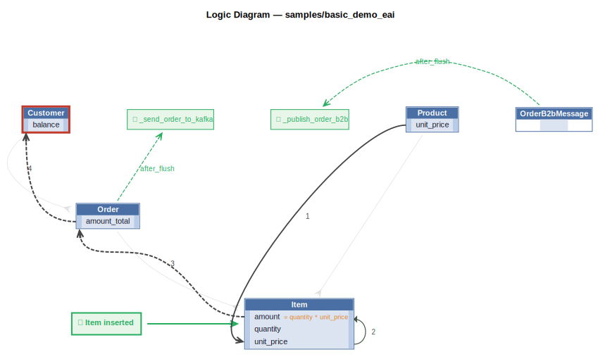

# Logic Flow — samples/basic_demo_eai

<table>
<tr valign="top">
<td width="65%">



</td>
<td width="35%">

### Rules

1. `unit_price = copy(unit_price)`<br>
2. `amount = quantity * unit_price`<br>
3. `amount_total = sum(amount)`<br>
4. `balance = sum(amount_total where date_shipped)`<br>
C. constraint: `Customer`<br>
E. `Order` → `_send_order_to_kafka` (after_flush)<br>
E. `OrderB2bMessage` → `_publish_order_b2b` (after_flush)

</td>
</tr>
</table>

## Requirements

```
App Integration — Kafka Publish on Order Dispatch
==================================================
Req §4: Publish to 'order_shipping' topic when Order.date_shipped is set.

Uses by-example publish (mapper=order_shipping) so the full order shape
is sent (customer_name, items, total) rather than just the primary key.

Guard condition fires on:
  INSERT with date_shipped set, OR
  UPDATE where date_shipped changed from None to a value.
```

```
Check Credit - Business Logic Rules
====================================
Req §1: Copy price from product, compute item amount, sum order total,
        sum customer balance, enforce credit limit.
```

```
Row-Event Bridge — order_b2b_message → order_b2b_processed topic
=================================================================
Req §3 (2-message pattern): After Consumer 1 commits an OrderB2bMessage blob,
this after_flush_row_event publishes the payload to the 'order_b2b_processed'
topic so Consumer 2 can parse and persist the domain rows.

Why after_flush_row_event (not row_event)?
  after_flush fires after SQLite assigns blob.id, so the Kafka key is a valid
  integer (not 'None'). row_event fires during before_flush — before the id is set.

is_processed guard (mandatory):
  The debug path (/consume_debug/order_b2b) runs process_order_b2b_payload()
  directly and creates the blob with is_processed=True in the same Tx.
  Without the guard, after_flush_row_event would re-publish to order_b2b_processed,
  causing Consumer 2 to attempt a duplicate insert → UNIQUE constraint crash.
```

---
_Generated 2026-07-03 07:39_
