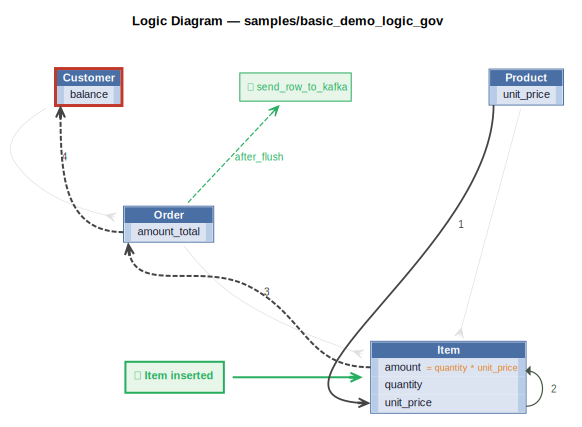

# Logic Flow — basic_demo

## Requirements

```
Use case: App Integration
    1. Publish the Order to Kafka topic 'order_shipping' if the date_shipped is not None.
```

```
On Placing Orders, Check Credit
    1. The Customer's balance is less than the credit limit
    2. The Customer's balance is the sum of the Order amount_total where date_shipped is null
    3. The Order's amount_total is the sum of the Item amount
    4. The Item amount is the quantity * unit_price
    5. The Item unit_price is copied from the Product unit_price
```



## Rules

**Check Credit**

1. `unit_price = copy(unit_price)`
2. `amount = quantity * unit_price`
3. `amount_total = sum(amount)`
4. `balance = sum(amount_total where date_shipped)`
5. `Customer constraint: balance < credit_limit`

**App Integration**

1. `Order` → `send_row_to_kafka` (after_flush)

---
_Generated 2026-05-23 07:36_
