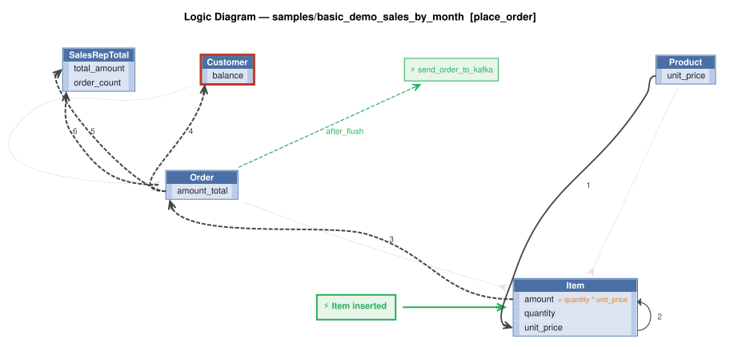

!!! pied-piper ":bulb: TL;DR - insert_parent: auto-created rollup/bucket rows from a composite natural key"

    * `SalesRepTotal(sales_rep_id, year_month)` is a monthly "bucket" row - **not pre-seeded**
    * Placing an `Order` for a sales rep auto-creates the bucket on first reference, and adjusts it (not re-creates it) on every later order for that same rep/month
    * The bucket key's `year_month` component is set generically - via `CreatedOnYearMonth` stamping (`logic/logic_discovery/system/all_classes_stamping.py`) - not a project-specific event
    * Includes a Behave test proving this, and guarding against a real LogicBank bug this exact shape exposed (fixed - see below)

    Status: Working example / regression project for `internal_dev/composite_key_issue/composite_key_issue.md`

# Sales Rep Totals — `insert_parent` on a Composite Key

For general ApiLogicServer setup, run instructions, and the key-customization-file map, see
[readme_standard.md](readme_standard.md).

**What this project demonstrates:** `Rule.sum`/`Rule.count(..., insert_parent=True)` auto-creating
a parent "bucket" row the first time a child references a key that doesn't exist yet — here, a
per-sales-rep, per-month sales rollup — with **zero event code** to create the bucket itself.

```python
# logic/logic_discovery/place_order/maintain_sales_totals.py
Rule.sum(derive=models.SalesRepTotal.total_amount, as_sum_of=models.Order.amount_total,
    insert_parent=True)

Rule.count(derive=models.SalesRepTotal.order_count, as_count_of=models.Order,
    insert_parent=True)
```

`SalesRepTotal`'s primary key is composite and natural — `(sales_rep_id, year_month)` — with no
surrogate `id` column. No `SalesRepTotal` rows are seeded; the first `Order` posted for a given
sales rep in a given month creates one automatically, and every subsequent order for that same
rep/month adjusts it in place.

&nbsp;

## Logic Diagram

Generated from the actual `Rule.*` declarations (not hand-drawn) via:
```bash
# from the Manager root:
python system/ApiLogicServer-Internal-Dev/logic_diagram_gv.py basic_demo_sales_by_month place_order
```

<table>
<tr valign="top">
<td width="65%">



</td>
<td width="35%">

### Rules

1. `unit_price = copy(unit_price)`<br>
2. `amount = quantity * unit_price`<br>
3. `amount_total = sum(amount)`<br>
4. `balance = sum(amount_total where date_shipped)`<br>
5. `total_amount = sum(amount_total)`<br>
6. `order_count = count(Order)`<br>
7. constraint: `Customer`<br>
8. `Order` → `send_order_to_kafka` (after_flush) — Order event: publish to Kafka topic 'order_shipping' when date_shipped becomes not None

</td>
</tr>
</table>

Rules 5 and 6 are the `insert_parent` buckets this project is about — `SalesRepTotal.total_amount`
and `SalesRepTotal.order_count`, both auto-creating the parent bucket row on first reference. See
`docs/requirements/place_order/logic_flow_place_order.md` for this same diagram+legend with the
full requirement text, and `docs/training/logic_diagrams/logic_diagram.md` for how to read the
diagram and how to regenerate it after changing logic.

**What it does *not* show:** `Order.CreatedOnYearMonth` — the bucket key's derived component —
because it's set by the generic cross-cutting stamping handler
(`logic/logic_discovery/system/all_classes_stamping.py`), not a `Rule.formula`/`Rule.copy`
declaration the diagram generator scans for. That's a real, known gap in the tool for this kind
of cross-cutting logic, not a sign the stamping isn't happening — see "Where the bucket key comes
from," below, for the actual code.

&nbsp;

## Where the bucket key comes from

`Order.CreatedOnYearMonth` (a component of the composite FK to `SalesRepTotal`, alongside
`Order.sales_rep_id`) is **not** set by a project-specific rule or event. It's stamped generically
by the cross-cutting handler every project already has:

```python
# logic/logic_discovery/system/all_classes_stamping.py
if logic_row.ins_upd_dlt == "ins" and hasattr(row, "CreatedOnYearMonth") and hasattr(row, "CreatedOn"):
    row.CreatedOnYearMonth = row.CreatedOn.strftime('%Y-%m')
```

Any project can opt into this same "bucket key" pattern just by adding a `CreatedOnYearMonth`
column and enabling stamping (`enable_stamping := True` in that file) — no custom event required.
`CreatedOn`/`CreatedOnYearMonth` are set **after** the row is constructed but **before** Row Logic
runs, which is exactly the timing that exposed the LogicBank bug below.

&nbsp;

## Other applications of this pattern

"Per-rep, per-month sales total" is one instance of a more general shape: **a parent row that
buckets children by a derived key, auto-created on first reference.** Any requirement phrased as
"maintain a running X per Y" fits, for example:

- **Daily/weekly digests** — `CustomerDailyActivity(customer_id, activity_date)`, bucketing orders
  or events per customer per day
- **Per-category rollups** — `CategoryMonthlyTotal(category_id, year_month)`, summing sales by
  product category over time, instead of a per-product total
- **Per-region/per-branch summaries** — `RegionQuarterlyTotal(region_id, year_quarter)`, same
  shape with a coarser period
- **Usage/quota tracking** — `AccountMonthlyUsage(account_id, year_month)`, counting API calls or
  transactions against a plan limit, auto-created the first time an account is used in a new
  period
- **Audit/compliance rollups** — `DepartmentDailyAuditCount(department_id, audit_date)`, tallying
  flagged transactions per department per day for a compliance dashboard

The mechanics are identical in every case: a composite natural key on the bucket table, `Rule.sum`/
`Rule.count(..., insert_parent=True)` on the buckets you need, and the derived component of the key
(month, quarter, day, whatever period) supplied via `CreatedOnYearMonth`-style generic stamping —
or a custom period column, stamped the same way — rather than a project-specific event.

&nbsp;

## The bug this project guards against

`insert_parent` against a composite key only worked, previously, when every column of that key
was set directly at row construction (`Child(parent_1=..., parent_2=..., ...)`). The moment a key
component is set **later** — by an `early_row_event` or, as here, generic stamping — two real
LogicBank bugs surfaced: the parent bucket silently failed to get created, and the child's own
composite-FK columns were silently nulled in the process. No error, no exception — just wrong
data. Fixed in **LogicBank 1.34.00** (see
`internal_dev/composite_key_issue/composite_key_issue.md`, v1.3, in `ApiLogicServer-src`, for the
full investigation). This project is both the case that found the bug and the regression coverage
for the fix — requires `LogicBank>=1.34.00` (pulled in transitively via the `apilogicserver`
package's own dependency pin, not this project's `requirements.txt` directly).

&nbsp;

## Running the Behave test

```bash
# from this project's root, venv activated
python api_logic_server_run.py &
sleep 5

cd test/api_logic_server_behave
python behave_run.py --outfile=logs/behave.log
```

Look for `Feature: Maintain Sales Totals` — 3 scenarios:

| Scenario | What it proves |
|---|---|
| First Order for a New Sales Rep Creates the Sales Total Bucket | `insert_parent` fires — `SalesRepTotal` row is auto-created with `order_count: 1` |
| Second Order for the Same Sales Rep Adjusts the Bucket | The **same** bucket is adjusted (`order_count: 2`), not duplicated |
| Order Retains its Sales Rep Assignment | `Order.sales_rep_id` / `Order.CreatedOnYearMonth` are not silently nulled |

**What to observe:**

- Console output ends with `4 scenarios passed, 0 failed, 0 skipped` (3 from this feature, plus the
  pre-existing `about.feature` stub).
- `test/api_logic_server_behave/logs/behave.log` has the full run — each `Scenario:` line followed
  by its `Given`/`When`/`Then` steps; a failure shows as `Assertion Failed: <message>` right under
  the failing step, naming exactly what went wrong (e.g. `BUG: no SalesRepTotal bucket for
  sales_rep_id=..., year_month=... (insert_parent did not fire)`).
- `logs/als.log` (also echoed to the server's console) shows the LogicBank rule trace for each
  POST — look for `Insert Parent: sales_rep_total` (bucket auto-created) on the first order for a
  new sales rep, and `Update - Adjusting sales_rep_total:` (bucket adjusted in place) on every
  order after that. Note: `als.log` rotates at 2MB with only 1 backup kept
  (`config/logging.yml`), so a specific line can roll off after enough other traffic — if you
  don't see it, check right after running the test rather than much later, or grep the terminal
  output instead.

To confirm the test actually catches a regression (not just a green rubber stamp), flip
`enable_stamping := True` back to `False` in `all_classes_stamping.py`, re-run the two commands
above, and watch all 3 scenarios fail with clear, specific messages — then flip it back.

&nbsp;

## Equivalent manual check (curl)

```bash
curl -X POST http://localhost:5656/api/Order/ \
  -H 'Content-Type: application/vnd.api+json' \
  -d '{"data": {"type": "Order", "attributes": {"customer_id": 1, "sales_rep_id": 1, "notes": "manual test"}}}'
# response attributes should show sales_rep_id and CreatedOnYearMonth both set (not null)

curl 'http://localhost:5656/api/SalesRepTotal/?sort=sales_rep_id'
# expect a row for that sales_rep_id / current year-month, with order_count >= 1
```

(`?sort=sales_rep_id` is required for `GET /api/SalesRepTotal/` with no filter — a separate,
narrower SAFRS bug in composite-PK default sorting; see composite_key_issue.md "Bug 1" for the
one-line explanation and why it's unrelated to the insert_parent fix above.)
