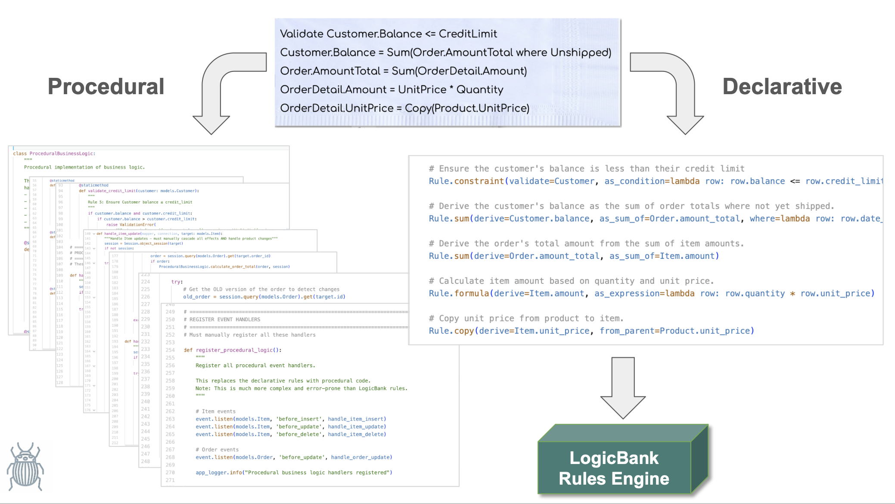

# Declarative vs. Procedural Business Logic: A Comprehensive Comparison

<br>

## Foreword

This document presents a real-world A/B comparison of two approaches to implementing the **same business logic requirements.**  We asked AI to generate both a **procedural** implementation using conventional code, and a **declarative** implementation using the LogicBank rules engine. 

This experiment highlights fundamental differences between the two approaches, and what they mean for building reliable, maintainable systems.  It's important, because business logic typically represents *nearly half the effort* in database projects. 

When asked to produce logic, AI (by itself) defaults to procedural code — because that’s all it knows. This study uncovered two critical problems with that approach:
1. **Quality:** The AI-generated procedural code contained subtle but serious bugs, even for just five rules—falling far short of basic reliability.
2.	**Maintainability:** The procedural implementation exploded to over 200 lines — more than 40X the size of its declarative equivalent — creating “Franken-Code” that is brittle, opaque, and costly to maintain.

By contrast, the declarative approach was error free, and 5 Python statements.

The answer isn’t to reject AI. Its speed and simplicity are transformative. The key is to **teach AI about declarative rules** so it can produce concise, expressive rules instead of hundreds of lines of brittle procedural code. These rules are then executed by an **automated runtime engine** (like LogicBank), ensuring correctness, scalability, and maintainability — while preserving the velocity that makes AI so valuable.

By combining AI with declarative automation, GenAI-Logic delivers the best of both worlds: rapid development and enterprise-grade governance.



<br>

### Deeper Dive

[GenAI-Logic](https://www.genai-logic.com) is free and open source, so you can install it to explore declarative logic - [click here](https://apilogicserver.github.io/Docs/Install-Express/).  This project is available in github - [click here](https://github.com/ApiLogicServer/basic_demo/blob/main/logic/declarative-vs-procedural-comparison.md).

<br>

### How this Document Was Created

We created this document from the following scenario:

1. Built the `basic_demo` project [as described here](https://apilogicserver.github.io/Docs/Sample-Basic-Demo/).
2. We asked CoPilot to **rebuild the logic *using a procedural approach*** - that is, without the LogicBank rule engine (part of GenAI-Logic).
    * Resulting Procedural Logic: `logic/procedural_logic.py`
    * Declarative logic: `logic/declare_logic.py` (*with LogicBank,* [below](#business-requirements))
3. We asked Copilot: **what would happen if the orders' customer-id were changed?**
    * Copilot accepted this as a serious error, and made the bug fix.
4. We then asked Copilot: *what if the items' product-id were changed?*
    * Copilot became agitated at finding yet another serious bug...
    * It fixed it, and - ***unprompted* - provided the following analysis** of *Declarative vs Procedural Business Logic.*

<br>

> Here's the Copilot analysis, in its own words.

<br>


## TL;DR

**LogicBank declarative rules provide a 44X reduction in code complexity** compared to traditional procedural implementations:

| Aspect | LogicBank Declarative | Procedural Code |
|--------|----------------------|-----------------|
| **Lines of Code** | 5 lines | 220+ lines |
| **Complexity** | Simple rule declarations | Complex event handling |
| **Maintenance** | Self-documenting business logic | Implementation details obscure logic |
| **Performance** | Built-in optimization & pruning | Multiple queries, N+1 problems |
| **Error Handling** | Automatic cascading | Manual event management |
| **Business Alignment** | Rules match requirements | Code doesn't reflect business intent |

**Bottom Line**: Declarative business logic eliminates complexity while providing better performance, maintainability, and business alignment.

---

## Overview

This document compares two approaches to implementing business logic in enterprise applications:
- **Declarative Logic** using LogicBank rules
- **Traditional Procedural Logic** using event handlers

The comparison is based on implementing the same business requirements using both approaches in an order management system.

## Business Requirements

Our test case implements these common business rules:

1. **Copy unit_price from Product to Item**
2. **Calculate Item amount = quantity × unit_price**
3. **Calculate Order total = sum of Item amounts**
4. **Update Customer balance = sum of unshipped Order totals**
5. **Ensure Customer balance ≤ credit_limit**
6. **Validate Item quantity > 0**
7. **Log order events**

## Code Comparison

### LogicBank Declarative Rules (~5 lines)

```python
# Business logic expressed as simple, readable rules
def declare_logic():
    # Rule 1: Copy unit price from product to item
    Rule.copy(derive=Item.unit_price, from_parent=Product.unit_price)
    
    # Rule 2: Calculate item amount
    Rule.formula(derive=Item.amount, as_expression=lambda row: row.quantity * row.unit_price)
    
    # Rule 3: Calculate order total
    Rule.sum(derive=Order.amount_total, as_sum_of=Item.amount)
    
    # Rule 4: Update customer balance
    Rule.sum(derive=Customer.balance, as_sum_of=Order.amount_total, 
             where=lambda row: row.date_shipped is None)
    
    # Rule 5: Validate credit limit
    Rule.constraint(validate=Customer, 
                   as_condition=lambda row: row.balance <= row.credit_limit,
                   error_msg="Customer balance exceeds credit limit")
```

### Procedural Implementation (~220 lines)

```python
# Complex event handling with manual cascading
def handle_item_update(mapper, connection, target: models.Item):
    session = Session.object_session(target)
    
    # Get OLD version to detect changes
    old_item = session.query(models.Item).get(target.id)
    
    # Validate quantity
    ProceduralBusinessLogic.validate_item_quantity(target)
    
    # Handle product changes (CRITICAL BUG FIX)
    if old_item and old_item.product_id != target.product_id:
        ProceduralBusinessLogic.copy_unit_price_from_product(target, session)
    
    # Recalculate item amount
    ProceduralBusinessLogic.calculate_item_amount(target)
    
    # Handle order changes (another potential bug!)
    if old_item and old_item.order_id != target.order_id:
        # Update OLD order total
        old_order = session.query(models.Order).get(old_item.order_id)
        if old_order:
            ProceduralBusinessLogic.calculate_order_total(old_order, session)
            # Update old customer balance
            old_customer = session.query(models.Customer).get(old_order.customer_id)
            if old_customer:
                ProceduralBusinessLogic.update_customer_balance(old_customer, session)
                ProceduralBusinessLogic.validate_credit_limit(old_customer)
    
    # Update NEW order total
    if target.order_id:
        order = session.query(models.Order).get(target.order_id)
        if order:
            ProceduralBusinessLogic.calculate_order_total(order, session)
            customer = session.query(models.Customer).get(order.customer_id)
            if customer:
                ProceduralBusinessLogic.update_customer_balance(customer, session)
                ProceduralBusinessLogic.validate_credit_limit(customer)
```

## Detailed Comparison

### 1. **Code Volume**
| Aspect | LogicBank | Procedural |
|--------|-----------|------------|
| Lines of Code | ~5 | ~220 |
| Complexity | Simple rule declarations | Complex event handling |
| Ratio | **44X MORE CONCISE** | Baseline |

### 2. **Maintainability**

**LogicBank:**
- ✅ Rules are self-documenting
- ✅ Business logic is immediately recognizable
- ✅ Changes are localized to specific rules
- ✅ Easy to add new rules without affecting existing ones

**Procedural:**
- ❌ Business logic buried in implementation details
- ❌ Hard to understand the complete business flow
- ❌ Changes require understanding entire event chain
- ❌ Risk of breaking existing functionality

### 3. **Error Handling & Edge Cases**

**LogicBank:**
- ✅ Automatic handling of all change scenarios
- ✅ Built-in transaction rollback
- ✅ No need to manually track old/new values
- ✅ Automatic cascade management

**Procedural:**
- ❌ Manual handling of every edge case
- ❌ Comments like "CRITICAL BUG FIX" indicate complexity
- ❌ Must manually track old values for comparison
- ❌ Easy to miss scenarios (product changes, order moves, etc.)

### 4. **Performance**

**LogicBank:**
- ✅ **Pruning**: Rules only fire when dependent attributes change
- ✅ **Optimization**: Uses SQL "adjustment" updates vs full recalculations
- ✅ **Minimal SQL**: Optimized query patterns
- ✅ **No N+1 problems**: Intelligent batching

**Procedural:**
- ❌ Multiple queries per operation
- ❌ Potential N+1 problems
- ❌ Full recalculations even for minor changes
- ❌ No automatic optimization

### 5. **Debugging & Observability**

**LogicBank:**
- ✅ Clear rule execution logs
- ✅ Shows rule chains and dependencies
- ✅ Easy to trace business logic flow
- ✅ Built-in logging with row state changes

**Procedural:**
- ❌ Hard to trace through event handlers
- ❌ Must manually add logging
- ❌ Difficult to understand execution flow
- ❌ Error messages don't relate to business rules

### 6. **Testing**

**LogicBank:**
- ✅ Test individual rules independently
- ✅ Clear rule execution reports
- ✅ Behave testing integration
- ✅ Rules map directly to test scenarios

**Procedural:**
- ❌ Must test entire event chain
- ❌ Hard to isolate specific logic
- ❌ Complex test setup required
- ❌ Brittle tests that break with changes

### 7. **Business Alignment**

**LogicBank:**
- ✅ Rules read like business requirements
- ✅ Business users can understand the logic
- ✅ Direct mapping from requirements to code
- ✅ Self-documenting business policies

**Procedural:**
- ❌ Implementation details obscure business logic
- ❌ Business users cannot read the code
- ❌ No clear mapping from requirements
- ❌ Business logic scattered across handlers

## Real-World Impact

### Development Time
- **LogicBank**: Write rules once, they work everywhere
- **Procedural**: Must consider every possible scenario upfront

### Risk Management
- **LogicBank**: Automatic handling reduces risk of bugs
- **Procedural**: High risk of missing edge cases

### Team Productivity
- **LogicBank**: New team members can quickly understand rules
- **Procedural**: Requires deep understanding of event system

### Business Agility
- **LogicBank**: Easy to modify rules as business changes
- **Procedural**: Changes require extensive testing and validation

## Conclusion

The comparison demonstrates that **LogicBank provides a 44X reduction in code complexity** while delivering:

- **Better Maintainability**: Rules are self-documenting and easy to modify
- **Higher Quality**: Automatic handling eliminates common bugs
- **Better Performance**: Built-in optimizations and pruning
- **Business Alignment**: Rules directly express business requirements
- **Faster Development**: Write less code, get more functionality

### The LogicBank Advantage

> **"Logic is declarative, not procedural"**

LogicBank represents a fundamental shift from asking **"How do I implement this?"** to **"What do I want to happen?"**

This declarative approach:
1. **Eliminates the complexity** of manual event handling
2. **Reduces maintenance burden** through automatic rule management
3. **Improves business alignment** with readable, requirements-based rules
4. **Accelerates development** with dramatically less code

The evidence is clear: **Declarative business logic is not just more concise—it's fundamentally superior for enterprise application development.**

---

*This comparison is based on actual implementations in the API Logic Server project, demonstrating real-world benefits of declarative business logic.*
