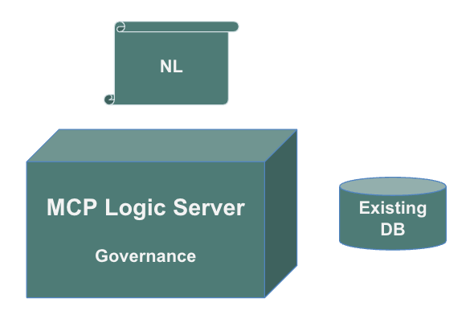

<style>
  -typeset h1,
  -content__button {
    display: none;
  }
</style>


&nbsp;
****Copilot** uses **MCP discovery** to create, interact with, and enforce logic in **GenAI-Logic projects****
&nbsp;
## 
**Prompt 1 (Create System):**

*Create a system named basic_demo from samples/dbs/basic_demo.sqlite*

**Prompt 2 (Add NL Logic):**

*Use case: Check Credit:*<br>

*1. The Customer's balance is less than the credit limit*<br>
*2. The Customer's balance is the sum of the Order amount_total where date_shipped is null*<br>
*3. The Order's amount_total is the sum of the Item amount*<br>
*4. The Item amount is the quantity * unit_price*<br>
*5. The Product count suppliers is the sum of the Product Suppliers*<br>
*6. Item unit_price copied from the Product*<br>

*Use case: App Integration*

*1. Send the Order to Kafka topic 'order_shipping' if the date_shipped is not None.*

(Developers review this DSL before execution, providing a natural human-in-the-loop checkpoint.)


**Prompt 3 (Test via MCP-discovered API):**  *Constraint blocks bad data* -- as shown below: ️

*On Alice's first order, update the widget quantity to 100*
&nbsp;


The diagram above shows the final step of a complete system, built and tested by Copilot with no manual code edits.

&nbsp;

##  Step 1 – Create System
In the GenAI-Logic [Manager](https://apilogicserver.github.io/Docs/Manager.md), use Copilot to create an application from an existing database — complete with Admin App, API, and MCP discovery.
**Step 1: Create Project:**
```bash title='Step 1: Create Project'
create a system named basic_demo from samples/dbs/basic_demo.sqlite
```
This command:

* Creates a new project folder (`basic_demo`)
* Generates a full **JSON:API** with auto-discovered tables (Customer, Order, Item, Product)

    * This sqlite sample database (Customers, Orders, Items and Products) is provided when you install GenAI-Logic

* Builds a **React Admin App** for instant data access
* Exposes **MCP metadata** at `/.well-known/mcp.json`, enabling Copilot or ChatGPT to automatically discover the schema and usage patterns  
* Opens a new instance of VSCode on the project

The project is ready to run:

* In the new project, use Copilot: `start the server` (or click F5)
* You can explore the admin app and the API, then `stop the server` (or Shift/F5)

 **Result:** a working three-tier system in under a minute — *database → API → web app → MCP discovery*.

&nbsp;

##  Step 2 – NL Logic
Copilot reads the MCP schema and responds to a natural-language instruction such as:

**Step 2: Declare Logic:**
```bash title='Step 2: Declare Logic'
Use case: Check Credit    
    1. The Customer's balance is less than the credit limit
    2. The Customer's balance is the sum of the Order amount_total where date_shipped is null
    3. The Order's amount_total is the sum of the Item amount
    4. The Item amount is the quantity * unit_price
    5. The Item unit_price is copied from the Product unit_price

Use case: App Integration
    1. Send the Order to Kafka topic 'order_shipping' if the date_shipped is not None.
```

It then inserts the following rules into `logic/declare_logic.py`:
```python
Rule.constraint(validate=Customer, as_condition=lambda row: row.balance <= row.credit_limit)
Rule.sum(derive=Customer.balance, as_sum_of=Order.amount_total)
Rule.sum(derive=Order.amount_total, as_sum_of=Item.amount)
Rule.formula(derive=Item.amount, as_expression=lambda row: row.quantity * row.unit_price)
Rule.copy(derive=Item.unit_price, from_parent=Product)
```
These **five declarative lines** replace hundreds of lines of procedural code, automatically providing:

* Credit-limit validation  
* Multi-table derivations  
* Multi-table chaining  
* Unit-price propagation  

All enforced by the **LogicBank** engine during each API transaction.

> AI can get a bit frisky - e.g., it might import objects not used.  Don't take any guff - make it fix any errors - it's quite good at that.

&nbsp;

##  Step 3 – Test with MCP
Copilot can now test the new rule using the MCP-discovered API — no manual coding required.
**Test with CoPilot and MCP Discovery:**
```bash title='Test with CoPilot and MCP Discovery'
Update Alice’s first order so that the quantity for the Widget is 100
```

Copilot uses MCP discovery (`.well-known`) to construct and issue this JSON:API request:
**Copilot issues::**
```bash title='Copilot issues:'
curl -X PATCH http://localhost:5656/api/Item/2   -H "Content-Type: application/vnd.api+json"   -d '{"data": {"type": "Item", "id": "2", "attributes": {"quantity": 100}}}'
```

> Tech Note: this is an *MCP-discovered API* — not yet a registered VS Code MCP tool; discovery alone enables this interaction.

&nbsp;

###  Multi-Table Logic Chaining
| Trigger | Effect |
|----------|---------|
| `Item.quantity` | Recalculates `Item.amount` |
| `Item.amount` | Updates `Order.amount_total` |
| `Order.amount_total` | Updates `Customer.balance` |
| `Customer.balance` | Fires credit-limit constraint |

**Outcome:** The logic engine detects that Alice’s balance would exceed her credit limit and **rejects the transaction automatically**.

&nbsp;

###  Runtime Trace
```
.Item[2] {update}
.Order[2] {update – Adjusting order.amount_total}
.Customer[1] {update – Adjusting customer.balance}
.Customer[1] {Constraint Failure: Customer balance > credit limit}
```
See the screen shot at the top of this page.

&nbsp;

###  Copilot’s Response
>  *Business logic working correctly!*  
>  *Update prevented automatically to enforce credit limit.*

Copilot used MCP to discover the schema, executed the update, and interpreted the deterministic response — proof that **AI + Logic collaboration** can be both natural and reliable.

&nbsp;

##  Architecture Summary
| Layer | Role | Description |
|-------|------|-------------|
| **Database** | Existing model | e.g. `sample_ai.sqlite` |
| **GenAI-Logic** | Auto-generated API + Logic runtime | Declarative rules via LogicBank |
| **MCP** | Discovery protocol | Enables AI to understand and safely invoke APIs |
| **Copilot** | Natural-language interface | Adds and tests business logic |

&nbsp;

##  Connecting to MCP Integration
This example continues the flow described in [**MCP Integration**](../Integration-MCP/): 

* **MCP Server Executors** = your logic-enabled APIs  
* **MCP Client Executors** = AI agents like Copilot that translate NL requests into Tool Context Blocks  
* **Declarative Logic** ensures every AI-driven transaction remains safe and auditable  

&nbsp;

##  Related Docs

* [Integration: MCP](../Integration-MCP/)  
* [Logic: Rule Types](../Logic/)  
* [Sample: Basic Demo](../Sample-Basic-Demo/)  
* [Study: Declarative vs. Procedural GenAI - A/B Comparison](https://apilogicserver.github.io/Docs/Logic-Why-Declarative-GenAI)  

_This example illustrates the **Business Logic Agent** pattern — Copilot supplies intent, GenAI-Logic guarantees deterministic execution._

<br>

---

## Study: Why Not Just CodeGen?

Some months back, we asked a question you might have wondered about... 
> Instead of **NL → DSL → Engine**, why not just have GenAI code it all?

<details markdown>

<summary>We ran an A/B Test, Did Some Reseach... Here's What We Found</summary>

Our [**complete study is here**](https://apilogicserver.github.io/Docs/Logic-Why-Declarative-GenAI), summarized below.

<br>

<details markdown>

<summary>1. We Tried It: an A/B Test</summary>

<br>We tried: we asked Claude Sonnet 4-5 to translate **five rules** into code

* ~200 lines → **2 correctness bugs** + performance hit

Then something remarkable happened:

* After finding the second bug, [**AI itself wrote a review**](https://github.com/ApiLogicServer/ApiLogicServer-src/blob/main/api_logic_server_cli/prototypes/basic_demo/logic/procedural/declarative-vs-procedural-comparison#what-happened-here) explaining why procedural logic *cannot* be correct for dependency graphs.
  **→ Bugs came from transitive dependencies, not weak prompts.**
  It recognized the problem was structural — not model quality.

</details>

<br>

<details markdown>

<summary>2. We Researched It: Alice et al</summary>

<br>Complex dependencies are a *well-known boundary* for code generation.

Paths can be tested, never proven complete.

1. LLMs show consistent weaknesses in multi-step reasoning and state tracking—the same failure mode seen in dependency propagation. See: **“Alice in Wonderland: Simple Tasks Showing Complete Reasoning Breakdown in State-Of-the-Art Large Language Models”** ([arXiv:2406.02061](https://arxiv.org/abs/2406.02061)).

2. A study titled “LMs: Understanding Code Syntax and Semantics for Code Analysis” found that while large language models (LLMs) excel at syntax, they struggle with semantics — especially dynamic semantics, which includes behavior over time, dependencies and state changes.  [Click here](https://arxiv.org/abs/2305.12138?utm_source=chatgpt.com).

3. A survey of AI usage in business found that AI still has limits in understanding domain-specific business rules, complex dependencies, verifying all cases, etc. [Click here](https://www.sciencedirect.com/science/article/pii/S219985312400132X?utm_source=chatgpt.com).

4. Industry commentary (e.g., from SonarSource) states explicitly: “AI models have limitations in understanding complex business logic or domain-specific requirements.” [Click here](https://www.sonarsource.com/resources/library/ai-code-generation-benefits-risks/?utm_source=chatgpt.com).

</details>

<br>

<details markdown>

<summary>3. We Reflected: Evolution Remains a Challenge</summary>

<br>Procedural glue is opaque, and every change forces full regeneration for dependency management — risking new bugs each time.

Declarative rules avoid this.

Rules are **self-organizing**: on startup, the engine discovers dependencies and guarantees ordering, propagation, and constraints. This allows:

* Add or change **one rule at a time**  
* Place new rules anywhere that makes sense - the engine recomputes the dependency graph automatically
* Existing logic remains correct without regeneration  

This mirrors SQL:  you don’t re-emit the entire schema to add one new query.

Declarative logic turns iterative change from a **rewrite problem** into an **append problem** — exactly what long-lived systems require for business agility.

</details>

<br>

<details markdown>

<summary>4. Intuitively... sql vs dbms</summary>

<br>You expect a natural-language **query to call a DBMS**, not **create one.**

Likewise, NL business logic should **call a rules engine**, not emit procedural code.

You want AI to *help* you with your spreadsheet, not *be excel*.

> AI can *help* with most anything, but it doesn't need to *be* everything.

</details>
<br>

<details markdown>

<summary>5. Finally - Governable Intent</summary>

<br> **AI → DSL → Engine**

- **AI (probabilistic):** NL intent → rules / DSL
- **DSL (deterministic):** human in the loop
- **Engine (runtime execution):** rules → ordering, propagation, constraints, debug, logging
    - **Guardrails:** deterministic rules define *when* AI runs and how outputs are governed

> AI expresses intent; the engine enforces correctness.

</details>

</details>

<br>

---

## Business Logic Agent: A Unified Model of Governable Creativity

But AI provides creativity that businesses want... how do we provide that, *with goverance?*

<details markdown>

<summary>Unified Deterministic and Probabilistic Logic</summary>

<br>Enterprises want the best of both: the creativity of probabalistic logic, *with* the governability of deterministic logic -- all in one unified Business Logic Agent.  Here's an example, and we then generalize.

<br>

<details markdown>

<summary>A. Example: Choose Supplier, based on current world conditions</summary>

Agentic systems are evolving quickly, and a clearer architectural picture is forming:

> Not AI *vs* Rules — **AI and Rules together.**

Different kinds of logic naturally call for different tools, as in this unified example:

* **Deterministic Logic** — logic that must always be correct, consistent, and governed.  
*Example:* “Customer balance must not exceed credit limit.”

* **Creative Logic** — logic that benefits from exploration, adaptation, and probabilistic reasoning.  
*Example:* “Which supplier can still deliver if shipping lanes are disrupted?”


    * **Creative reasoning needs boundaries.<br>Deterministic rules supply the guardrails that keep outcomes correct, consistent, and governed.**

**Declare Logic: Deterministic and Probabilistic:**
```bash title='Declare Logic: Deterministic and Probabilistic'
Use case: Check Credit:

1. The Customer's balance is less than the credit limit
2. The Customer's balance is the sum of the Order amount_total where date_shipped is null
3. The Order's amount_total is the sum of the Item amount
4. The Item amount is the quantity * unit_price
5. The Product count suppliers is the sum of the Product Suppliers
6. Use AI to Set Item field unit_price by finding the optimal Product Supplier 
                                          based on cost, lead time, and world conditions

Use case: App Integration
1. Send the Order to Kafka topic 'order_shipping' if the date_shipped is not None.
```

And then, test via MCP-discovered API:**  *Constraint blocks bad data*: ️
**Test Logic with MCP Discovery:**
```bash title='Test Logic with MCP Discovery'
On Alice's first order, include 100 Egyptian Cotton Sheets
```

<details markdown>

<summary>Data Model, including AI Audit Trail</summary>

<br> 


</details>

</details>

<br>

<details markdown>

<summary>B. The Business Logic Agent</summary>

<br> **The Business Logic Agent** processes a *declarative NL requests:*

- At declaration time (e.g., in Copilot):

    * **D1:** Accepts a unified declarative NL request
    * **D2.** Uses GenAI to create
        * Rules (in Python DSL: Domain Specific Logic) for deterministic Logic
        * LLM calls for Probablistic

- At runtime

    * **R1:** DSL is executed by the Rules Engine (deterministic - no NL pocessing occurs)
    * **R2:** LLM calls


**Agentic systems become far more compelling when probabilistic intent is paired with deterministic enforcement.**

This "governable intent" model aligns with enterprise expectations —  
adaptive where helpful, reliable where essential.

**The Business Logic Agent unifies probabilistic intent with deterministic enforcement in a single model**

</details>

<br>

<details markdown>

<summary>C. Echoes Modern Thinking</summary>

<br>Lamanna: *"Sometimes customers don't want the model to freestyle…
They want hard-coded business rules."*
→ Exactly this hybrid: **probabilistic intent + deterministic enforcement**

> Governable AI

</details>

</details>

<br>

---

## Heads-Up: AI-Enabled Projects

<details markdown>

<summary>Copilot can help you understand, learn, and do... here's how</summary>

<br>

GenAI-Logic projects are already **AI-enabled**, meaning they come with built-in training materials that help assistants like **GitHub Copilot**, **Claude**, or **ChatGPT** understand your project context.  For more information, see [AI-Enabled Projects Overview](https://apilogicserver.github.io/Docs/Project-AI-Enabled.md).

Once you’ve completed this demo, try engaging your AI assistant directly — it already knows about your project’s structure, rules, and examples.

*Understand* GenAI-Logic by **asking Copilot questions** such as:

- “Where are the declarative business rules defined?”
- “Explain how credit-limit validation works in this project.”
- “Show me how to add a new rule for discount calculation.”
- “Walk me through the AI Guided Tour.”

*Learn* about GenAI-Logic with the *AI-Guided Tour*.  **Just ask Copilot: *guide me through***.

- note: you should first delete `logic/logic_discovery/check_credit.py`)

In addition to all the things CoPilot can do natively, we've taught it about GenAI-Logic.  **Just ask Copilot: *what can you help me with?***

</details>