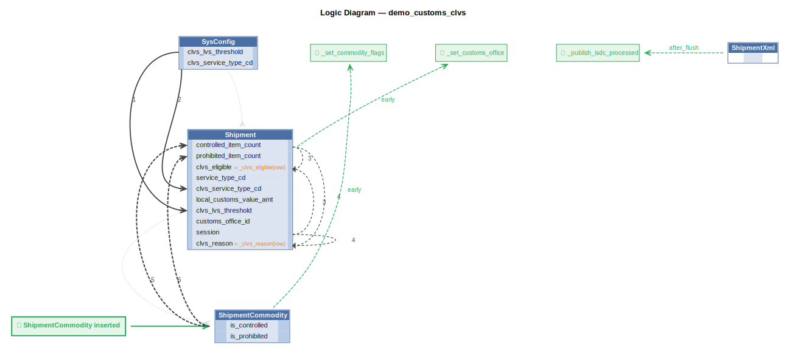

# Logic Flow — demo_customs_clvs

## Requirements

```
Scenario: Shipment at or below the LVS threshold is eligible
  Given a shipment imported by an authorized CLVS courier
  And the shipment has an estimated value for duty not exceeding CAD $3,300
  And the shipment has no prohibited commodity lines (ShipmentCommodity.is_prohibited = 1)
  And the shipment has no controlled or regulatory goods (lookup using first ten digits of the harmonized tariff number)
  And the shipment is released at a CBSA-designated customs office
  When the shipment eligibility is evaluated
  Then the shipment shall be eligible for the CLVS Program
  And set the clvs_reason as a comma delimited list of short all reasons why failed (or blank)
```

```
Row-event bridge: ShipmentXml insert → publish to isdc_processed Kafka topic.
```

```
Logic discovery: Shipment matching (Phase 2).

On Shipment insert, look up the matching Customer using:
    Shipment.trprt_bill_to_acct_nbr == Customer.duty_bill_to_acct_nbr

If no match: log a warning, do nothing.
If match found: create a ShipmentParty row, matching high confidence columns
from Customer to ShipmentParty.
Use Rule.row_event (not early_row_event) — fires before_flush so the new
ShipmentParty writes atomically with the parent Shipment.
```



## Rules

1. `clvs_reason = _clvs_reason(row)` — Derive clvs_reason: comma-delimited CLVS ineligibility reasons (blank if eligible).
2. `clvs_eligible = _clvs_eligible(row)` — Derive clvs_eligible: 1 if shipment meets all CLVS criteria, else 0.
3. `prohibited_commodity_count = count(ShipmentCommodity where is_prohibited)`
4. `controlled_commodity_count = count(ShipmentCommodity where controlled_regulated_goods_id)`
E. `ShipmentCommodity` → `_resolve_hs_controlled` (early) — Resolve controlled_regulated_goods_id and is_prohibited from HS code lookup on insert.
E. `ShipmentXml` → `_publish_isdc` (after_flush)

---
_Generated 2026-05-22 18:29_
