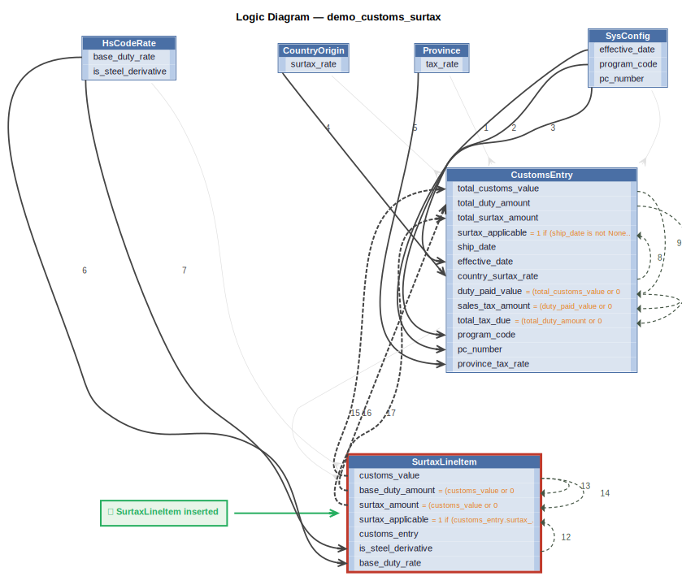

# Logic Flow — demo_customs_surtax

## Rules

1. `effective_date = copy(effective_date)`
2. `program_code = copy(program_code)`
3. `pc_number = copy(pc_number)`
4. `country_surtax_rate = copy(surtax_rate)`
5. `province_tax_rate = copy(tax_rate)`
6. `base_duty_rate = copy(base_duty_rate)`
7. `is_steel_derivative = copy(is_steel_derivative)`
8. `surtax_applicable = 1 if (ship_date is not None
                   ...`
9. `duty_paid_value = (total_customs_value or 0`
10. `sales_tax_amount = (duty_paid_value or 0`
11. `total_tax_due = (total_duty_amount or 0`
12. `surtax_applicable = 1 if (customs_entry.surtax_applicable == 1
    ...`
13. `base_duty_amount = (customs_value or 0`
14. `surtax_amount = (customs_value or 0`
15. `total_customs_value = sum(customs_value)`
16. `total_duty_amount = sum(base_duty_amount)`
17. `total_surtax_amount = sum(surtax_amount)`
C. constraint: `SurtaxLineItem`

---
_Generated 2026-06-10 16:06_
