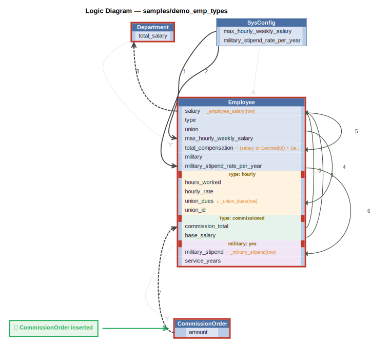

# Logic Flow — demo_emp_types

## Requirements

```
Departments have a name and a budget.
Department.total_salary = sum of Employee.salary (all types).
Department.total_salary must not exceed Department.budget.
```

```
Employees have a name, dept, and salary.
Employees have a type that is one of: 'salaried', 'hourly', or 'commissioned'.

Hourly employees are employees with hours_worked (REAL) and hourly_rate (REAL).
Hourly employees: salary = hours_worked * hourly_rate.
Hourly employees: salary must not exceed 5000 per week.
Hourly employees may be assigned to a Union (optional); only Hourly employees may have a union_id.
Unions have a name and a dues_rate (REAL).
Hourly employees: union_dues = hours_worked * union.dues_rate (0 if no union assigned).

Commissioned employees are employees who can have Orders; only Commissioned employees may have Orders.
Each Order has an amount and a customer name.
Commissioned employees: commission_total = sum of Order.amount.
Commissioned employees: salary = base_salary + commission_total.
```

```
Employees may also have a military classification, independent of employment type.
Military employees have a branch (TEXT: 'Army', 'Navy', 'Air Force', 'Marines', 'Coast Guard'),
a rank (TEXT), and service_years (INTEGER).
Military employees receive a military_stipend (REAL) = service_years * 100.
Total compensation for military employees = salary + military_stipend.
Total compensation for non-military employees = salary.
```



## Rules

1. `max_hourly_weekly_salary = copy(max_hourly_weekly_salary)`
2. `military_stipend_rate_per_year = copy(military_stipend_rate_per_year)`
3. `salary = _employee_salary(row)` — Derive salary: type-branched — hourly=hours*rate, commissioned=base+commission, salaried=entered.
4. `union_dues = _union_dues(row)` — Derive union_dues: hours_worked * union.dues_rate for hourly employees in a union, else 0.
5. `total_compensation = (salary or Decimal(0`
6. `military_stipend = _military_stipend(row)` — Derive military_stipend: service_years * rate for military employees, 0 otherwise.
7. `commission_total = sum(amount)`
8. `total_salary = sum(salary)`
C. constraint: `Department`
C. constraint: `Employee`
C. constraint: `CommissionOrder`

---
_Generated 2026-07-02 08:00_
