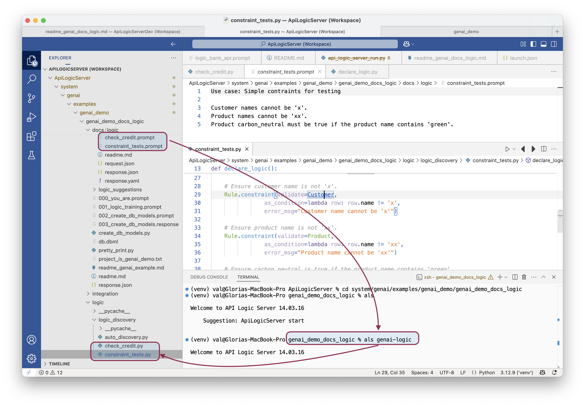

Status: this example **under construction.**

The general idea:



It should work (build and run), but:

1. additional customizations (new endpoints, security, etc) are not migrated in this procedure.
    * Consider copying back to the original: database/db.sqlite, database/models, rebuilt api/expose_api_models.py

Use this to explore:

1. [managing logic in your project with multiple files](https://apilogicserver.github.io/Docs/WebGenAI-CLI/#ide-nat-language-docslogic)
2. Merging multiple logic files into a single project, reflecting newly introduced attributes into:
    * the data model
    * and the test data

<br/>

## Use system/genai/examples/genai_demo/genai_demo_docs_logic

<br/>

1. About the `genai_demo_docs_logic` project


The `/logic` files are natural language prompts - `credit_check.prompt` and `constraint_tests`.
 
> Observe this logic introduces new attributes: `customer.balance, product.carbon_neutral`

> This support is dependent on project creation from WebGenAI (`docs` folder contains data/logic models)

<br/>

3. Use `genai-logic` to translate Natural Language logic into logic code at `genai_demo_no_logic/logic/logic_discovery` (it takes a few moments):

```
cd system/genai/examples/genai_demo/genai_demo_docs_logic
als genai-logic
```

4. Observe the new logic files in `logic/logic_discovery`

<br/>
<br/>

## Fixup to account for new attributes

The project is not yet runnable, since: 
* the logic refers to attributes not in the data model / database
* the test data is incomplete and incorrect.

To address, use the `genai-utils --fixup` utility, then create a new project:

<br/>

1. Execute `fixup` to get a revised data model and test data

```
# cd genai_demo_docs_logic  # (you should already be at the directory)
als genai-utils --fixup    
```

Creates `docs/fixup` -- verify:
1.   `2_models.response` contains customer.balance, product.carbon_neutral
2.   `3_rules.response` contains all logic


<br/>

2. Create a new project with the logic, revised data model and test data

```
cd ..   # This cd is important!  (else you get TypeError: ...)
als genai --project-name=genai_demo_docs_logic_fixed --retries=-1 --repaired-response=genai_demo_docs_logic/docs/fixup/response_fixup.json

# or, --repaired-response now supports a directory of data model / rule models:
als genai --project-name=genai_demo_docs_logic_fixed --retries=-1 --repaired-response=genai_demo_docs_logic/docs/fixup
```

<br/>

## Test

To test, open and start `genai_demo_no_logic_fixed`, and use the Admin app to update a customer name to "x".  This should trigger a constraint message.