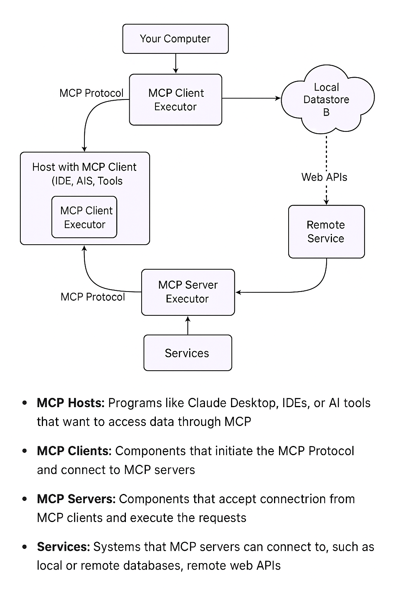

Model Context Protocol is a way for:

* LLMs to chorograph multiple MCP servers in a chain of calls.

* Chat agents to *discover* and *call* external servers, be they databases, APIs, file systems, etc. 

For tech background, see Appendix 2.


This is to explore:

| Explore                                                           | Status |
| ----------------------------------------------------------------- | ------ |
| ALS Svr can be used as an MCP server                              | Runs   |
| Nat Lang access from ChatBot (eg, ChatGPT) to (tunnelled) ALS Svr | Fails <br>Non-std API<br>MCP requires pre-registered resource schemas inside its system — which you and I cannot modify from outside (?) <br> See Appendix 1|
| ALS Svr can be choroegraphed by LLM (1 in a chain of calls)       | ?      |
|

A value prop might be: *instant mcp-fy your legacy DB and business logic*.

&nbsp;


> Status: Technology Exploration

## ChatGPT testing

In the Manager, open `samples/nw_sample_nocust`, and explore `integration/mcp`.  This has been successfully used to invoke the server, including with authorization.

This is just an initial experiment, without automation such as creation of openAI version 3 from version 2.  Many substantive issues need to be addressed, including but not limited to security, update, etc.

We welcome participation in this exploration.  Please contact us via [discord](https://discord.gg/HcGxbBsgRF){:target="_blank" rel="noopener"}.

Local testing:
1. Run `integration/mcp/3_executor_test_agent.py`


&nbsp;

## Access via ChatGPT

### Tunnel to local host with ngrok

Requires the web version, which in turn requires tunnel to local host such as [ngrok](https://ngrok.com/downloads/mac-os?tab=download), then

```
ngrok config add-authtoken <obtain from https://dashboard.ngrok.com/get-started/setup/macos>
```

then
```
ngrok http 5656
```

and note the url like: `https://mcp_url_eg_bca3_2601.ngrok-free.app -> http://localhost:5656`

We'll call it `mcp_url`.

### Use natlang_to_api

```
pip install openai==0.28.1
```

Run `natlang_to_api.py` (gateway not required)


### Configure ChatGPT


replacing url to create prompt (??)        d:
{
  "tool": "json-api",
  "method": "GET",
  "url": "https://mcp_url.ngrok.io/api/Customer",
  "query_params": {
    "filter[Country]": "Germany",
    "page[limit]": 2
  },
  "headers": {
    "Accept": "application/vnd.api+json"
  },
  "expected_output": "List of customer records"
}

### Create the MCP in Web ChatGPT

Explore > Create

An early try:

```prompt
You are an AI Planner that builds MCP tool_context blocks to call a JSON:API server.

Use this information:
- Base URL: [insert your ngrok URL]
- API conforms to JSON:API standard (application/vnd.api+json).
- Key resources: Customer, Order, Product.

Example Goal:
"List all customers from Germany, limited to 2 results."

Expected MCP tool_context output:

{
  "tool": "json-api",
  "method": "GET",
  "url": "mcp_url/api/Customer",
  "query_params": {
    "filter[Country]": "Germany",
    "page[limit]": 2
  },
  "headers": {
    "Accept": "application/vnd.api+json"
  },
  "expected_output": "List of customer records"
}
```

Later, did this:

```prompt
You are an AI Planner + Executor for a live JSON:API server.

When a user gives you a natural language goal (e.g., “list customers from Germany”), you:
	* Identify the resource (Customer, Order, Product).
	* Map filters (e.g., Country=Germany).
	* Construct a JSON:API call to the live endpoint (through a function called fetch_resource).
	* Execute the live API call through the function.
	* Format and display the results neatly.

Base URL:
https://mcp_url.ngrok-free.app/api/

The API follows JSON:API standards (application/vnd.api+json).
```


online:

{
  "tool": "json-api",
  "method": "GET",
  "url": "https://mcp_url.ngrok-free.app/api/Customer",
  "query_params": {
    "filter[Country]": "Germany",
    "page[limit]": 2
  },
  "headers": {
    "Accept": "application/vnd.api+json"
  },
  "expected_output": "List of customer records"
}


## Appendix 1: OpenAI Feedback

It appears that OpenAI is missing an enabling feature:

📢 Feedback: Unlocking Swagger-Based JSON:API Support in MCP
Summary:
As a developer, I have a fully functional REST API with a Swagger 2.0 spec and a proxy layer that emits strict JSON:API compliant responses. 

However, MCP fails to parse the results due to a ValueError, seemingly because the resource type ("type": "Customer") isn't known to MCP’s internal schema registry — even though it is fully defined in my Swagger spec.

Details:

The server replies with correct Content-Type: application/vnd.api+json
* Every item includes "type", "id", and "attributes"
* The response includes jsonapi and links
* Swagger 2.0 spec clearly defines the resource fields

Issue: MCP does not ingest the Swagger schema to understand new resource types or field structures, making machine-integration impossible — despite the API being fully compliant with both Swagger and JSON:API standards.

Request: Please support one (or more) of the following:

1. Auto-ingesting Swagger (OpenAPI) specs for schema understanding
2. Allowing users to register or upload resource types
3. Relaxing strict JSON:API parsing to tolerate unfamiliar types that are structurally valid
4. Benefit: This would unlock powerful real-world MCP integrations with actual APIs — enabling developers to query their real data using natural language, with minimal friction and zero backend changes.

## Appendix 2: Tech Notes

Info courtesy ChatGPT...

&nbsp;

### LangChain

What LangChain Does:

* Chains together prompts, tools, memory, and agents
* Helps you call APIs, query databases, or browse documents using LLMs
* Provides standard components like:
* Prompt templates
* Retrieval (RAG)
* Agents (autonomous or guided)
* Tool wrappers (e.g., OpenAPI, SQL, Python functions)
* Memory modules

⸻

💡 Example Use Case:

“Build an agent that answers business questions using a SQL database + OpenAI.”

LangChain can:
1.	Accept a question from a user
2.	Convert it into a SQL query (via GPT)
3.	Run it on your database
4.	Return and explain the result

***See:*** `integration/mcp/1_langchain_loader.py`

&nbsp;

### MCP




For more information:

* [see here](https://modelcontextprotocol.io/introduction)
* [and here](https://apilogicserver.github.io/Docs/Integration-MCP/)
* [and here](https://www.youtube.com/watch?v=1bUy-1hGZpI&t=72s)