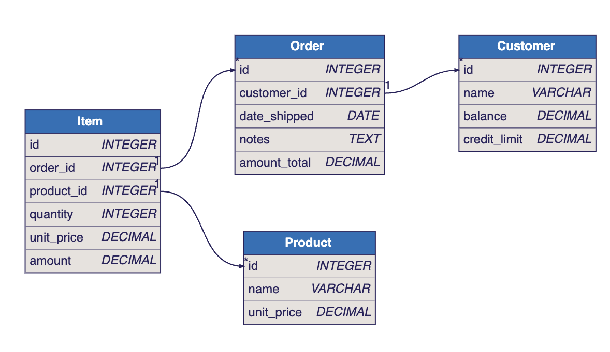

## Explore the created microservice in your Browser

API Logic Server / GenAI Microservice Automation has turned your prompt into a microservice; explore it:

1. A ***multi-table* application** - explore the links at left

2. A **standard *multi-table* JSON:API** - [click here]()

 

## TL;DR

From a simple Natural Language Prompt (or existing database), you get:

1. Multi-table App & API - no db design, framework, screen painting.  Your business idea, *running* - ready for collaboration and iteration.  

2. A project you can [customize in your IDE](https://apilogicserver.github.io/Docs/Tutorial/#3-customize-and-debug-in-your-ide) with Python, eg:

    * [declarative security](https://apilogicserver.github.io/Docs/Security-Overview/): keycloak authentication, role-based row authorization 

    * [declarative business logic](): multi-table constraints and derivations using rules that are 40X more concise than code, extensible with Python 

    * application integration (e.g., [kafka messaging](https://apilogicserver.github.io/Docs/Sample-Integration/)),  

To create unlimited projects on your cloud/network, contact `apilogicserver@gmail.com` for a free docker image, and project support

 

## Explore the created microservice locally

 

Download your Project, or Run the Docker Image

 You can explore this microservice on your own computer

1. Download

    * Observe the project is a set of [models]() - not a huge pile of difficult-to-understtand code

2. Docker

    * The created project includes scripts to automate docker creation, so you can deploy anywhere

 

## Automatic Database Design

## Project Information

Diagnostics 

 Name: genai 0182VZ9X3A1MY87STQTMRYWA7_1

Prompt: restaurant

 

## Internal Notes

### Current Landing

### Hover text

If possible, hover text for:

* *multi-table* multi-page app: Applications providing multiple pages, e.g. a Customer Page and an Order Page, with filtering, pagination and sorting

* *multi-table* api: self-serve (analogous to GraphQL), with pagination, optimistic locking, filtering, sorting, and related data access