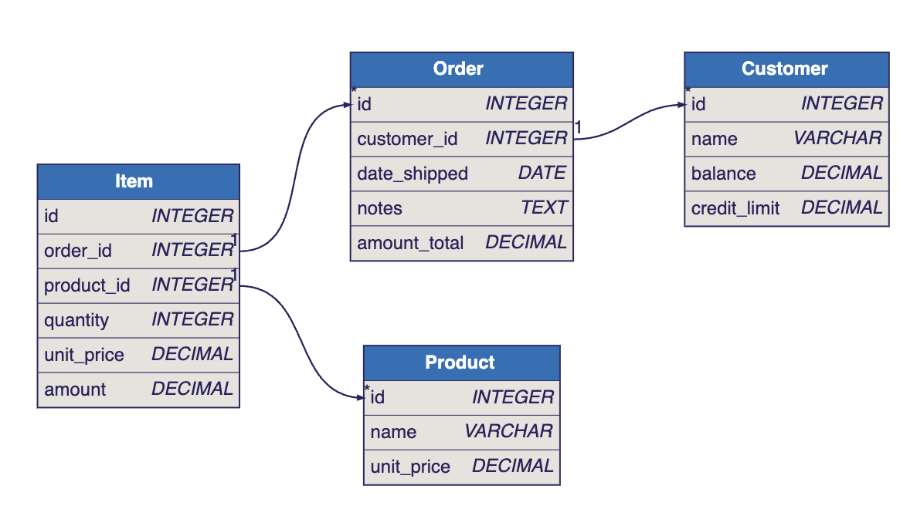
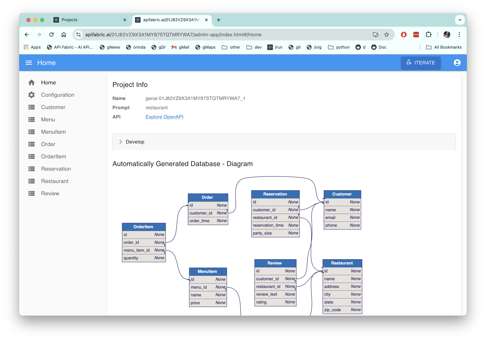

## Project Information

Prompt: yyy

API: [Expore Open API]()

 

Download the project, or run Docker image

You can explore this microservice on your own computer

1. [Download]() your project (customize in your IDE to add logic & security)

    * Observe the project is a set of [models]() - not a huge pile of difficult-to-understand code

2. Docker

 

 

What Just Happened

API Logic Server / GenAI Microservice Automation has turned your prompt into a microservice:

1. A ***multi-table* application** - explore the links at left

2. A **standard *multi-table* JSON:API** - [explore Open API here]()

 

It simply cannot be faster or simpler.

To create unlimited projects on your cloud/network, contact `apilogicserver@gmail.com` for a free docker image, and project support.

 

 

TL;DR - Instant Microservice, Customize with Declarative Rules and Python in your IDE

From a simple Natural Language Prompt (or existing database), you get:

1. **Instant Working Software** - enables collaboration and iteration to *get the requirements right:*

    * Eliminate weeks to months of complex framework coding, db design, or screen painting.  
    
    * Iterate 15 times... before lunch.

2. **Standards-Based Customization** - speed and simplicity, plus all the flexibility of a framework.  You get a standard project you can download and [**customize in your IDE**](https://apilogicserver.github.io/Docs/Tutorial/#3-customize-and-debug-in-your-ide) with Python, eg:

    * [Declarative security](https://apilogicserver.github.io/Docs/Security-Overview/): configure keycloak authentication, declare role-based row authorization 

    * [Declarative business logic](https://apilogicserver.github.io/Docs/Logic-Why/): multi-table constraints and derivations using ***unique rules*** that are 40X more concise than code, extensible with Python. 

    * [Application integration](https://apilogicserver.github.io/Docs/Sample-Integration/) (e.g., custom APIs and kafka messaging).  

3. **Automated Open Deployment** - standard containers

    * Created projects include scripts to automate docker creation, so you can deploy anywhere.  
    
    * Open means no runtime fees, no lock-in.

 

## Automatic Database Design

## Project Diagnostics

Diagnostics 

 Name: genai 0182VZ9X3A1MY87STQTMRYWA7_1

Prompt: restaurant

 

## Internal Notes

### Current Landing

### Hover text

If possible, hover text for:

* *multi-table* multi-page app: Applications providing multiple pages, e.g. a Customer Page and an Order Page, with filtering, pagination and sorting

* *multi-table* api: self-serve (analogous to GraphQL), with pagination, optimistic locking, filtering, sorting, and related data access