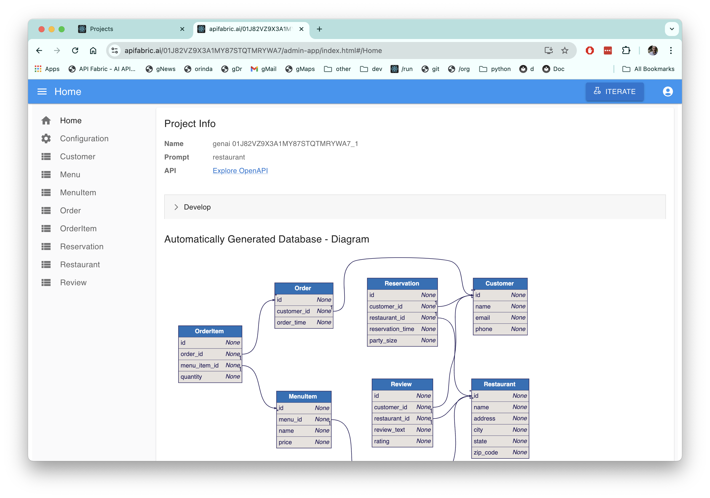

## Project Information

Prompt: yyy

API: [Expore Open API]()

 

Download the project, or run Docker image

You can explore this microservice on your own computer

1. [Download]() your project (customize in your IDE to add logic & security)

    * Observe the project is a set of [models]() - not a huge pile of difficult-to-understand code

2. Docker

 

 

What Just Happened

 

1. Instant Working Software - Get the Requirements Right

Automation has turned your prompt into a microservice: a working **application**, and a **standard API.**

It simply cannot be faster or simpler.

* Eliminate weeks to months of complex framework coding, db design, or screen painting.  

* Iterate 15 times... before lunch.

 

 

 

2. Customize - Declarative Rules and Python in your IDE

The speed and simplicity of AI, plus all the flexibility of a framework.  

* Download the standard project, and [**customize in your IDE**](https://apilogicserver.github.io/Docs/Tutorial/#3-customize-and-debug-in-your-ide)

* Use standard Python: e.g. provide [Application integration](https://apilogicserver.github.io/Docs/Sample-Integration/) (custom APIs and kafka messaging) 

* [Declarative security](https://apilogicserver.github.io/Docs/Security-Overview/): configure keycloak authentication, declare role-based row authorization 

* [Declarative business logic](https://apilogicserver.github.io/Docs/Logic-Why/): multi-table constraints and derivations using ***unique rules*** that are 40X more concise than code, extensible with Python 

 

 

 

3. Deploy - Standard container, no fees, no lock-in

Created projects include scripts to automate docker creation, so you can deploy anywhere.  

There are no runtime fees, no lock-in.

 

To create unlimited projects on your cloud/network, contact `apilogicserver@gmail.com` for a free docker image, and project support.

 

## Automatic Database Design

## Project Diagnostics

Diagnostics 

 Name: genai 0182VZ9X3A1MY87STQTMRYWA7_1

Prompt: restaurant

 

## Internal Notes

### Current Landing

### Hover text

If possible, hover text for:

* *multi-table* multi-page app: Applications providing multiple pages, e.g. a Customer Page and an Order Page, with filtering, pagination and sorting

* *multi-table* api: self-serve (analogous to GraphQL), with pagination, optimistic locking, filtering, sorting, and related data access