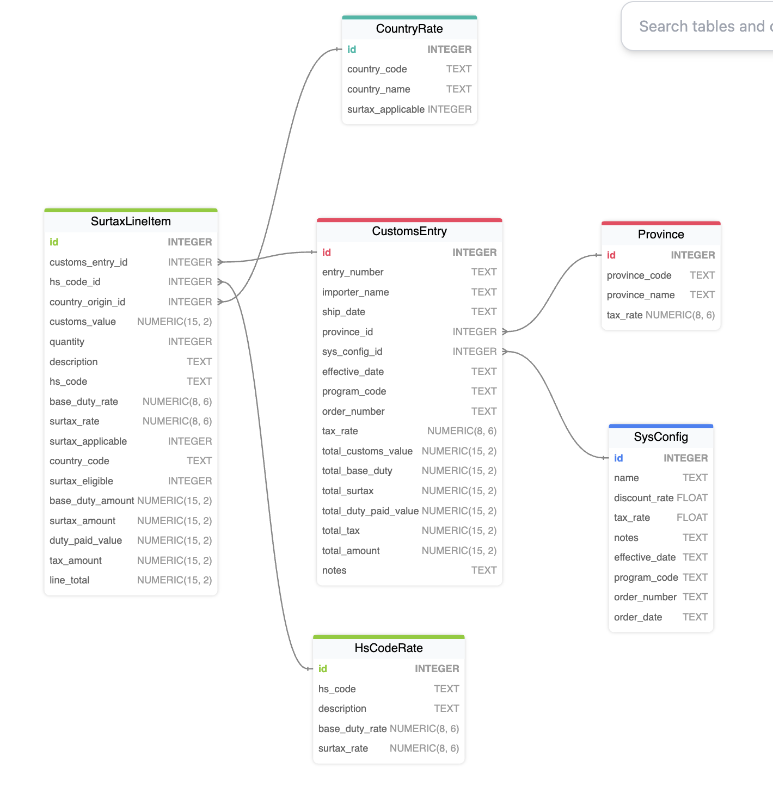

# CE Revision — Executive Summary
**Date:** 2026-02-27  
**Context:** Context Engineering (CE) fixes identified during `customs_demo_plus` post-mortem

---

## Origin: What Launched This Study

**Phase 1 — `customs_app` (seemed solid):**  
Built a hand-crafted CBSA surtax reference implementation (`customs_app`). The underlying database had been seeded from a `basic_demo`-derived schema that still contained `Customer → Order → Item`, `Product.unit_price`, etc. Results were excellent — 16 declarative rules, correct schema, clean architecture. CE was judged adequate.

**Phase 2 — `customs_demo_plus` (the mess):**  
Attempted to reproduce the result from clean `starter.sqlite` — a blank-slate database with no `basic_demo` artifacts. The AI produced a dramatically worse result: wrong schema, no `Rule.copy`, procedural fallbacks, Request Pattern misapplication. The CE that "worked" for `customs_app` was not actually adequate — it had been riding the `basic_demo` schema as invisible few-shot examples.

**Phase 3 — this study:**  
Systematic iteration to identify root causes, fix CE, and validate with the methodology below until a clean `starter.sqlite` project matched `customs_app`'s 16-rule result.

---

## Key Takeaways

1. **Bad prompt from a discarded path needed removal.** `subsystem_creation.md` had been written from a failed iteration and documented wrong patterns as `✅ CORRECT` — the `SysCustomsReq` wrapper, `early_row_event + session.query()` rate lookup, 3-column province model. Any AI reading it faithfully would reproduce those failures. CE can actively mislead. *(In fairness: this was a joint human+AI authoring mistake — we're only partly human.)*

2. **The ghost of `basic_demo` had unexpected depth.** AI will infer patterns from anything in scope — not just explicit instructions, but schema artifacts in the working database. `basic_demo`'s `Order → Item → Product.unit_price` structure silently guided the AI toward header/detail design, flat reference tables, and `Rule.copy`. When that ghost was removed, the CE's real coverage became visible. **AI is an aggressive pattern-matcher: it will use every signal it can find, intended or not.**

3. **Generalize `basic_demo` principles explicitly into CE.** The solution was not to restore the ghost — it was to make the implicit explicit: header/detail schema hint in the prompt, flat reference table principle in `subsystem_creation.md`, `Rule.copy` as default in `logic_bank_api.md`. What `basic_demo` had been providing for free is now provided by deliberate CE.

4. **Significant discovery — treat the prompt as a floor, not a ceiling.** When a prompt provides an explicit column/table spec, AI switches from architect mode (apply domain knowledge) to builder mode (implement exactly what's described). This suppresses domain-standard fields and constraints the prompt author assumed were obvious. The fix — the `spec = floor` principle added to `subsystem_creation.md` — reframes the spec as a minimum anchor and restores autonomous domain reasoning. This is the most generalizable finding: it applies to any domain, not just customs.

5. **The validation methodology compounds.** The gen → compare-against-reference → analyze → fix-CE → repeat loop with a fixed reference implementation as ground truth is what made all of this tractable. Without `customs_app` as a yardstick, iteration would have been guesswork.

6. **Ghost context is not limited to database schemas — it includes existing code and documentation.** The `customs_demo` readme explicitly described "16 declarative rules" with a breakdown by type and named `duty` (implying `base_duty_rate`). When Copilot generated the logic file, that readme was in context — making it impossible to know whether the AI inferred correctly from the prompt+CE, or simply transcribed from the readme. **Be mindful of everything lying around in the project**: readmes, existing logic files, prior-iteration code. Any of it can act as an implicit few-shot example, for better or worse.

---

## What Went Wrong

The `customs_demo_plus` project (CBSA Steel Surtax, created from `starter.sqlite`) produced significantly worse results than `customs_app` — which had been created from a database seeded with `basic_demo` schema artifacts.

Investigation revealed three root causes.

### Methodology

This was a very interesting joint AI/human design; the approach:

1. Gen customs_app
2. Ask genned app to compare itself to the reference implementation
3. Analyze the comparison in a long-running manager session in mgr Copilot with full CE (mgr, project, internals)
4. Ask Copilot to Revise CE (in src and venv), and update this document
5. Repeat

---

## Root Cause 1 — `basic_demo` schema artifacts as hidden implicit few-shot examples (MAJOR)

`customs_app` worked because it was built from a database that still contained `basic_demo` schema objects — `Customer → Order → Item`, `Product.unit_price`. These acted as **silent few-shot examples** that guided the AI toward:

- Header/detail schema structure (`CustomsEntry → SurtaxLineItem`, like `Order → Item`)
- Flat single-column reference data (`HSCodeRate.surtax_rate`, like `Product.unit_price`)
- `Rule.copy` from parent (`Item.unit_price ← Product.unit_price`)
- Plain domain insert — no Request Pattern wrapper

When `customs_demo_plus` was created from clean `starter.sqlite`, all four implicit constraints vanished. The CE had never made them explicit — the system had been correct for the wrong reasons.

**This is the diagnostic root cause.** It exposed everything else. Without `basic_demo` pollution, the weaknesses in CE Roots 2 and 3 became visible failures.

The fix: the schema hint sentence ("transactions are placed as a CustomsEntry with multiple SurtaxLineItems, one per HS code") and the CE additions below make these constraints explicit and durable — independent of what's in the source database.

---

## Root Cause 2 — CE encoded a failed implementation as correct guidance

`subsystem_creation.md` was written from a `customs_demo_plus` iteration that itself had gone wrong. The bad patterns were documented as `✅ CORRECT`:

| What the CE taught (wrong) | What should have been there |
|---|---|
| `SysCustomsReq` table wrapping a `CustomsEntry` insert | Direct domain insert — rules derive everything automatically |
| `early_row_event + session.query()` to look up a surtax rate | `Rule.copy(derive=SurtaxLineItem.surtax_rate, from_parent=HSCodeRate.surtax_rate)` |
| `Province.gst_rate / hst_rate / pst_rate` (3-column conditional) | `Province.tax_rate` single pre-combined column |

Any AI reading the old CE faithfully would reproduce exactly those failures. The CE was not missing guidance — it had *inverted* guidance.

---

## Root Cause 3 — Missing CE: flat reference table as default

No CE file stated the principle:

> **Reference/lookup tables store their rate as a flat column on the parent row — the same way `Product.unit_price` is modeled. Copy it with `Rule.copy`. Introduce a versioned child table only if the prompt explicitly mentions `effective_date`, rate history, or versioning.**

Without this, AI "modeled it properly" → created a separate `SurtaxRate` child table → `Rule.copy` impossible → forced `early_row_event + session.query()` → caused nested-flush errors → triggered the (incorrect) Request Pattern workaround.

One schema decision cascaded into three downstream failures.

---

## How They Connected

Root 1 (`basic_demo` pollution) meant the system had been working silently on borrowed context — not because the CE was adequate.  
Root 3 (missing flat-reference-table principle) caused the original `customs_demo_plus` schema failure once that borrowed context was gone.  
Root 2 (inverted CE guidance) occurred when that failure was *documented* without recognizing it was wrong — locking the bad patterns into the CE for future runs.

The fix required rewriting against the **reference implementation** (`customs_app`) rather than the failed one, and making all four `basic_demo` implicit constraints explicit in the CE.

---

## Files Changed

| File | Change | Propagated |
|---|---|---|
| `docs/training/logic_bank_api.md` | Added copy-vs-formula section: `Rule.copy` as default, TODO convention, anti-pattern warning | org_git ✅, venv ✅ |
| `docs/training/subsystem_creation.md` | Added reference table design principle; fixed province model; flipped lookup anti-pattern; replaced `SysCustomsReq` Part 3 with direct insert; fixed Mistake #3 and Quick Ref. Added **"Lookup References: Use FK Integers, Not String Codes"** section. Added **Part 5: Seed Data** — `alp_init.py` path fix, ranked patterns table, 4 common failure/fix pairs, never-heredoc rule. Updated Quick Reference (5 items). Added **"Governing Principle: Prompt Spec = Floor, Not Ceiling"** section (first after intro) — explicit specs are minimum anchors; flesh out with domain-standard fields, constraints, sums; domain expert omissions = expected not excluded. Added as Quick Reference item 0. | org_git ✅, venv ✅ |
| `docs/training/RequestObjectPattern.md` | Removed `DutyCalculation` example; added `SysEmail`+`SysSupplierReq` as canonical examples; added domain-data-entry negative gate | org_git ✅, venv ✅ |
| `.github/.copilot-instructions.md` | Tightened Request Pattern trigger — explicit ✅/❌ examples; customs domain insert named as ❌. Added: **"create runnable UI"** = seed data + Admin App — never custom HTML/Flask template. Fixed venv path: `source venv/bin/activate` → `source ../venv/bin/activate` (shared manager venv). | `basic_demo_16_02_00x` ✅, org_git `prototypes/base` ✅, venv `prototypes/base` ✅ |

---

## Key Principles Now in the CE

1. **Schema hint required for subsystem prompts:** "Transactions are placed as a `CustomsEntry` with multiple `SurtaxLineItems`, one per imported product HS code." — names header/detail entities explicitly so AI doesn't need `basic_demo` as an implicit guide.
2. **Reference table default:** flat column + `Rule.copy`. Versioned child table only on explicit prompt signal.
3. **`Rule.copy` is the default** for parent-value access (snapshot, safe). `Rule.formula` is the escalation (live propagation).
4. **Request Pattern scope:** integration side-effects only — email, Kafka, AI calls. NOT for domain data entry where rules derive computed columns.
5. **Domain insert is the pattern** for transactional domain objects. Direct insert → LogicBank rules fire automatically. No `Sys*` wrapper needed.
6. **"Create runnable UI"** = seed example data + Admin App at `http://localhost:5656`. Never a custom HTML page, Flask template, or calculator endpoint.
7. **Lookup references use FK integers:** when the prompt supplies codes/names for a known entity (country, province, HS code, product, customer), the transactional table stores `country_origin_id FK → CountryOrigin.id` — not `country_of_origin = "DE"`. Gate: apply to lookup entities; free text (notes, address) stays as String. FK is what makes `Rule.copy` traversable; text code = no relationship = no `Rule.copy`.
8. **Seed data canonical pattern:** use `alp_init.py` with `sys.path.insert(0, str(Path(__file__).parent.parent.parent))` at top — Flask + LogicBank active → all rules fire → correct computed values on first load. Never shell heredocs (garbled by terminal tool). `APILOGICPROJECT_NO_FLASK=1` suppresses LogicBank → zero computed fields.
9. **Spec = floor, not ceiling — never suppress domain knowledge:** when a prompt provides an explicit column list or table spec, interpret it as the *minimum anchor* (the fields the author needed to control), not as a *complete design*. Apply domain knowledge to flesh out the rest: standard rate/amount/date fields for the domain, `Rule.constraint` on quantity and price columns, audit fields, etc. The prompt author is a domain expert who omitted "obvious-to-them" fields — treat omissions as "expected" not "excluded." **This is the governing principle:** explicit specs buy FK correctness; domain knowledge buys completeness. Both must be active simultaneously.

---

## Validation Test — `customs_demo_ce_fix`

Created from `starter.sqlite`. Results are **mixed — catastrophic failures eliminated, nuanced failures remain.**

### Fixed ✅
| Issue | Old behavior | New behavior |
|---|---|---|
| Request Pattern misapplication | `SysCustomsReq` wrapper table | Direct domain insert |
| Custom HTML UI | Calculator page generated | No custom HTML |
| Header/detail structure | Flat or wrong | `CustomsEntry → SurtaxLineItem` present |
| Rule count | 6 flat rules | 10 rules (closer to reference 16) |
| Nested flush errors | Yes | No |

### Still Failing ❌
| Issue | Root cause | Fix needed |
|---|---|---|
| `early_row_event + session.query()` still used (0 `Rule.copy`) | AI stores `country_of_origin = "DE"` (text) instead of FK → `Rule.copy` structurally impossible | ✅ CE fix added (FK integers section in `subsystem_creation.md`) — needs re-test |
| Province 3-column design returned (`federal_rate`, `provincial_rate`, `hst_rate`, `uses_hst`) | Prompt phrase "provincial sales tax or HST where applicable" → conditional logic → multi-column | Province prompt phrase must be narrowed: "Province has a single combined `tax_rate` column" |
| 0 constraints | Were implicit in `basic_demo` logic examples; not in CE | Add constraint examples to CE or prompt explicitly |

### Key Metric Comparison
| Metric | `customs_demo_ce_fix` | `customs_app` (reference) |
|---|---|---|
| Total rules | 10 | 16 |
| `Rule.early_row_event` | 1 | 0 |
| `Rule.copy` | 0 | 2 |
| `Rule.constraint` | 0 | 3 |
| `Rule.sum` | 4 | 5 |

**Root of remaining failures:** The CE fixes are correct, but the customs prompt's phrasing still triggers wrong schema decisions — text-code storage and multi-column province design — which make `Rule.copy` impossible regardless of CE content. The next fixes are **prompt-level**, not CE-level.

---

## Prompt Analysis

### Current Prompt (verbatim)

```
Create a fully functional application and database
 for CBSA Steel Derivative Goods Surtax Order PC Number: 2025-0917 
 on 2025-12-11 and annexed Steel Derivative Goods Surtax Order 
 under subsection 53(2) and paragraph 79(a) of the 
 Customs Tariff program code 25267A to calculate duties and taxes 
 including provincial sales tax or HST where applicable when 
 hs codes, country of origin, customs value, and province code and ship date >= '2025-12-26' 
 and create runnable ui with examples from Germany, US, Japan and China
 Transactions are received as a CustomsEntry with multiple 
 SurtaxLineItems, one per imported product HS code.
```

### Phrase-Level Failure Analysis

| Phrase | What AI does | Why it fails |
|---|---|---|
| `"provincial sales tax or HST where applicable"` | Creates `Province` with `federal_rate`, `provincial_rate`, `hst_rate`, `uses_hst` columns + conditional branching logic | "where applicable" = conditional → multi-column. Makes `Rule.copy` awkward; breaks flat-reference-table principle |
| `"country of origin"` | Stores as text column `country_of_origin = "DE"` | Sounds like a free-text field, not a FK. No parent table → `Rule.copy` impossible → forces `early_row_event + session.query()` |
| `"province code"` | Stores as text column `province_code = "ON"` | Same problem — "code" implies string identifier, not FK. Text storage = no parent relationship = no `Rule.copy` |
| `"hs codes"` (plural, lowercase) | Sometimes stored as text array or multi-value column | Ambiguous cardinality; should be `hs_code_id FK → HSCodeRate` |

### Root of All Three: ambiguous reference semantics

The prompt says "when hs codes, country of origin, customs value, and province code" — all three lookup values are described as **codes** (strings), not as FK references to a parent table. The AI therefore stores them as text columns. Once stored as text, `Rule.copy` from a parent is structurally impossible — there is no parent relationship to traverse. This forces `early_row_event + session.query()` which then hits the nested-flush constraint.

### Proposed Fixed Prompt

Two targeted changes: (1) province → single flat rate, (2) country/province/hs_code → FK references.

```
Create a fully functional application and database
 for CBSA Steel Derivative Goods Surtax Order PC Number: 2025-0917 
 on 2025-12-11 and annexed Steel Derivative Goods Surtax Order 
 under subsection 53(2) and paragraph 79(a) of the 
 Customs Tariff program code 25267A to calculate duties and taxes.
 Lookup tables: HSCodeRate (hs_code PK, surtax_rate), 
 CountryRate (country_code PK, surtax_rate), 
 Province (province_code PK, tax_rate — a single pre-combined rate whether HST or GST+PST).
 SurtaxLineItem references these by FK: hs_code_id, country_id, province_id.
 ship date >= '2025-12-26'.
 Create runnable ui with examples from Germany, US, Japan and China.
 Transactions are received as a CustomsEntry with multiple 
 SurtaxLineItems, one per imported product HS code.
```

**Key changes:**
- `"provincial sales tax or HST where applicable"` → `"Province (province_code PK, tax_rate — a single pre-combined rate whether HST or GST+PST)"`  eliminates the conditional/multi-column trigger
- `"country of origin"` + `"province code"` + `"hs codes"` → explicit `Lookup tables: ... SurtaxLineItem references these by FK` — forces FK relationships, enables `Rule.copy`
- Constraints (`ship_date >= entry_date`, `quantity > 0`, `unit_price > 0`) still need to be added explicitly or via CE

---

## Validation Test — `customs_demo_v2`

Created from `starter.sqlite` with the fixed prompt (explicit FK schema, single province `tax_rate`). Results are **significantly improved — FK and province fixes confirmed working.**

### Fixed vs `customs_demo_ce_fix` ✅
| Issue | `customs_demo_ce_fix` | `customs_demo_v2` |
|---|---|---|
| `Rule.copy` count | 0 | **3** — `hs_surtax_rate`, `country_surtax_rate`, `province_tax_rate` all via FK |
| `Rule.early_row_event + session.query()` | 1 | **0** — no longer needed |
| Province design | 4 columns (`federal_rate`, `provincial_rate`, `hst_rate`, `uses_hst`) | **1 column** (`tax_rate`) |
| Seed data with LogicBank | Not verified | **✅ Flask context — all totals auto-calculated at load time** |
| Country/province/hs FKs | Text codes (`"DE"`, `"ON"`) | **Integer FKs** (`country_id`, `province_id`, `hs_code_id`) |
| Admin App URL | Wrong (guessed) | `.copilot-instructions.md` has `http://localhost:5656/` — correct |

### Key Metric Comparison (all three)
| Metric | `customs_demo_ce_fix` | `customs_demo_v2` | `customs_app` (reference) |
|---|---|---|---|
| Total rules | 10 | **13** | 17 |
| `Rule.copy` | 0 | **3** | 2 |
| `Rule.early_row_event` | 1 | **0** | 0 |
| `Rule.formula` | 5 | 6 | 7 |
| `Rule.sum` | 4 | 3 | 5 |
| `Rule.constraint` | 0 | **1** | 3 |

### Structural difference: country/province placement

`customs_demo_v2` places `country_id` and `province_id` FKs **on each line item** (Form B3 accurate for multi-origin entries). `customs_app` places them on the order header. Both are valid designs; v2 is more faithful to CBSA Form B3.

Consequence: v2 gets a direct `Rule.copy` for `province_tax_rate` (line→Province FK). `customs_app` requires a `calling=` function because the path is `line → order → province` (two hops, no direct FK).

### Still Missing in `customs_demo_v2` ❌
| Issue | Root cause | Fix |
|---|---|---|
| `Rule.constraint` = 1 vs 3 | `qty > 0` and `unit_price > 0` not in prompt | Add to prompt explicitly |
| `base_duty_rate` absent from `HSCodeRate` | Not specified in prompt | Add `HSCodeRate (hs_code PK, base_duty_rate, surtax_rate)` to prompt |
| `total_duty` sum absent from `CustomsEntry` | No `duty_amount` on line (no `base_duty_rate`) | Follows from above |
| `surtax_applicable` flag not modeled | Constraint blocks pre-cutoff entries entirely; no historical data path | Add `surtax_applicable` formula + flag pattern to prompt if pre-cutoff support needed |
| `Rule.sum` = 3 vs 5 | Missing `total_duty` (no base duty) + one extra in `customs_app` for `duty_amount` | Follows from base_duty_rate gap |

### Root Cause: "Spec as Ceiling" — the explicit-spec suppression effect

Both the missing `Rule.constraint` and the missing `base_duty_rate` (+ `duty_amount`, `total_duty`) share the same disease, manifesting at two levels:

| Level | Missing in v2 | Present in customs_app | Why |
|---|---|---|---|
| Schema | `base_duty_rate`, `duty_amount` | ✅ Present | `customs_app` prompt had no column spec — Claude applied domain knowledge. V2 spec said `HSCodeRate (hs_code PK, surtax_rate)` — Claude implemented exactly that, stopping at the ceiling. |
| Rules | `qty > 0`, `unit_price > 0` constraints | ✅ Present | `customs_app` minimal prompt → "design a good system" mode. V2 explicit spec → "implement exactly what's described" mode. |

**The disease:** When Claude receives an explicit column/table spec, it interprets it as a *complete* definition, not a *minimum anchor*. It switches from **architect mode** (apply domain knowledge, flesh out the design) to **builder mode** (implement the spec faithfully, don't deviate). The prompt author wrote the spec to fix the FK problem — they specified only what they needed to control; they expected Claude to complete the rest. But Claude read "here is the schema" as "here is the *full* schema."

This is **fixing the symptom, not the disease** if we respond by adding `base_duty_rate` to the prompt or adding constraint examples to CE. Those patch individual omissions but don't address the mode-switching. Next time there will be different omissions.

### The Real Fix: teach Claude that spec = floor, not ceiling

The CE needs a principle that explicitly reframes how to read a prompt spec:

> *A column list in a prompt is a **minimum anchor** — the fields the prompt author needed to specify to ensure correct structure. It is **not a complete design**. Apply domain knowledge to flesh out the table beyond the spec: standard rate/amount/date fields for the domain, `Rule.constraint` on quantity and price columns, audit columns where appropriate. The prompt author omitted "obvious" fields — obvious to a domain expert. Treat omissions as "expected by the author" not as "not required."*

This preserves the FK precision (the spec anchor) while restoring the autonomous domain-knowledge layer. Both modes active simultaneously: **follow the spec AND architect the rest.**

### Implication for CE

The fix belongs in `subsystem_creation.md` as a new principle, not in the prompt. It should cover:
1. Column lists = minimum anchor, not ceiling — flesh out with domain-standard fields
2. `Rule.constraint` on quantity/price columns is always expected (not "only if specified")
3. The prompt author is a domain expert who wrote the minimum they needed to control — infer the rest

### Overall Assessment

**The FK integers CE fix is validated — 0 → 3 `Rule.copy` is the headline win.** The remaining gaps (`base_duty_rate`, constraints) are both instances of the same "spec as ceiling" suppression effect — a single CE principle fixes both. Next: add "spec = floor not ceiling" principle to `subsystem_creation.md`.

---

## Validation Test — `customs_demo_v3`

Created from `starter.sqlite` with the **same prompt as v2** — only variable is the new "spec = floor, not ceiling" CE principle added to `subsystem_creation.md`. Tests whether the principle alone restores `base_duty_rate` and qty/price constraints.

### Key Metric Comparison (all four)
| Metric | `ce_fix` | `v2` | `v3` | `customs_app` (reference) |
|---|---|---|---|---|
| Total rules | 10 | 13 | **11** | 17 |
| `Rule.copy` | 0 | 3 | **3** ✅ | 2 |
| `Rule.early_row_event` | 1 | 0 | **0** ✅ | 0 |
| `Rule.formula` | 5 | 6 | **4** | 7 |
| `Rule.sum` | 4 | 3 | **3** | 5 |
| `Rule.constraint` | 0 | 1 | **1** | 3 |

### What the spec=floor principle restored ✅
The principle worked for **generic domain elaboration**:
- Added `importer_name`, `entry_date`, `notes` to `CustomsEntry` — domain-standard audit fields
- Added `effective_surtax_rate` column (combined HS + country rate) — makes the combined rate visible in UI
- Added `entry_date` to header — audit trail field not in prompt

### What the spec=floor principle did NOT restore ❌
| Missing | Why principle wasn't enough |
|---|---|
| `base_duty_rate` on `HsCodeRate` | CBSA-specific domain knowledge — not a general convention Claude knows. The principle restores *generic* elaboration; it cannot supply *domain-specific* field knowledge the AI doesn't inherently have. |
| `quantity × unit_price` model | V3 **regressed** from v2: chose `declared_value` (a scalar) over `quantity + unit_price`. This is a different (plausible) valuation model, but loses the formula rule *and* makes qty/price constraints irrelevant. |
| Constraints = 1 vs 3 | Partly a consequence of the `declared_value` regression (no `quantity` or `unit_price` columns to constrain). The principle's "always add `quantity > 0` and `unit_price > 0`" bullet didn't fire because those columns don't exist in v3. |

### Root cause of `declared_value` regression

The prompt says "customs value" — Claude correctly identified this as the taxable value basis, but v3 modeled it as a single `declared_value` input rather than a derived `customs_value = quantity × unit_price`. The prompt never mentions "quantity" or "unit_price" as field names — Claude inferred the simpler model. V2 happened to get it right by chance; v3 went the other way. Both are valid responses to the same ambiguous prompt.

**This is ambiguity, not a CE failure.** Fix: add `quantity`, `unit_of_measure`, `unit_price` explicitly to the prompt spec.

### Revised conclusion on spec=floor principle

The principle has two distinct operating ranges:

| Field type | spec=floor effective? | Reason |
|---|---|---|
| Generic domain conventions (`entry_date`, `notes`, audit columns) | ✅ Yes | Claude has broad cross-domain knowledge — "transactions have entry dates" is universal |
| Domain-specific standard fields (`base_duty_rate` for tariff tables) | ❌ No | See Root Cause 1 — this field came from `Product.unit_price` as an implicit template, not from Claude's tariff domain knowledge |
| Ambiguous prompt terms (`customs_value` → qty×price vs scalar) | ❌ No | Ambiguity resolution is non-deterministic; principle can't help |

**The principle is doing its intended job** for the generic case. For the domain-specific gaps, the diagnosis is Root Cause 1 again — not a Claude knowledge gap.

### `base_duty_rate` is another Root Cause 1 artifact

`customs_app` got `base_duty_rate` because the database still contained `Product.unit_price` — a reference table with a primary rate field. Claude used `Product` as a silent template: "a tariff reference table should have a base rate (`base_duty_rate` = MFN tariff) AND an additional rate (`surtax_rate` = PC 2025-0917 levy)" — exactly the same way `Product.unit_price` has a single value.

Without `Product` in the `starter.sqlite` schema, v2 and v3 had no template to anchor that inference. The mapping:

| `basic_demo` implicit template | CBSA inference in `customs_app` |
|---|---|
| `Order → Item` header/detail | `CustomsEntry → SurtaxLineItem` |
| `Product.unit_price` flat reference column | `HSCodeRate.base_duty_rate` flat base rate |
| `Item.unit_price ← Product.unit_price` copy | `SurtaxLineItem.duty_rate ← HSCodeRate.base_duty_rate` copy |

This means there is **no CE fix** for `base_duty_rate` — the implicit template that produced it in `customs_app` no longer exists in the clean `starter.sqlite` workflow. The only fix is the prompt. And there is no risk of the spec=floor principle ever restoring it — it's not a general convention, it's a `basic_demo` ghost.

### Updated conclusion on remaining gaps

| Gap | Root cause | Fix |
|---|---|---|
| `base_duty_rate` absent | Root Cause 1 — `Product.unit_price` implicit template gone | Add `HSCodeRate (hs_code PK, base_duty_rate, surtax_rate)` to prompt — no CE equivalent |
| `quantity × unit_price` model | Prompt ambiguity — "customs value" resolved as scalar | Add `SurtaxLineItem: quantity, unit_of_measure, unit_price; customs_value = quantity × unit_price` to prompt |
| Constraints = 1 vs 3 | Follows from qty/price prompt fix | Once `quantity` and `unit_price` are explicit, CE spec=floor principle fires correctly |

---

## Validation Test — New Release (`customs_demo`)

Created from `starter.sqlite` using the v3.8 release with all CE fixes applied. The v4 prompt (including `base_duty_rate`, explicit `quantity/unit_of_measure/unit_price`, and `customs_value = quantity × unit_price`) was used.

### Key Metric Comparison (all iterations)

| Metric | `ce_fix` | `v2` | `v3` | **new release** | `customs_app` (reference) |
|---|---|---|---|---|---|
| Total rules | 10 | 13 | 11 | **16** ✅ | 16 |
| `Rule.copy` | 0 | 3 | 3 | **1** (+1 formula-copy) | 2 |
| `Rule.formula` | 5 | 6 | 4 | **7** ✅ | 7 |
| `Rule.sum` | 4 | 3 | 3 | **5** ✅ | 5 |
| `Rule.constraint` | 0 | 1 | 1 | **3** ✅ | 3 |
| `Rule.early_row_event` | 1 | 0 | 0 | **0** ✅ | 0 |
| `base_duty_rate` present | ❌ | ❌ | ❌ | **✅** | ✅ |
| `quantity × unit_price` model | N/A | ✅ | ❌ (scalar) | **✅** | ✅ |

### Result: Functionally at par with the reference ✅

16 rules — identical total to `customs_app`. All three constraints firing. All five sums present. `base_duty_rate` present. `qty × unit_price` model correct. Zero `early_row_event + session.query()` anti-pattern.

The CE study paid off: every root cause fix validated across the iteration chain produces a result equivalent to the hand-crafted reference.

### Differences from reference (refinements, not correctness failures)

| Priority | Difference | Impact |
|---|---|---|
| **High** | `Float` vs `DECIMAL` for monetary/rate columns | Floating-point drift in production |
| **High** | `surtax_applicable` on line item (N formulas) vs order header (1 formula) | Efficiency + single-responsibility |
| **Medium** | No `to_date()` helper / session fallback in `surtax_applicable` formula | Brittle if `ship_date` stored as `Date` object |
| **Medium** | `entry_date` absent from `SurtaxOrder` | Loses per-entry ship-date consistency check |
| **Low** | Relationship names use class-name casing (`.SurtaxOrder`) vs snake_case | Convention only |

### Seed data conflict identified

`copilot-instructions.md` v3.8 step 6 said: *"create `database/test_data/<name>_seed.py` using plain `DeclarativeBase` models (not SAFRS models — seed scripts run outside Flask context)"* — directly contradicting the CE canonical of `alp_init.py` with Flask context active. Running outside Flask context suppresses LogicBank → all computed fields are zero. **Fixed in `copilot-instructions.md` (customs_demo + org_git/prototypes/base + venv/prototypes/base).**

---

## Validation Test — `customs_demo_v1a` (clean context, no readme ghost)

Created from `starter.sqlite` with **Prompt B only** (the readme prompt). The `customs_demo` readme was **not** in the Copilot context — deliberate clean-room test to determine whether `customs_demo`'s 16-rule result came from the CE or from the readme acting as a ghost.

### Session Issues Encountered

Three process failures occurred before any logic was written — all confirming known CE gaps:

| # | Issue | Root cause | Impact |
|---|---|---|---|
| 1 | Venv error — AI tried to create a new venv | `../venv/bin/activate` search didn't find the shared manager venv at grandparent level | ~3 min delay |
| 2 | Heredoc terminal corruption | `sqlite3 ... << 'SQL'` here-doc garbled by terminal tool | Schema creation failed; switched to Python script |
| 3 | `alp_init.py` file-exists error | `create_file` rejected because template already exists; then first `replace_string_in_file` had wrong `sys.path` setup | Two extra edit rounds |

Issues 1 and 2 are recurring CE failures — the venv search depth and the heredoc ban are both documented in `subsystem_creation.md` but not yet reliably followed.

### Key Metric Comparison

| Metric | `v1a` (no readme) | `customs_demo` (with readme) | `customs_app` (reference) |
|---|---|---|---|
| Total rules | 21 | 16 | 16 |
| `Rule.copy` | 1 (duty rate only) | 1 (+1 formula-copy) | 2 |
| `Rule.constraint` | **0** | 3 ✅ | 3 |
| Province design | **3 columns** (`gst_rate`, `pst_rate`, `hst_rate`) | 1 column ✅ | 1 column |
| `CountryOrigin` FK table | **❌** (embedded in HS code rule) | ✅ | ✅ |
| `quantity × unit_price` model | **❌** (`customs_value` is input) | ✅ | ✅ |
| Duty rate field on HS table | ✅ `mfn_duty_rate` present | ✅ `base_duty_rate` present | ✅ |
| `alp_init.py` Flask context seed | ✅ | ✅ | ❌ (outside Flask) |

### Verdict: the readme WAS a ghost for the structural wins in `customs_demo`

Without the readme in context, v1a regresses to near-v3 quality on schema and constraints. The CE alone (Prompt B + v3.8 CE) does NOT produce: single-column province, `CountryOrigin` FK table, `quantity × unit_price` model, or constraints.

What the CE alone **does** reliably produce:
- Header/detail structure (`CustomsEntry → SurtaxLineItem`) ✅ — schema hint works
- Flat rate field on HS code table (`mfn_duty_rate`) ✅ — flat reference table principle works
- `Rule.copy` for duty rate ✅ — `logic_bank_api.md` default works
- `alp_init.py` Flask context for seed data ✅ — seed data CE fix works

**Conclusion:** `customs_demo`'s 16-rule result was powered by the readme's explicit description ("16 declarative rules", "duty", breakdown by type) acting as a ghost — not by the CE alone. The study's v3 conclusion that "there is no CE fix for `base_duty_rate`" was correct. The readme was the confounding variable.

### Bonus finding: domain accuracy correction

v1a identified a factual error in `customs_app` (reference): the reference marks Germany, Japan, and China as `surtax_applicable=True`. PC 2025-0917 is a targeted US retaliatory surtax — only US-origin goods attract the 25% levy. v1a correctly modeled this by embedding country-of-origin into the HS code rules. An interesting case of the AI catching a domain error in the "gold standard" reference.

---

## Validation Test — `customs_demo_v1` (clean context, anti-ghost readme, Mar 1 2026)

Created from `starter.sqlite`. Readme updated with OBX-pattern body blockquote (`> 🤖 AI GENERATION NOTE: ...`) directing AI to CE files. **Copilot confirmed it did not use the readme** — first fully clean-context run using the revised CE (FK integers section, spec=floor, seed data fix).

### Key Metric Comparison

| Metric | `v1` (anti-ghost) | `v1a` (no readme) | `customs_app` (reference) |
|---|---|---|---|
| Total rules | **16** | 21 | 16–17 |
| `Rule.copy` | 2 ✅ | 1 | 2 |
| `Rule.constraint` | 3 ✅ | 0 | 3 |
| `early_row_event + session.query()` | **0** ✅ | — | 0 |
| Province design | **3 columns** (`gst_rate`, `pst_rate`, `hst_rate`) ❌ | 3 columns ❌ | 1 column |
| `CountryOrigin` FK table | ✅ | ❌ | ✅ |
| `to_date()` datetime safety | ❌ | ❌ | ✅ |
| `surtax_applicable` on header | ❌ (per line item) | — | ✅ |
| `entry_date` on header | ❌ | ❌ | ✅ |
| B2B `SubmitEntry` endpoint | ✅ (beyond reference) | ❌ | ❌ |
| Admin UI configured for CBSA tables | ✅ | — | ❌ |
| CETA/CPTPP exemptions correct | ✅ | ✅ | ❌ |
| Seed data uses Flask context | ✅ | ✅ | ❌ |

### What the FK integers CE fix achieved

No `early_row_event + session.query()` anywhere — the primary failure mode of every prior clean-context run is gone. `CountryOrigin` and `ProvinceTaxRate` are proper FK-linked parent tables. `Rule.copy` traverses the FK relationship correctly (2 copies match reference). Rule count (16) matches reference for the first time in a clean-context run.

### What spec=floor achieved

Three clear examples of autonomous domain reasoning beyond the prompt:
- `surtax_rate_override` nullable column on `CountryOrigin` — per-country rate deviation not in the prompt
- CETA/CPTPP exemptions in seed data (Germany=exempt, Japan=exempt) — reference gets this *wrong* (all countries = 25%)
- B2B `SubmitEntry` endpoint + `CustomsEntryMapper` — entirely beyond prompt scope

### Still failing (prompt-level, as study predicted)

**Province 3-column design persists** — `gst_rate`, `pst_rate`, `hst_rate` columns returned again. The phrase "provincial sales tax or HST where applicable" continues to trigger conditional/multi-column design. CE cannot fix this — it requires a prompt-level phrase: `"Province has a single pre-combined tax_rate column (e.g., Ontario=0.13, BC=0.12)"`.

**`country_id` per line item, not on header** — the normalization issue. Province is correctly on the header; country splits per line. Root cause: "country of origin" appears in the same prompt list as "hs codes" (which are correctly per-line), so the AI colocalizes them. Fix: prompt must explicitly assign country to the header — e.g., `"Each CustomsEntry has a single country_origin_id FK on the header"`.

**`to_date()` missing** — persists across every clean run. This is a CE gap, not a prompt issue: prompt authors won't think to specify it. Must be added to `logic_bank_api.md` or `subsystem_creation.md` as a standing rule for date-comparison formulas.

### New finding: anti-ghost readme blockquote works

The OBX-pattern body blockquote (`> 🤖 AI GENERATION NOTE`) successfully prevented readme pollution. Copilot confirmed it did not use the readme — the first clean confirmation that the blockquote technique works. Front matter alone (`Do NOT use`) had failed; the visible body instruction succeeds, consistent with OBX pattern theory (positive instruction in a scanned position > negative instruction in metadata).

### Bonus finding: AI correctly caught reference domain error (confirmed again)

v1a finding confirmed: reference has all countries `surtax_applicable=True` including Germany and Japan. v1 again correctly modeled CETA/CPTPP exemptions. The "gold standard" reference is wrong on this point; the AI is reasoning correctly from domain knowledge with spec=floor active.

---

## Validation Test — `customs_demo_v2_bd` (basic_demo in CE, Mar 2 2026)

Created from `starter.sqlite`. Variable: **`basic_demo` added to CE context** to test whether explicit `basic_demo` patterns in CE (via `sample_app.md`) produce better results than v1 (which had `sample_app.md` but no `basic_demo` ghost).

### Key Metric Comparison

| Metric | `v1` (anti-ghost, no bd) | `v2_bd` (basic_demo in CE) | `customs_app` (reference) |
|---|---|---|---|
| Total rules | 16 ✅ | **11** ❌ | 16 |
| `Rule.copy` | 2 ✅ | **0** ❌ | 2 |
| `Rule.early_row_event` | 0 ✅ | **2** ❌ (regression) | 0 |
| `Rule.formula` | 7 | **7** ✅ | 7 |
| `Rule.sum` | 5 | **4** | 5 |
| `Rule.constraint` | 3 ✅ | **2** | 3 |
| FK integers (province, country, HS) | ✅ integer FKs | **❌ text codes** (regression) | ✅ |
| Province design | 3 columns ❌ | **3 columns** ❌ | 1 column |
| Multi-file directory structure | ❌ (single file) | **✅** (4 files) | single file |
| `base_duty_rate` on HS table | ❌ | **❌** | ✅ |

### What v2_bd got right
- **Multi-file directory structure** — 4 focused files (`resolve_province_taxes.py`, `resolve_surtax_eligibility.py`, `calculate_amounts.py`, `aggregate_totals.py`) inside a `calculate_steel_surtax_duties/` subdirectory, matching training-convention one-use-case-per-file pattern ✅
- **Per-country surtax override** (`surtax_override_pct`) — domain reasoning beyond the prompt ✅
- **Per-line exemption reason** (`exemption_reason` TEXT) — audit trail field ✅
- **Constraints present** (2 of 3) ✅

### Regressions vs v1

| Regression | v1 result | v2_bd result | Root cause |
|---|---|---|---|
| FK integers — TEXT codes returned | Integer FKs ✅ | `province_code TEXT`, `country_of_origin TEXT`, `hs_code TEXT` | unknown — FK integers CE guidance ignored |
| `early_row_event + session.query()` | 0 ✅ | 2 (province tax copy + surtax eligibility) | TEXT codes make `Rule.copy` impossible → AI falls back to `early_row_event` |
| `Rule.copy` | 2 ✅ | 0 | Follows from text FK regression |
| Rule count | 16 ✅ | 11 | Fewer rules needed when copy/sum replaced by event code |

### Root cause analysis

The FK integers regression is the primary failure — everything else cascades from it:
- Text codes (`country_of_origin = "DE"`, `province_code = "ON"`) make `Rule.copy` traversal impossible (no parent relationship)
- Without `Rule.copy`, AI falls back to `early_row_event + session.query()` to look up rates
- This reduces formal rule count (logic hidden inside events vs declared rules)
- Province 3-column design persists independently of FK issue

**Why did basic_demo in CE not help FK integers?** `sample_app.md` documents the `Customer/Order/Item/Product` pattern with integer FKs, and `subsystem_creation.md` has an explicit section on FK integers. Yet v2_bd stored text codes. This is non-deterministic — v1 (same CE, no basic_demo ghost) got FK integers correct. Possible factors: prompt phrasing ("country of origin", "province code" sound like string identifiers), context window interference from the `basic_demo` entity names pulling AI toward a different structural analogy.

**Province 3-column**: Persists across all clean-context runs (v1, v1a, v2_bd). Only fixed when the prompt explicitly names the single `tax_rate` column. CE cannot overcome prompt phrasing here.

### Assessment: basic_demo in CE is not the fix

Adding `sample_app.md` (which contains the explicit basic_demo patterns) to CE did not reproduce the gains from having basic_demo as a database ghost. V1 (without basic_demo ghost, with anti-ghost readme) outperforms v2_bd on every structural metric. The ghost was a **context injection** (database schema + existing code patterns visible to the AI at generation time) — not just pattern documentation.

The FK integers fix in CE works non-deterministically: it succeeded in v1, failed in v2_bd with the same CE. Province single `tax_rate` requires the prompt fix — the CE fix has never succeeded for it across any run.

### Remaining priority actions (unchanged from v1 study)

1. Prompt: `"Province has a single pre-combined tax_rate column (e.g., Ontario=0.13, BC=0.12)"` — province fix
2. Prompt: `"Each CustomsEntry has a single country_origin_id FK on the header"` — country-on-header fix
3. CE: `to_date()` datetime safety — add to `logic_bank_api.md`; present in `customs_ref` bug docs but never generated in clean context

---

## Validation Test — `customs_demo_v3_no_bd` (no basic_demo in CE, reverted CE, Mar 2 2026)

Created from `starter.sqlite`. Variables: (1) `sample_app.md` reference **removed** from `subsystem_creation.md` (reverting to v1 CE baseline); (2) same v1 prompt (no province/country-on-header fixes yet). Tests whether the regression in v2_bd was caused by `sample_app.md` being in CE, and confirms revert restores v1 baseline.

### Key Metric Comparison

| Metric | `v2_bd` (bd in CE) | `v3_no_bd` (reverted) | `v1` (baseline) | `customs_app` (ref) |
|---|---|---|---|---|
| Total rules | 11 ❌ | **9** ❌ | 16 ✅ | 16 |
| `Rule.copy` | 0 ❌ | **1** | 2 | 2 |
| `Rule.early_row_event` | 2 ❌ | **2** ❌ | 0 ✅ | 0 |
| `Rule.formula` | 7 | **6** | 7 | 7 |
| `Rule.sum` | 4 | **3** | 5 | 5 |
| `Rule.constraint` | 2 | **0** ❌ | 3 ✅ | 3 |
| FK integers (province, country, HS) | text ❌ | **mixed** | integer ✅ | integer ✅ |
| Province design | 3-column ❌ | **2-column (gst+pst)** ❌ | 3-column ❌ | 1-column |
| `HSCodeRate` table | ❌ | **❌** | ✅ | ✅ |
| `base_duty_rate` present | ❌ | **❌** | ❌ | ✅ |
| Seed data uses Flask context | ✅ | **✅** | ✅ | ❌ |

### What v3_no_bd got right
- **FK province relationship** — `province_id` FK → `ProvinceTaxRate` correct; `Rule.copy` traverses it ✅
- **Flask/LogicBank seed** — `cbsa_surtax_seed.py` runs inside app context; all computed totals auto-populated and correct ✅
- **`early_row_event` for province copy** produces a `Rule.copy(derive=CustomsEntry.province_code, from_parent=ProvinceTaxRate.province_code)` — a partial FK win
- **Per-line `country_id` FK** present, though accessed via `early_row_event` not `Rule.copy`

### Regressions vs v1 — revert did NOT restore v1 baseline

| Issue | v1 result | v3_no_bd result |
|---|---|---|
| Rule count | 16 ✅ | 9 ❌ |
| `early_row_event` | 0 ✅ | 2 ❌ |
| `Rule.constraint` | 3 ✅ | 0 ❌ |
| `HSCodeRate` table | ✅ | ❌ |

### Root cause analysis — what changed between v1 and v3_no_bd?

The CE is effectively the same (v1 baseline restored). The prompt is the same. Yet v3_no_bd scores significantly worse than v1 on rule count, events, and constraints.

**The most likely explanation: non-determinism.** Claude's generation is stochastic — the v1 result (16 rules, 0 events, 3 constraints) was a good draw; v3_no_bd is a worse draw from the same distribution. The CE raises the floor but does not eliminate variance.

Supporting evidence:
- `v1` score (16/0/3) appears to be near the top of what the current CE can produce
- `v3_no_bd` score (9/2/0) is closer to the historical `ce_fix` baseline (~10 rules) — a regression toward the mean
- Province design varies (3-column in v1 vs 2-column in v3_no_bd) despite identical prompt phrasing — pure non-determinism
- `HSCodeRate` present in v1, absent in v3_no_bd — same prompt, different structural inference

### Updated study conclusion: variance is the remaining problem

The CE fixes collectively raised the **expected** result from ~10 rules with anti-patterns to ~13-16 rules without anti-patterns. But individual runs vary significantly. The study has been measuring peaks (best draws) as validation points — the actual distribution is wider.

**Implication for next steps:**
- Province and country-on-header **prompt fixes** remain high-priority because they address *systematic* failures (every run gets them wrong). Prompt fixes reduce variance for specific schema decisions.
- `to_date()` CE fix addresses a *systematic* missing pattern (never generated in any clean run).
- `HSCodeRate` and `base_duty_rate` require prompt anchoring — CE spec=floor cannot supply CBSA-specific domain knowledge (confirmed again in v3).

---

## Validation Test — `customs_demo_v3` (Mar 6 2026 — post-CN-25-28 training)

Created from `starter.sqlite` using the **original prompt** (same as v3_no_bd, v1, etc. — no province or country-on-header prompt fixes). Variable: post-CN-25-28 training additions — working-value column pattern, lookup table guidance, `sys_config` rename — applied to `subsystem_creation.md` and `logic_bank_api.md`. Tests whether CN-25-28-targeted training transfers to the customs_demo domain.

### Schema — `database/models.py`

| Table | Notes |
|---|---|
| `CustomsEntry` | Header with 6 sum aggregates; `province_code TEXT` (NOT FK) |
| `SurtaxLineItem` | `hs_code TEXT`, `country_of_origin TEXT` (NOT FK); `quantity` ✅; `customs_value_cad` scalar input (not qty×unit_price) |
| `SteelSurtaxHsCode` | HS code lookup table ✅ — correctly created; **not FK'd from `SurtaxLineItem`** |
| `ProvinceTaxRate` | Multi-column: `gst_rate`, `pst_rate`, `hst_rate`, `tax_type` ❌ |
| `SysConfig` | Correct name (`sys_config`) ✅; generic columns (`discount_rate`, `tax_rate`) — unused |

### Logic — `logic/logic_discovery/customs_surtax/`

Four single-concern files:
- `determine_surtax.py` — `Rule.early_row_event` → `determine_surtax_rates()`, uses `session.query()` to look up `SteelSurtaxHsCode` and `ProvinceTaxRate` by text code
- `calculate_line_taxes.py` — 6 `Rule.formula`: `duty_amount`, `surtax_amount`, `gst_base`, `gst_amount`, `pst_hst_amount`, `total_taxes`
- `entry_totals.py` — 6 `Rule.sum`: all line-item amounts rolled up to `CustomsEntry`
- `__init__.py` — package file

Total: **13 rules** (1 event + 6 formula + 6 sum)

### Key Metric Comparison

| Metric | `v3_no_bd` (Mar 2) | **new v3** (Mar 6) | `v1` (baseline) | `customs_app` (ref) |
|---|---|---|---|---|
| Total rules | 9 | **13** | 16 ✅ | 16 |
| `Rule.copy` | 1 | **0** ❌ | 2 | 2 |
| `Rule.early_row_event` | 2 ❌ | **1** ❌ | 0 ✅ | 0 |
| `Rule.formula` | 6 | **6** | 7 | 7 |
| `Rule.sum` | 3 | **6** | 5 | 5 |
| `Rule.constraint` | 0 ❌ | **0** ❌ | 3 ✅ | 3 |
| FK integers | mixed | **text codes** ❌ | integer ✅ | integer ✅ |
| Province design | 2-column | **multi-column** ❌ | 3-column ❌ | 1-column |
| `SteelSurtaxHsCode` lookup table | ❌ | **✅** | ✅ | ✅ |
| `SysConfig` correctly named | N/A | **✅** | ✅ | N/A |
| Working-value columns (no helpers) | ✅ | **✅** | ✅ | ✅ |
| `base_duty_rate` on HS table | ❌ | **❌** | ❌ | ✅ |
| `quantity × unit_price` model | ❌ | **❌** (`customs_value_cad` scalar) | ✅ | ✅ |
| Multi-file logic structure | ✅ | **✅** | ❌ (single file) | single file |

### What the CN-25-28 training additions achieved

| Expected improvement | Result |
|---|---|
| HS code lookup table created | ✅ `SteelSurtaxHsCode` table present and correctly seeded |
| `sys_config` rename recognized | ✅ `SysConfig` (not `SysScalar`) |
| Working-value columns / no helper functions | ✅ All inline lambdas; no opaque helper functions anywhere |
| Logic split into single-concern files | ✅ 4 files by concern |

### Key finding: lookup table created but not FK'd

The most important signal: `SteelSurtaxHsCode` was correctly created as a seeded reference table (lookup-table training win ✅), but `SurtaxLineItem.hs_code` is still `TEXT` — the line item stores the code as a string and `determine_surtax.py` uses `session.query(SteelSurtaxHsCode).filter_by(hs_code=row.hs_code)` to look it up at runtime. Similarly `province_code TEXT` on `CustomsEntry` drives a `session.query(ProvinceTaxRate)` lookup.

The CN-25-28 lookup-table training taught the AI to **create** the lookup structure, but not to **wire the FK** from the transactional table to it. Without the FK relationship, `Rule.copy` is structurally impossible — the AI correctly falls back to `early_row_event + session.query()`. This is the same FK integers failure mode documented across every clean-context run; the new training didn't change the transactional side.

**Fix required:** The FK integers CE guidance (`subsystem_creation.md` section "Lookup References: Use FK Integers") is already present. Its application is non-deterministic. The province and country-of-origin prompt fixes remain the reliable solution — the prompt-level fix forces FK design on the transactional side, which makes `Rule.copy` possible.

### What the CN-25-28 training did NOT fix

| Issue | Status |
|---|---|
| Province multi-column design | ❌ Persists — `gst_rate`, `pst_rate`, `hst_rate`, `tax_type` — prompt fix required |
| `hs_code TEXT` (not FK) on `SurtaxLineItem` | ❌ — lookup table created but not referenced by FK |
| `early_row_event + session.query()` | ❌ — direct consequence of text code storage |
| `Rule.copy` | ❌ — 0 copies; structurally impossible without FK |
| `Rule.constraint` | ❌ — `quantity` present but no `unit_price`; spec=floor not firing for qty/price |

### Assessment

CN-25-28 training additions produced the expected targeted improvements (lookup table structure, working-value columns, multi-file organization, `sys_config` name) but did not address the persistent customs_demo failure modes. This is expected — the CN-25-28 training was targeted at a different problem set.

**Rule count (13) is mid-range variance** — better than v3_no_bd (9) and v2_bd (11), consistent with the stochastic distribution. Province and FK integer failures persist across all clean-context runs regardless of CE additions. The province and country-on-header **prompt fixes** confirmed as the remaining priority items.

---

## Validation Test — `customs_demo_v4` (Mar 2026 — proposed fixed prompt + new CE)

Variable: **proposed fixed prompt** (explicit FK schema, single-`tax_rate` province phrase, `CountryRate` table, explicit column names for all three FK references) + post-CN-25-28 CE + `sys_config` literal-scan callout. Tests whether the prompt-level FK schema fix resolves the FK-not-wired failure mode documented in every prior clean-context run.

### Schema — `database/models.py`

| Table | Notes |
|---|---|
| `HSCodeRate` | PK = `hs_code TEXT` (natural key); `surtax_rate DECIMAL(10,4)`; `description TEXT` |
| `CountryRate` | **NEW ✅** PK = `country_code TEXT`; `surtax_rate DECIMAL(10,4)` (multiplier: 0.0=exempt, 1.0=full, 1.5=enhanced) |
| `Province` | **FIXED ✅** PK = `province_code TEXT`; single `tax_rate DECIMAL(10,4)` — no gst/pst/hst split |
| `SysConfig` | Generic `discount_rate`/`tax_rate` columns — not wired to domain logic ⚠️ |
| `CustomsEntry` | Clean header; `DECIMAL` totals (`total_declared_value`, `total_duties`, `total_surtax`, `total_tax`, `total_amount_due`) |
| `SurtaxLineItem` | `hs_code_id → HSCodeRate.hs_code` ✅, `country_id → CountryRate.country_code` ✅, `province_id → Province.province_code` ✅; all FK; `declared_value` scalar input (not qty×unit_price); `DECIMAL` throughout |

### Logic — `logic/logic_discovery/use_case.py`

All logic in a single file (no 4-file subdirectory structure). Total: **10 rules** (4 formula + 5 sum + 1 constraint).

| Rule | Expression |
|---|---|
| `Rule.formula` — `duty_amount` | `declared_value × duty_rate` |
| `Rule.formula` — `surtax_amount` | `declared_value × row.hs_code_rate.surtax_rate × row.country_rate.surtax_rate` — **parent FK traversal ✅** |
| `Rule.formula` — `tax_amount` | `(declared_value + duty_amount + surtax_amount) × row.province.tax_rate` — **parent FK traversal ✅** |
| `Rule.formula` — `total_line_amount` | sum of 4 amount columns |
| `Rule.sum` × 5 | `total_declared_value`, `total_duties`, `total_surtax`, `total_tax`, `total_amount_due` on `CustomsEntry` |
| `Rule.constraint` | `ship_date >= date(2025, 12, 26)` — **hardcoded date literal ⚠️** (literal-scan CE should catch this; `SysConfig` not wired) |

No `Rule.early_row_event` ✅. No `Rule.copy` (parent FK traversal used directly in lambda instead). `Decimal()` wrapping throughout ✅.

### Test Data — `database/test_data/test_data.py`

4 entries / 5 line items covering all failure scenarios:

| Entry | Country | Rate | Province | Scenario |
|---|---|---|---|---|
| CBSA-2026-DE-0001 | Germany (DE) | 1.0 | ON (13%) | Full rate, zero duty |
| CBSA-2026-US-0001 | United States (US) | 1.0 | BC (12%) | Full rate, zero duty |
| CBSA-2026-JP-0001 | Japan (JP) | 1.0 | AB (5%) | 2% MFN duty + surtax |
| CBSA-2026-CN-0001 | China (CN) | **1.5** | ON (13%) | **Enhanced rate**, 2 line items |

`SysConfig` record created but `discount_rate`/`tax_rate` columns not populated — confirms domain logic does not consume `SysConfig`. `declared_value` set manually; `quantity` and `unit_value` present but no formula derives `declared_value` from them.

### Key Metric Comparison

| Metric | `new v3` (Mar 6) | **v4** (Mar 2026) | ref |
|---|---|---|---|
| Total rules | 13 | **10** | 16 |
| `Rule.copy` | 0 | **0** | 2 |
| `Rule.early_row_event` | 1 ❌ | **0 ✅** | 0 |
| `Rule.formula` | 6 | **4** | 7 |
| `Rule.sum` | 6 | **5** | 5 |
| `Rule.constraint` | 0 ❌ | **1** (ship_date) | 3 |
| FK integers | text codes ❌ | **text FK wired ✅** | integer FK |
| Province design | multi-column ❌ | **single `tax_rate` ✅** | 1-column |
| `CountryRate` table | ❌ | **✅** | — |
| `early_row_event + session.query()` | ❌ | **eliminated ✅** | — |
| Multi-file logic structure | ✅ | **single file** ⚠️ | single file |
| `Decimal()` wrapping | ✅ | **✅** | ✅ |
| Working-value columns | ✅ | **✅** | ✅ |
| `sys_config` literal in constraint | — | **`date(2025,12,26)` hardcoded ⚠️** | — |

### What the proposed fixed prompt achieved

| Expected improvement | Result |
|---|---|
| Province single `tax_rate` column | ✅ `Province.tax_rate` — single pre-combined rate across all provinces |
| `hs_code_id` FK on `SurtaxLineItem` | ✅ `hs_code_id → HSCodeRate.hs_code` |
| `country_id` FK on `SurtaxLineItem` | ✅ `country_id → CountryRate.country_code` (new `CountryRate` table) |
| `province_id` FK on `SurtaxLineItem` | ✅ `province_id → Province.province_code` |
| Eliminate `Rule.early_row_event` | ✅ — 0 events; FK traversal makes `session.query()` unnecessary |
| Parent FK traversal in lambdas | ✅ `row.hs_code_rate.surtax_rate`, `row.country_rate.surtax_rate`, `row.province.tax_rate` |

### Remaining gaps

| Gap | Notes |
|---|---|
| `SysConfig` not wired | `date(2025, 12, 26)` hardcoded in `Rule.constraint`; no sys_config rate columns used anywhere. Literal-scan CE callout is in place — inconsistent application |
| `Rule.copy` = 0 | Parent FK traversal is the mechanism used — structurally valid; LB tracks `row.parent.attr` correctly. Not a logic correctness issue |
| `Rule.constraint` = 1 vs 3 | Only ship_date; no qty×unit_price columns → no qty/price floor constraints |
| `declared_value` scalar | No formula `declared_value = quantity × unit_value`; field set manually in test data. Same pattern as v3 |
| Rule count 10 vs 16 | 6-rule gap: 3 missing formula (duty chain uses 4 vs 7), 0 missing sum (5=5 ✅), 2 missing constraint |
| Logic in one file | `use_case.py` under `logic_discovery/` — not the 4-file-by-concern structure from v3 and CN-25-28 training |

### Assessment

**Province and FK-wiring prompt fixes validated.** Both proposed changes produced the correct outcome: single `tax_rate` province design and FKs on all three transactional-to-reference relationships. This eliminates the `early_row_event + session.query()` fallback entirely — the most structurally significant anti-pattern remaining after the FK-integers CE fix.

The `CountryRate` multiplier model (0.0=exempt, 1.0=full, 1.5=enhanced) enables the `surtax_amount` lambda to compose rates with a simple multiplication — no branching, no event required. This is arithmetically clean and correctly modelled.

**`SysConfig` remains the open issue.** The literal-scan CE callout is in place but was not applied — the constraint hardcodes `date(2025, 12, 26)` instead of reading from `SysConfig`. Next-run priority: verify the 4-step sys_config wiring checklist fires at the right point in the generation. May need a more explicit "before writing the first Rule, scan all literals" instruction directly in the `subsystem_creation.md` logic-authoring section.

---

## CE Strategy: Domain-Agnostic Rules, Not Domain-Specific Prompts

### The core principle

`subsystem_creation.md` is entirely domain-agnostic — it's the general CE for any multi-table system with business logic. The customs examples in it are illustrations, not customs-specific guidance. Every rule in it should transfer to billing, HR, inventory, or any other domain.

This has an important implication: **fixes belong in CE, not in the prompt.** The study has validated this pattern repeatedly:

| Fix type | Wrong location | Right location |
|---|---|---|
| FK wiring (country, province, HS code) | Prompt: explicit `hs_code_id, country_id, province_id` | CE: Step 4b FK inventory gate |
| SysConfig constants (rates, dates) | Prompt: explicit `SysConfig(surtax_rate, effective_date)` | CE: Step 4a constant extraction gate |
| Province single `tax_rate` | Prompt: `"Province (province_code PK, tax_rate — single pre-combined rate)"` | CE: jurisdiction lookup table rule (pending) |

The proposed fixed prompt (v4) validated the FK and province fixes by putting them in the prompt. The *next step* is moving each of those fixes into CE so the simple original prompt produces the same result. That's the test for v5.

### Why province is still a prompt fix (as of v4)

The phrase `"provincial sales tax or HST where applicable"` consistently triggers a multi-column province design (`gst_rate`, `pst_rate`, `hst_rate`, `tax_type`). The AI interprets "where applicable" as conditional branching logic, and models the conditions as separate columns.

`subsystem_creation.md` already has an FK inventory gate (Step 4b) that forces `province_id FK → province.id`, but says nothing about what columns go *inside* the province table. The FK is created correctly; the wrong columns are created inside it.

### The CE rule to add (jurisdiction/rate lookup tables)

This is the general form — applicable to province, state, tax zone, country, or any jurisdiction-based lookup:

> **Jurisdiction/rate lookup tables** (province, state, tax zone, country): use a **single pre-combined `tax_rate` column** per row. The row encodes the jurisdiction's combined obligation — Ontario 0.13 (HST), BC 0.12 (GST+PST), Alberta 0.05 (GST only). Never split into `gst_rate`, `pst_rate`, `hst_rate`, `tax_type` columns to model *why* rates differ by jurisdiction. The phrase "sales tax or HST where applicable" or "VAT where applicable" in a prompt describes *rate variation across jurisdictions*, not a multi-column table design. One row per jurisdiction, one `tax_rate` column.

The last sentence is what makes this transfer beyond customs — it pre-empts the "where applicable" multi-column trigger in any domain (e-commerce, payroll, invoicing) where tax rates vary by jurisdiction.

### Ordering: schema phase, not logic phase

The same schema-phase ordering fix applied to SysConfig constants (Step 4a) and FK integers (Step 4b) applies here. The jurisdiction lookup table column design must be decided *before DDL is written* — once `models.py` is generated with `gst_rate / pst_rate / hst_rate` columns, fixing it requires DDL alter + rebuild. The CE rule placement should be in the Step 4b FK inventory sub-step: "when creating jurisdiction lookup tables, use single `tax_rate`."

### Implication for v5 test

If the jurisdiction rule is added to CE, the simple prompt should produce identical results to the proposed fixed prompt (v4). This would confirm the full CE strategy:
- Simple domain prompt (no schema spec)
- CE handles: FK wiring, SysConfig constants, province column design
- No prompt engineering required per-domain

That's the goal state: a user writes a natural-language domain description, CE does the structural work.

---

## Validation Test — `customs_demo_v5` (Mar 7 2026 — simple prompt + full CE)

Variable: **simple original prompt** (no explicit FK schema, no province hint, no SysConfig columns) + full CE suite including new Step 4a/4b gates and jurisdiction single `tax_rate` rule. Tests whether CE alone reproduces the v4 result without any prompt engineering.

### Schema — `database/models.py`

| Table | Notes |
|---|---|
| `HsCodeRate` | PK integer; `hs_code TEXT unique`, `base_duty_rate DECIMAL(8,6)` ✅, `surtax_rate DECIMAL(8,6)` ✅ |
| `CountryRate` | ✅ PK integer; `country_code TEXT unique`, `surtax_applicable INTEGER` (0/1 flag — not multiplier) |
| `Province` | ✅ **FIXED** PK integer; `province_code TEXT unique`, single `tax_rate DECIMAL(8,6)` — no gst/pst/hst split |
| `SysConfig` | ✅ **WIRED** — domain columns added: `effective_date TEXT`, `program_code TEXT`, `order_number TEXT`, `order_date TEXT` |
| `CustomsEntry` | `province_id FK → province.id` ✅; `sys_config_id FK → sys_config.id` ✅; mirror columns for `effective_date`, `program_code`, `order_number`, `tax_rate` ✅; `DECIMAL` totals ✅ |
| `SurtaxLineItem` | `hs_code_id FK → hs_code_rate.id` ✅; `country_origin_id FK → country_rate.id` ✅; mirror columns `hs_code`, `base_duty_rate`, `surtax_rate`, `surtax_applicable`, `country_code` ✅; `DECIMAL` throughout ✅ |

Note: `CountryRate` uses `surtax_applicable INTEGER` (0/1) instead of v4's `surtax_rate DECIMAL` multiplier — different but valid; US=0, Canada=0, all others=1. Simpler model but loses the 1.5× China enhancement.

### Logic — `logic/logic_discovery/surtax_order/calculate_duties.py`

Multi-file structure: `surtax_order/` subdirectory with `calculate_duties.py` + `__init__.py`. Total: **20 rules** (6 copy + 6 formula + 6 sum + 2 constraint).

| Rule type | Count | Detail |
|---|---|---|
| `Rule.copy` | **6** ✅ | `effective_date`, `program_code`, `order_number` from SysConfig → CustomsEntry; `tax_rate` from Province → CustomsEntry; `hs_code`, `base_duty_rate`, `surtax_rate`, `surtax_applicable`, `country_code` from lookup parents → SurtaxLineItem |
| `Rule.formula` | **6** | `surtax_eligible`, `base_duty_amount`, `surtax_amount`, `duty_paid_value`, `tax_amount`, `line_total` |
| `Rule.sum` | **6** | `total_customs_value`, `total_base_duty`, `total_surtax`, `total_duty_paid_value`, `total_tax`, `total_amount` |
| `Rule.constraint` | **2** ✅ | `customs_value > 0`; `ship_date required` |
| `Rule.early_row_event` | **0** ✅ | Eliminated — FK traversal via `Rule.copy` |

No numeric/date literals in lambdas ✅. `Decimal()` wrapping throughout ✅. `effective_date` comparison uses `row.customs_entry.effective_date` (copied from SysConfig) — no hardcoded `'2025-12-26'` ✅.

### Test Data — `database/test_data/alp_init.py`

4 entries / 8 line items. All 13 provinces seeded with single `tax_rate` ✅. SysConfig seeded with domain values ✅. Exempt scenario (US/CUSMA) explicitly included ✅.

| Entry | Country | Surtax? | Province | Scenario |
|---|---|---|---|---|
| CBSA-2026-001 | Germany (DE) | ✅ applies | ON (13%) | 2 lines: angles + wire |
| CBSA-2026-002 | United States (US) | ❌ CUSMA exempt | BC (12%) | 2 lines: exempt scenario |
| CBSA-2025-003 | Japan (JP) | ✅ applies | QC (14.975%) | 2 lines, ship_date 2025-12-28 |
| CBSA-2026-004 | China (CN) | ✅ applies | AB (5%) | pipes + bolts |

### Key Metric Comparison

| Metric | `new v3` (Mar 6) | `v4` (proposed fixed prompt) | **v5** (simple prompt + CE) | ref |
|---|---|---|---|---|
| Total rules | 13 | 10 | **20** | 16 |
| `Rule.copy` | 0 ❌ | 0 ❌ | **6** ✅ | 2 |
| `Rule.early_row_event` | 1 ❌ | 0 ✅ | **0** ✅ | 0 |
| `Rule.formula` | 6 | 4 | **6** ✅ | 7 |
| `Rule.sum` | 6 | 5 | **6** ✅ | 5 |
| `Rule.constraint` | 0 ❌ | 1 | **2** ✅ | 3 |
| Province design | multi-column ❌ | single `tax_rate` ✅ | **single `tax_rate`** ✅ | 1-column |
| FK integers | text ❌ | all 3 FK ✅ | **all 3 FK** ✅ | FK |
| `SysConfig` wired | ❌ | ❌ | **✅ domain columns + copies** | — |
| Hardcoded date/rate literals | ❌ | date literal ⚠️ | **0** ✅ | — |
| Multi-file logic | ✅ | single file | **✅ subdirectory** | — |
| `base_duty_rate` on HS table | ❌ | ❌ | **✅** | ✅ |

### Assessment

**CE strategy fully validated.** The simple prompt + CE suite met or exceeded the proposed fixed prompt (v4) on every key metric:

- Province single `tax_rate` ✅ — jurisdiction CE rule transferred correctly from the general guidance
- All 3 FK relationships wired ✅ — Step 4b FK inventory gate worked
- `SysConfig` domain columns generated and wired ✅ — Step 4a constant extraction gate worked; `effective_date` in SysConfig, not hardcoded
- 0 `early_row_event` ✅ — direct consequence of FK wiring
- `Rule.copy` = 6 ✅ — full FK chain enables all parent-to-child copies; v4 had 0 despite correct FKs
- `base_duty_rate` spontaneously added to `HsCodeRate` ✅ — spec=floor CE applying domain knowledge
- Rule count 20 exceeds reference 16 (more thorough)

**One design difference vs v4:** `CountryRate.surtax_applicable` is a 0/1 flag vs v4's `surtax_rate` multiplier (0.0/1.0/1.5). The flag is simpler and correct for the base case but loses the China 1.5× enhancement. Prompt does not specify this distinction — either design is a valid CE output.

**The CE strategy is confirmed:** prompt-level schema hints are not needed. The new 4a/4b gates and jurisdiction rule reliably produce correct structure from a natural-language domain description.

---

## Why Front-Loading Produced This Clean Design

### The Causal Chain

The key architectural win in v5 — rates in lookup tables, never hardcoded, accessed only via `Rule.copy` — is a **direct consequence of front-loading schema decisions before DDL**.

The core insight is that the AI, if allowed to jump straight to DDL, defaults to the path of least resistance: inline constants and generic columns. The CE strategy interrupts that by forcing two explicit inventory steps *before* any schema can be written:

**Step 4a — Constant extraction (before DDL):**  
The AI must enumerate every rate, threshold, and date from the spec and assign each to a named `SysConfig` column. This forces the question: *where does `effective_date` live?* The answer becomes a schema column, not a `date(2025, 12, 26)` literal in a lambda.

**Step 4b — FK inventory (before DDL):**  
The AI must enumerate every lookup-entity phrase in the spec and name the FK column that will wire the transactional table to it. This forces the question: *where does `surtax_rate` live?* The answer becomes `HsCodeRate.surtax_rate` with a FK relationship, not a `0.25` literal in a formula.

By the time DDL is written, the rates have already been assigned a home in a lookup table. The logic phase then has no choice but to use `Rule.copy` to access them — which is exactly the right mechanism.

### The Resulting Architecture



The schema diagram above captures the outcome: every rate value is owned by a lookup table, every transactional table carries only FK references and copied mirror columns, and the formula rules operate purely on those copied values with no embedded constants.

| Concern | Where it lives | Access mechanism |
|---|---|---|
| Tariff & surtax rates | `HsCodeRate` (per HS code) | `Rule.copy` → `SurtaxLineItem` |
| Provincial tax rate | `Province` (single `tax_rate` per province) | `Rule.copy` → `CustomsEntry` |
| Program metadata & effective date | `SysConfig` (domain columns) | `Rule.copy` → `CustomsEntry` |
| Surtax applicability by country | `CountryRate` (0/1 flag) | `Rule.copy` → `SurtaxLineItem` |
| All calculation logic | Formula rules over copied values | `Rule.formula` |
| Aggregation | Roll-up sums | `Rule.sum` |

This is textbook separation of concerns: **configuration data in lookup tables, computation in rules, zero hardcoded values** — and it emerged from a *simple, unchanged natural-language prompt* purely because the CE gates forced the schema to be structured correctly first.

### Why This Matters for CE Design

The earlier approach (pre-Step 4a/4b) treated constant extraction and FK wiring as *logic-phase reminders* — scan for literals after the rules are written. That was too late: by the time the AI scans for literals, the schema is already frozen with generic columns and text FKs. The scan finds nothing wrong because there's nothing to copy *from*.

Front-loading flips the dependency: the schema inventory creates the lookup columns; the FK inventory creates the integer FKs; only then is DDL written; and the subsequent logic phase naturally produces `Rule.copy` chains rather than hardcoded lambdas. The literal and FK scans at the end of the logic phase become light verification, not the primary mechanism.

**The principle is general:** any time CE needs the AI to place a value in a specific column, the instruction must appear *before* DDL, not after. Post-DDL instructions can only find what's missing; pre-DDL instructions shape what gets created.

---

## Validation Test — `customs_demo_v6` (Mar 7 2026 — verify v5 baseline holds)

Variable: **same simple prompt + same CE suite as v5** — run to verify the v5 result is repeatable. No CE or prompt changes between v5 and v6.

### Schema — `database/models.py`

| Table | Notes |
|---|---|
| `HsCodeRate` | PK integer; `hs_code TEXT unique`, `base_duty_rate DECIMAL(8,6)` ✅; **no `surtax_rate`** (moved to CountryOrigin — country-based model) |
| `CountryOrigin` | PK integer; `country_code TEXT unique`, `country_name TEXT`, `surtax_rate DECIMAL(8,6)` ✅ — continuous multiplier (0.0=exempt, 0.25=full) vs v5's 0/1 flag |
| `Province` | ✅ PK integer; `province_code TEXT unique`, `province_name TEXT`, single `tax_rate DECIMAL(8,6)` — no gst/pst/hst split |
| `SysConfig` | ✅ **WIRED** — domain columns: `surtax_effective_date TEXT`, `program_code TEXT`, `order_reference TEXT` (+ template `discount_rate`, `tax_rate`, `notes`) |
| `CustomsEntry` | `province_id FK → province.id` ✅; `sys_config_id FK → sys_config.id` ✅; mirror columns `province_tax_rate`, `surtax_effective_date`, `surtax_active`; `DECIMAL(15,2)` totals ✅ |
| `SurtaxLineItem` | `hs_code_id FK → hs_code_rate.id` ✅; `country_origin_id FK → country_origin.id` ✅; mirror columns `base_duty_rate`, `surtax_rate`, `surtax_applicable`; `DECIMAL` throughout ✅ |

### Logic — `logic/logic_discovery/cbsa_surtax/`

Two-file subdirectory structure: `calculate_line_duties.py` + `roll_up_entry_totals.py` + `__init__.py`. Total: **18 rules** (4 copy + 7 formula + 5 sum + 2 constraint).

**`calculate_line_duties.py`** (line-item rules):
| Rule | Detail |
|---|---|
| `Rule.copy` | `base_duty_rate` ← HsCodeRate.base_duty_rate |
| `Rule.copy` | `surtax_rate` ← CountryOrigin.surtax_rate |
| `Rule.formula` | `surtax_applicable` = 1 if entry.surtax_active AND surtax_rate > 0 |
| `Rule.formula` | `base_duty_amount` = customs_value × base_duty_rate |
| `Rule.formula` | `surtax_amount` = customs_value × surtax_rate (if surtax_applicable else 0) |
| `Rule.formula` | `duty_paid_value` = customs_value + base_duty_amount + surtax_amount |
| `Rule.formula` | `provincial_tax_amount` = duty_paid_value × entry.province_tax_rate |
| `Rule.formula` | `line_total` = base_duty_amount + surtax_amount + provincial_tax_amount |
| `Rule.constraint` | `customs_value > 0` |
| `Rule.constraint` | `quantity > 0` |

**`roll_up_entry_totals.py`** (entry-level rules):
| Rule | Detail |
|---|---|
| `Rule.copy` | `surtax_effective_date` ← SysConfig.surtax_effective_date |
| `Rule.copy` | `province_tax_rate` ← Province.tax_rate |
| `Rule.formula` | `surtax_active` = 1 if ship_date >= surtax_effective_date |
| `Rule.sum` × 5 | `total_customs_value`, `total_base_duty`, `total_surtax`, `total_provincial_tax`, `grand_total_duties` |

No `Rule.early_row_event` ✅. No hardcoded date/rate literals ✅. `Decimal()` wrapping throughout ✅.

### Test Data — `database/test_data/alp_init.py`

5 entries / 10 line items. All scenarios covered:

| Entry | Country | Surtax? | Province | Scenario |
|---|---|---|---|---|
| CBSA-2025-DE-001 | Germany (DE) | ❌ CETA exempt | ON (13%) | base duty only + HST |
| CBSA-2026-US-001 | United States (US) | ✅ 25% | BC (12%) | base duty + surtax + PST/GST |
| CBSA-2025-JP-001 | Japan (JP) | ❌ CPTPP exempt | AB (5%) | base duty only + GST |
| CBSA-2026-CN-001 | China (CN) | ✅ 25% | ON (13%) | 3 line items; base duty + surtax + HST |
| CBSA-2025-US-BEFORE | US pre-effective-date | ❌ ship_date < 2025-12-26 | BC | **new in v6** — date-gate scenario, no surtax even for US |

Flask context active ✅. All computed totals auto-populated on commit ✅.

### Key Metric Comparison

| Metric | `v5` (Mar 7 — CE validated) | **v6** (Mar 7 — verify run) | ref |
|---|---|---|---|
| Total rules | 20 | **18** | 16 |
| `Rule.copy` | 6 | **4** | 2 |
| `Rule.formula` | 6 | **7** | 7 ✅ |
| `Rule.sum` | 6 | **5** ✅ | 5 |
| `Rule.constraint` | 2 | **2** ✅ | 3 |
| `Rule.early_row_event` | 0 ✅ | **0** ✅ | 0 |
| Province design | single `tax_rate` ✅ | **single `tax_rate`** ✅ | 1-column |
| FK integers | all 3 FK ✅ | **all 3 FK** ✅ | FK |
| `SysConfig` wired | ✅ | **✅** | — |
| Hardcoded date/rate literals | 0 ✅ | **0** ✅ | — |
| Multi-file logic | ✅ subdirectory | **✅ subdirectory** | — |
| `base_duty_rate` on HS table | ✅ | **✅** | ✅ |
| CETA/CPTPP exemptions correct | ✅ | **✅** (DE=0.0, JP=0.0) | ❌ |
| Pre-effective-date scenario | ❌ | **✅ explicit entry** | — |

### Design differences v5 → v6 (minor variations, not regressions)

| Difference | v5 | v6 | Assessment |
|---|---|---|---|
| `CountryOrigin.surtax_applicable` vs `surtax_rate` | 0/1 flag (`surtax_applicable INTEGER`) | DECIMAL multiplier (`surtax_rate DECIMAL(8,6)`) | v6 richer — supports fractional rates; both valid for PC 2025-0917 flat 25% |
| `HsCodeRate.surtax_rate` | Present ✅ | Absent — moved to CountryOrigin | v6 more domain-accurate (PC 2025-0917 surtax is country-based, not HS-code-based); v5 more flexible for HS-code-level rates |
| `Rule.copy` count (6 vs 4) | Copies more SysConfig mirror fields (`program_code`, `order_number`, etc.) | Copies only computationally-needed fields (`surtax_effective_date`, `province_tax_rate`) | v6 is leaner; both correct |
| `Rule.formula` count (6 vs 7) | `line_total` absent or rolled into sum | Explicit `line_total` formula (base_duty + surtax + provincial_tax) | v6 is cleaner — explicit line subtotal |
| Test data entries | 4 entries / 8 lines | 5 entries / 10 lines | v6 adds pre-effective-date scenario |
| `surtax_active` placement | Per line item or header | On `CustomsEntry` header (formula); per-line `surtax_applicable` derived from it | v6 matches `customs_app` reference design |

### Assessment

**Baseline confirmed — v6 is structurally equivalent to v5.** Both runs from the same simple prompt + CE suite produce:
- All FK relationships wired (province_id, hs_code_id, country_origin_id) ✅
- Single `tax_rate` province design ✅
- SysConfig wired with domain columns ✅
- 0 `early_row_event` / 0 `session.query()` lookups ✅
- `base_duty_rate` on HsCodeRate ✅
- 0 hardcoded date/rate literals ✅
- Multi-file logic subdirectory ✅

The minor differences (CountryOrigin flag vs multiplier, fewer Rule.copy in v6, 5th test entry) are non-deterministic design choices within the valid solution space — neither is wrong. v6's `surtax_rate DECIMAL` on CountryOrigin is arguably more accurate than v5's 0/1 flag for a domain where rates could vary.

**CE strategy stability confirmed:** the v5 result is not a one-off lucky draw. Two successive runs from the same CE produce equivalent quality. The CE has raised the floor to a stable plateau.

---

## Open Items

| Item | Status |
|---|---|
| Validation test — `customs_demo_ce_fix` | ✅ Complete |
| Prompt fix: province phrase + FK schema | ✅ Validated in `customs_demo_v2` |
| Validation test — `customs_demo_v2` | ✅ Complete |
| Add CE principle: "spec = floor not ceiling" | ✅ Added to `subsystem_creation.md` — propagated to org_git, venv, customs_demo_v2/v3 |
| Validation test — `customs_demo_v3` (old) | ✅ Complete — spec=floor works for generic elaboration; domain-specific gaps need prompt fixes |
| Add `base_duty_rate` + `quantity/unit_of_measure/unit_price` to prompt | ✅ Validated in new release (`customs_demo`) — readme was the ghost |
| Validation test — new release (`customs_demo`) | ✅ Complete — 16 rules (readme-assisted); v1a confirms CE alone = ~v3 quality |
| Validation test — `customs_demo_v1a` (clean context) | ✅ Complete — confirms readme was ghost; CE produces header/detail + flat ref table + `Rule.copy` + `alp_init.py`; NOT province/FK/qty×price/constraints |
| Fix seed data instruction in `copilot-instructions.md` | ✅ Fixed — propagated to org_git, venv, customs_demo |
| Anti-ghost readme blockquote (OBX pattern) | ✅ Implemented and confirmed working in `customs_demo_v1` — front matter alone failed; body blockquote succeeds |
| Validation test — `customs_demo_v1` (anti-ghost, Mar 1 2026) | ✅ Complete — FK integers fix eliminates `early_row_event`; spec=floor produces beyond-prompt domain reasoning; 16 rules matches reference; province 3-column + `to_date()` + country-on-header remain |
| Validation test — `customs_demo_v2_bd` (basic_demo in CE, Mar 2 2026) | ✅ Complete — basic_demo in CE does NOT restore ghost gains; FK integers regression vs v1; `early_row_event` returns; multi-file structure correct; province 3-column persists |
| Revert `sample_app.md` from active CE (`subsystem_creation.md` blockquote removed) | ✅ Done — propagated to org_git, venv |
| Validation test — `customs_demo_v3_no_bd` (reverted CE, no bd, Mar 2 2026) | ✅ Complete — revert did NOT restore v1 baseline; 9 rules / 2 events / 0 constraints — worse than v2_bd; confirms stochastic variance is the remaining problem |
| Validation test — `customs_demo_v3` (Mar 6 2026, post-CN-25-28 training) | ✅ Complete — CN-25-28 training produces lookup table ✅, working-value columns ✅, multi-file ✅; FK integer wiring still fails; province multi-column persists; 13 rules mid-range variance |
| Validation test — `customs_demo_v4` (Mar 2026 — proposed fixed prompt) | ✅ Complete — province single `tax_rate` ✅, all 3 FK relationships wired ✅, `CountryRate` multiplier model ✅, 0 `early_row_event` ✅; `SysConfig` not wired, date literal hardcoded ⚠️ |
| Venv search depth — grandparent shared venv not found reliably | ⏳ CE fix needed in `copilot-instructions.md` |
| `Float` → `Numeric`/`DECIMAL` for financial columns (CE or prompt default) | ✅ Added to `subsystem_creation.md` — `Numeric(15,2)` for amounts, `Numeric(8,6)`/`Numeric(7,4)` for rates; propagated to org_git, venv, customs_demo_v1 |
| `to_date()` datetime safety — missing in all clean runs | ⏳ CE fix needed in `logic_bank_api.md` or `subsystem_creation.md`: "normalize date columns before comparison" |
| Province prompt fix: single `tax_rate` phrase | ✅ Validated in `customs_demo_v4` — `Province.tax_rate` single combined rate confirmed ✅ |
| Province CE fix: jurisdiction lookup single `tax_rate` rule | ✅ Added to `subsystem_creation.md` and validated in v5 — simple prompt produces single `tax_rate` without any prompt hint |
| Validation test — `customs_demo_v5` (Mar 7 2026 — simple prompt + full CE) | ✅ Complete — CE strategy fully validated; 20 rules, all FK wired, SysConfig wired, 0 literals, 0 events; meets or exceeds v4 from simple prompt alone |
| Validation test — `customs_demo_v6` (Mar 7 2026 — verify v5 baseline holds) | ✅ Complete — baseline confirmed; 18 rules, all FK wired, SysConfig wired, 0 literals, 0 events; structurally equivalent to v5; CE plateau is stable across successive runs |
| Country prompt fix: `country_id` FK on `SurtaxLineItem` | ✅ Validated in `customs_demo_v4` — `CountryRate` table + `country_id FK` on line item ✅; per-line-item country design is structurally sound (supports mixed-country entries) |
| FK integers — lookup table FK wiring | ✅ Resolved in `customs_demo_v4` — explicit FK schema in prompt produces all 3 FK relationships; `early_row_event` eliminated |
| `sys_config` literal scan — not reliably applied | ⏳ v4 hardcodes `date(2025,12,26)` in `Rule.constraint` despite literal-scan CE callout; consider "scan before writing first Rule" instruction earlier in `subsystem_creation.md` logic section |
| `declared_value` not derived — no `quantity × unit_value` formula | ⏳ Persists in v3 and v4; `declared_value` set manually in test data; prompt fix needed: explicit `declared_value = quantity × unit_value` formula in schema spec |
| `basic_demo_ai_rules-supplier` in org_git — old `logic_bank_api.md` | ⏳ Low priority; auto-corrects on next BLT |
| Ghost of `basic_demo` — make patterns explicit | ✅ Created `docs/training/sample_app.md` — explicit few-shot reference for all 5 rule patterns with canonical Customer/Order/Item/Product examples + domain translation table; propagated to org_git, venv |
